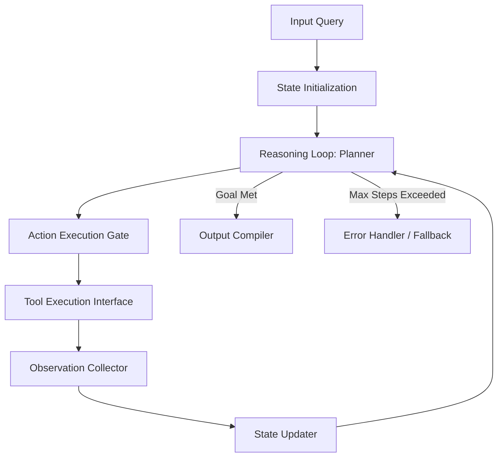

# Agent Architecture Blueprint (Project Venus V0.8)

## 1. System Topology & Core Components
This document defines the architectural blueprint for standard agents within the Project Venus ecosystem. It enforces a standard loop structure, state management protocol, and execution safety gate.



---

## 2. Core Execution Loop (ReAct / Plan-and-Execute)
Each agent operates on a modified **Reason-Act-Observe** execution sequence:

```python
# Pseudo-implementation of the Core Agent Execution Loop
def agent_execution_loop(system_prompt, user_query, state_store, tool_registry):
    state = state_store.initialize(user_query)
    step = 0
    
    while step < state.max_steps:
        # Step 1: Reason and Plan next step
        plan = model.generate_plan(system_prompt, state.history, tool_registry.schemas)
        state.update_plan(plan)
        
        if plan.is_complete:
            return state.compile_final_output()
            
        # Step 2: Act (Validate and Sandbox Tool Call)
        tool_call = plan.target_tool_call
        validation = tool_registry.validate(tool_call)
        
        if not validation.is_authorized:
            state.append_observation(f"Error: Tool call rejected by Policy: {validation.reason}")
            step += 1
            continue
            
        # Step 3: Execute in isolated Sandbox
        try:
            observation = tool_registry.execute_in_sandbox(tool_call)
        except Exception as e:
            observation = f"Execution Error: {str(e)}"
            
        # Step 4: Observe and Update State
        state.append_observation(observation)
        step += 1
        
    raise MaxStepsExceededException("Agent failed to converge within limits.")
```

---

## 3. Interface Definitions

### 3.1 Input / Output Schema
Every agent conforming to this blueprint must implement the following interfaces:

```json
{
  "$schema": "http://json-schema.org/draft-07/schema#",
  "title": "AgentInterface",
  "type": "object",
  "properties": {
    "agent_id": { "type": "string" },
    "session_id": { "type": "string" },
    "input_payload": {
      "type": "object",
      "properties": {
        "query": { "type": "string" },
        "context_overrides": { "type": "object" }
      },
      "required": ["query"]
    },
    "state_ledger": {
      "type": "array",
      "items": {
        "type": "object",
        "properties": {
          "timestamp": { "type": "string", "format": "date-time" },
          "thought": { "type": "string" },
          "action": { "type": "string" },
          "observation": { "type": "string" }
        },
        "required": ["timestamp", "thought", "action", "observation"]
      }
    }
  },
  "required": ["agent_id", "session_id", "input_payload"]
}
```

---

## 4. State & Memory Management
Agents maintain state across three distinct isolation horizons:
1.  **Transient Memory:** Scratched after each sub-step (stored in call stack variables).
2.  **Session Memory:** Persists across multi-turn user conversations (stored in-memory or Redis caches).
3.  **Long-Term Memory:** Retained across multiple sessions (stored in vector/relational databases).

---

## 5. Cross-References
*   Communication patterns between multiple agents are governed by [MULTI_AGENT_ORCHESTRATION_SPEC.md](file:///Users/dronpancholi/Developer/01_Strategic/Venus/uaieos_templates/MULTI_AGENT_ORCHESTRATION_SPEC.md).
*   Detailed agent-to-agent message formats are documented in [AGENT_COMMUNICATION_PROTOCOL.md](file:///Users/dronpancholi/Developer/01_Strategic/Venus/uaieos_templates/AGENT_COMMUNICATION_PROTOCOL.md).
*   Sandbox execution rules are defined in [TOOL_SANDBOXING_POLICY.md](file:///Users/dronpancholi/Developer/01_Strategic/Venus/uaieos_templates/TOOL_SANDBOXING_POLICY.md).
