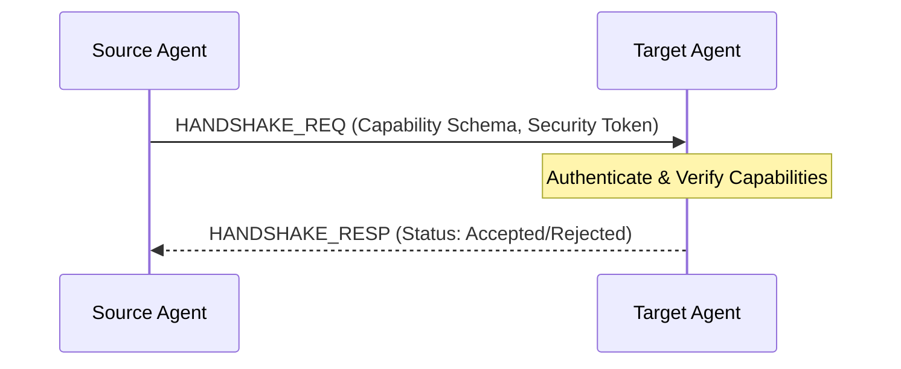

# Agent Communication Protocol (Project Venus V0.8)

## 1. Scope
This protocol governs the message exchange schemas, transportation channels, and lifecycle hooks for agent-to-agent and agent-to-system interactions. It ensures uniform serialization, traceability, and error propagation across distributed workflows.

---

## 2. Transport Architecture
Agents communicate via:
*   **Asynchronous Message Broker (Production):** RabbitMQ / NATS JetStream (binary JSON payloads).
*   **Synchronous Inter-Process Communication (IPC):** gRPC over HTTP/2 (high-performance loops).
*   **Local Event Loop:** In-memory queue (micro-testing / localized orchestration).

---

## 3. Message Envelope Schema
Every message transmitted between agents must conform to the following schema specification.

```json
{
  "$schema": "http://json-schema.org/draft-07/schema#",
  "title": "VenusAgentMessageEnvelope",
  "type": "object",
  "properties": {
    "message_id": { "type": "string", "format": "uuid" },
    "correlation_id": { "type": "string", "format": "uuid" },
    "timestamp": { "type": "string", "format": "date-time" },
    "sender": {
      "type": "object",
      "properties": {
        "agent_id": { "type": "string" },
        "agent_role": { "type": "string" }
      },
      "required": ["agent_id", "agent_role"]
    },
    "recipient": {
      "type": "object",
      "properties": {
        "agent_id": { "type": "string" }
      },
      "required": ["agent_id"]
    },
    "message_type": { 
      "type": "string", 
      "enum": ["HANDSHAKE_REQ", "HANDSHAKE_RESP", "TASK_DELEGATION", "TASK_UPDATE", "TASK_COMPLETE", "TASK_FAILED", "HEARTBEAT"] 
    },
    "payload": {
      "type": "object",
      "properties": {
        "context_state": { "type": "object" },
        "data": { "type": "object" },
        "error_details": {
          "type": "object",
          "properties": {
            "error_code": { "type": "string" },
            "message": { "type": "string" },
            "traceback": { "type": "string" }
          }
        }
      },
      "required": ["data"]
    }
  },
  "required": ["message_id", "correlation_id", "timestamp", "sender", "recipient", "message_type", "payload"]
}
```

---

## 4. Interaction Lifecycles

### 4.1 Handshake Sequence
Before exchanging operational tasks, agents must execute a capability verification handshake.



### 4.2 Failure Escalation Protocol
If an agent fails during task execution, it must propagate the failure up the hierarchy:

1.  **Immediate Catch:** Local sandbox errors are captured by the Agent Loop.
2.  **Notification:** Send `TASK_FAILED` message containing the failure payload and stack trace to the Orchestrator.
3.  **Routing Trigger:** Orchestrator catches `TASK_FAILED` and applies the route fallback rules defined in `DYNAMIC_MODEL_ROUTING_SPEC.md`.

---

## 5. Cross-References
*   The orchestrator managing these communications is defined in [MULTI_AGENT_ORCHESTRATION_SPEC.md](file:///Users/dronpancholi/Developer/01_Strategic/Venus/uaieos_templates/MULTI_AGENT_ORCHESTRATION_SPEC.md).
*   Underlying agent state machines are governed by [AGENT_ARCHITECTURE_BLUEPRINT.md](file:///Users/dronpancholi/Developer/01_Strategic/Venus/uaieos_templates/AGENT_ARCHITECTURE_BLUEPRINT.md).
*   Tool executions resulting from messages are schema-checked via [TOOL_SCHEMA_DEFINITION.md](file:///Users/dronpancholi/Developer/01_Strategic/Venus/uaieos_templates/TOOL_SCHEMA_DEFINITION.md).
