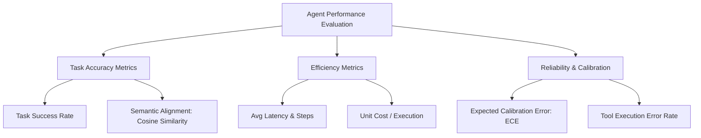

# Agent Performance Scorecard
**Document ID:** Venus-UAIEOS-TEMP-28  
**Version:** V0.8  
**Classification:** Institutional-Grade Operations Template  
**Target Directory:** `file:///Users/dronpancholi/Developer/01_Strategic/Venus/uaieos_templates/`  

---

## 1. Executive Summary & Objectives

This document defines the **Agent Performance Scorecard**, providing a standardized metric dashboard to track, grade, and audit autonomous agent deployments under Project Venus. 

The primary objectives are to:
1. Benchmark agent instances across functional execution dimensions (Task Success, Efficiency, and Safety Compliance).
2. Detail calibration measures to align agent decision confidence with real-world accuracy.
3. Establish thresholds for automated remediation and promotion.

---

## 2. Key Performance Indicators & Formulations

### 2.1 Task Success and Semantic Alignment
Task completion accuracy is evaluated through exact-match constraints and the Cosine Similarity of the final artifact compared to reference targets:

$$\text{Cos}(\mathbf{a}_{\text{agent}}, \mathbf{a}_{\text{target}}) = \frac{\mathbf{a}_{\text{agent}} \cdot \mathbf{a}_{\text{target}}}{\|\mathbf{a}_{\text{agent}}\| \|\mathbf{a}_{\text{target}}\|}$$

### 2.2 Expected Calibration Error (ECE)
To ensure the agent's internal confidence estimation (router decision or self-assessment score) is aligned with its actual performance, we monitor ECE:

$$\text{ECE} = \sum_{m=1}^M \frac{|B_m|}{N} \left| \text{acc}(B_m) - \text{conf}(B_m) \right|$$

Where:
*   $\text{conf}(B_m)$ is the average self-assessed confidence score in bin $B_m$.
*   $\text{acc}(B_m)$ is the actual success rate in bin $B_m$.

### 2.3 Efficiency Metric (Cost per Task)
$$\text{Cost}_{\text{task}} = \sum_{i=1}^{S} \left( C_{\text{input\_tokens}}^{(i)} + C_{\text{output\_tokens}}^{(i)} \right) + \sum_{j=1}^{T} C_{\text{tool\_execution}}^{(j)}$$

Where $S$ is the number of steps in the agent run, and $T$ is the count of external tool executions.

---

## 3. Agent Performance Scorecard Matrix

*This template must be populated for every agent release cycle.*

### 3.1 Scorecard Summary Table
*   **Evaluation Period:** `[YYYY-MM-DD to YYYY-MM-DD]`
*   **Target Domain:** `[e.g., Financial Modeling, Code Development]`

| Agent Instance ID | Success Rate (%) | Avg Steps / Task | Avg Latency (s) | Tool Call Accuracy | Cost / Task ($) | ECE Score | Overall Grade | Status |
|---|---|---|---|---|---|---|---|---|
| `AGT-GEN-01 (V0.7)` | 82.5% | 6.2 | 14.5s | 91.2% | $0.42 | 0.088 | **B** | Deprecated |
| `AGT-GEN-01 (V0.8)` | 94.1% | 4.1 | 8.2s | 98.6% | $0.28 | 0.041 | **A** | **Active** |
| `AGT-DB-02 (V0.5)`  | 76.8% | 8.9 | 22.1s | 85.0% | $0.78 | 0.120 | **C** | **Remediation** |
| `AGT-SEC-04 (V1.0)`  | 99.8% | 2.1 | 3.4s | 99.9% | $0.05 | 0.015 | **A+** | **Active** |

---

## 4. Grading Criteria & Operational Thresholds

The Overall Grade is calculated using the weighted sum of normalized performance scores:

$$\text{Final Score} = 0.40 \cdot S_{\text{accuracy}} + 0.25 \cdot (1 - S_{\text{latency\_norm}}) + 0.20 \cdot S_{\text{tool\_acc}} + 0.15 \cdot (1 - S_{\text{ece\_norm}})$$

*   **Grade A (Score $\ge 0.90$):** Approved for production deployment.
*   **Grade B (Score $0.80 - 0.89$):** Permitted in staging; review for optimization.
*   **Grade C (Score $0.70 - 0.79$):** Requires intervention. Triggers developer audit of prompt prompts and tool schemas.
*   **Grade D (Score $< 0.70$):** Immediate isolation. Fails validation checkpoints.

---

## 5. Agent Diagnostic Audit Protocol

When an agent falls to **Grade C** or **Grade D**, operators must initiate the following diagnostic protocol:

1.  **Retrieve Step History:** Run a dump of the agent's historical traces.
2.  **Verify Tool Schemas:** Validate that downstream system endpoints have not undergone API contract shifts.
3.  **Evaluate Calibrations:** Check ECE scaling values to ensure routing weights are accurate.
4.  **Execute Regression Tests:** Run the failed agent instance against the Golden Dataset (`file:///Users/dronpancholi/Developer/01_Strategic/Venus/uaieos_templates/GOLDEN_DATASET_EVALUATION_PLAN.md`).

---
*For score assessments or performance reports, contact the Lead Agent Auditor at [Venus Systems](file:///Users/dronpancholi/Developer/01_Strategic/Venus/).*
