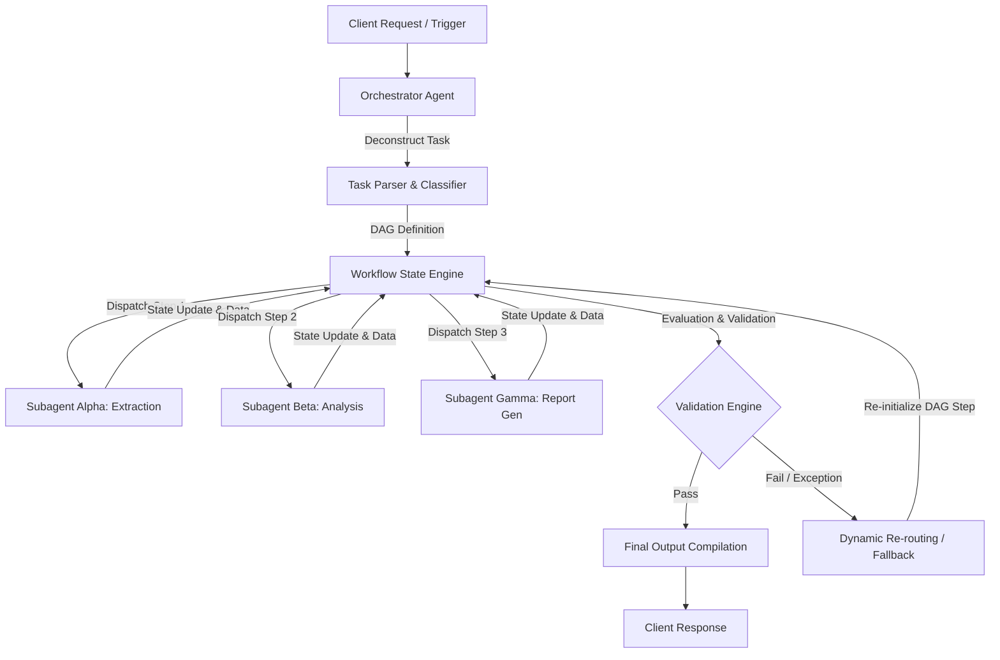
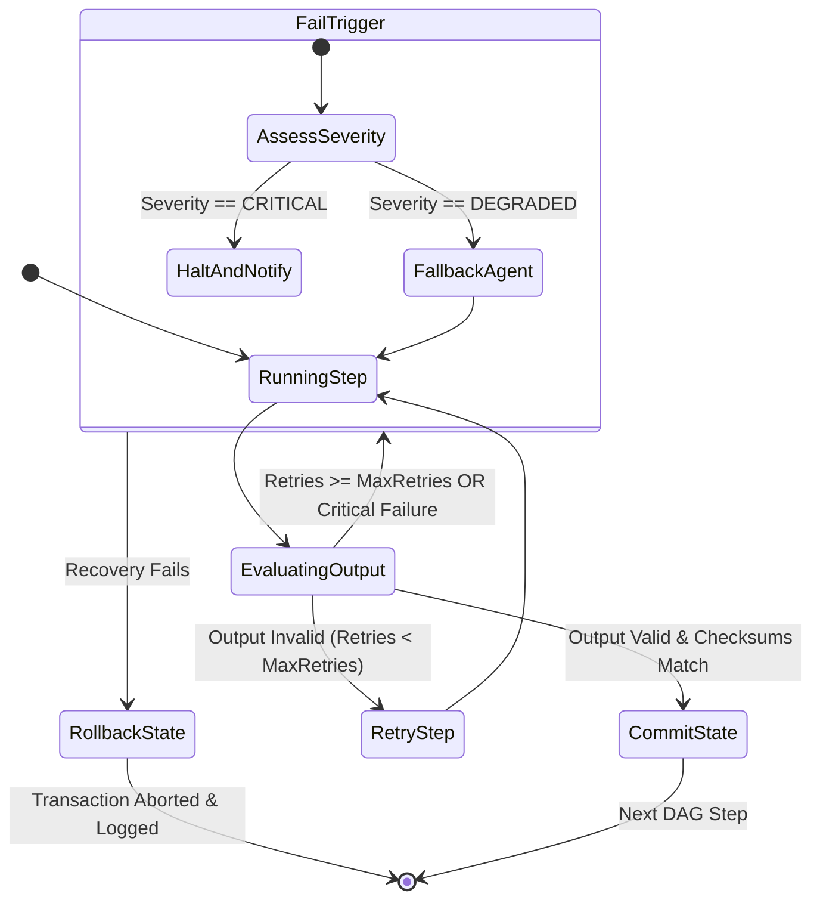

# Agent Workflow Orchestration Specification
**Document ID:** Venus-UAIEOS-TEMP-21  
**Version:** V0.8  
**Classification:** Institutional-Grade Operations Template  
**Target Directory:** `file:///Users/dronpancholi/Developer/01_Strategic/Venus/uaieos_templates/`  

---

## 1. Executive Summary & Objectives

Multi-agent environments require rigid, deterministic control loops to govern interactions between autonomous nodes, ensuring safety, repeatability, and alignment with corporate objectives. This specification outlines the framework for **Agent Workflow Orchestration** under Project Venus. 

The primary objectives are:
1. Define a standardized topology for Directed Acyclic Graph (DAG) based agent task execution.
2. Establish a unified JSON state management schema to maintain auditability and transaction boundaries.
3. Formulate the dynamic agent selection and routing algorithm utilizing cost, latency, and capability weighting.
4. Implement standard fallback policies for execution failures.

---

## 2. Agent Workflow Topology

Orchestration in Project Venus is configured as an **Orchestrator-Mediated Hybrid DAG**. Subagents operate with local autonomy but report state changes and seek routing decisions from a centralized Orchestrator Agent.



### 2.1 Nodes and Edges Definition
*   **Nodes (Subagent Tasks):** Discrete execution units encapsulated by a single agent persona and associated toolsets.
*   **Edges (Transitions):** Evaluated condition paths that pass state variables and input parameters from one node to the next.

---

## 3. Unified State Management Schema

The execution state is persisted in a distributed key-value store. Every execution step must validate against the following JSON Schema:

```json
{
  "$schema": "https://json-schema.org/draft/2020-12/schema",
  "title": "OrchestratorStateContext",
  "type": "object",
  "required": [
    "workflow_id",
    "parent_correlation_id",
    "current_step",
    "execution_status",
    "global_context",
    "step_history"
  ],
  "properties": {
    "workflow_id": { "type": "string", "format": "uuid" },
    "parent_correlation_id": { "type": "string", "format": "uuid" },
    "current_step": { "type": "string" },
    "execution_status": {
      "type": "string",
      "enum": ["INITIATED", "PARSING", "DISPATCHED", "AWAITING_INPUT", "COMPLETED", "FAILED", "ROLLED_BACK"]
    },
    "global_context": {
      "type": "object",
      "properties": {
        "user_id": { "type": "string" },
        "security_clearance": { "type": "string", "enum": ["L1", "L2", "L3", "SECRET"] },
        "accumulated_payload": { "type": "object" },
        "token_budget": { "type": "integer" },
        "token_spent": { "type": "integer" }
      },
      "required": ["user_id", "security_clearance", "accumulated_payload", "token_budget", "token_spent"]
    },
    "step_history": {
      "type": "array",
      "items": {
        "type": "object",
        "required": [
          "step_id",
          "agent_id",
          "timestamp_started",
          "timestamp_completed",
          "status",
          "input_checksum",
          "output_checksum",
          "execution_metadata"
        ],
        "properties": {
          "step_id": { "type": "string" },
          "agent_id": { "type": "string" },
          "timestamp_started": { "type": "string", "format": "date-time" },
          "timestamp_completed": { "type": "string", "format": "date-time" },
          "status": { "type": "string", "enum": ["SUCCESS", "FAILED", "TIMEOUT", "SKIPPED"] },
          "input_checksum": { "type": "string" },
          "output_checksum": { "type": "string" },
          "execution_metadata": {
            "type": "object",
            "properties": {
              "tokens_used": { "type": "integer" },
              "execution_latency_ms": { "type": "integer" },
              "retry_count": { "type": "integer" }
            },
            "required": ["tokens_used", "execution_latency_ms", "retry_count"]
          }
        }
      }
    }
  }
}
```

---

## 4. Agent Selection & Routing Algorithm

The Orchestrator utilizes a multi-criteria scoring algorithm to select the optimal subagent $A_i$ from the registered capability pool $\mathcal{A}$ for a given task $T$.

Let:
*   $C(A_i)$ be the normalized token cost coefficient of Agent $A_i$ (where $C \in [0, 1]$, $0$ being cheapest).
*   $L(A_i)$ be the historical latency percentile score of Agent $A_i$ (where $L \in [0, 1]$, $0$ being fastest).
*   $S(A_i, T)$ be the semantic alignment score (Cosine Similarity) between the task description embeddings $\mathbf{v}_T$ and the agent capability description embeddings $\mathbf{v}_{A_i}$:

$$\text{Cos}(A_i, T) = \frac{\mathbf{v}_{A_i} \cdot \mathbf{v}_T}{\|\mathbf{v}_{A_i}\| \|\mathbf{v}_T\|}$$

The overall routing score $R(A_i)$ for each candidate agent is computed as:

$$R(A_i) = w_s \cdot \text{Cos}(A_i, T) - w_c \cdot C(A_i) - w_l \cdot L(A_i)$$

Where the weights satisfy the constraint:

$$w_s + w_c + w_l = 1.0$$

The Orchestrator selects the agent that maximizes the routing score:

$$A_{\text{selected}} = \arg\max_{A_i \in \mathcal{A}} R(A_i)$$

### 4.1 Routing Configuration Matrix
The system weights are dynamically adjusted based on the user-specified prioritization policy:

| Policy Profile | Semantic Weight ($w_s$) | Cost Weight ($w_c$) | Latency Weight ($w_l$) | Selection Criterion |
|---|---|---|---|---|
| **High Accuracy** | 0.80 | 0.10 | 0.10 | Prioritizes semantic match (e.g., GPT-4o-level agents) |
| **Cost-Sensitive**| 0.30 | 0.60 | 0.10 | Prioritizes low-cost execution (e.g., local SLMs) |
| **Real-Time**     | 0.30 | 0.10 | 0.60 | Prioritizes lowest latency (e.g., highly optimized edge APIs) |
| **Balanced**      | 0.50 | 0.25 | 0.25 | Default configuration |

---

## 5. Failure Recovery & Self-Healing Policies

To prevent partial state degradation, a strict transactional rollback protocol is enforced when a node fails.



### 5.1 Rollback Sequence
1.  **Halt:** Immediately stop downstream DAG execution.
2.  **Snapshot Reversion:** Restore the state context to the last known committed step: `step_history[-1].status == "SUCCESS"`.
3.  **Compensating Action:** Execute compensation tools (e.g., delete temp files, release memory locks, cancel active API requests).
4.  **Log Mutation:** Append an entry to the `step_history` with `status: "ROLLED_BACK"` and output details.

---

## 6. Template & Implementation Guides

### 6.1 Agent Capability Registry
*Use this markdown template to register new agents into the orchestration registry.*

```markdown
### Agent Definition: [Agent Name]
*   **Agent ID:** `AGT-YYYY-[0-9]{4}`
*   **Base Model Endpoint:** `[Model Provider / Deployment Path]`
*   **System Prompt Fingerprint (SHA-256):** `[Hex String]`
*   **Primary Capability Tag:** `[e.g., Structured Extraction, Code Generation]`
*   **Cost Coefficient ($C$):** `[0.0 to 1.0]`
*   **Target Latency SLA ($L_{target}$):** `[Milliseconds]`
```

### 6.2 State Transition Log Schema
Every transition must append to a ledger containing:
```csv
timestamp,workflow_id,step_from,step_to,agent_id,routing_score,execution_time_ms,tokens_consumed,status
```

---
*For questions regarding this template, refer to the core architecture team at [Venus Systems](file:///Users/dronpancholi/Developer/01_Strategic/Venus/).*
