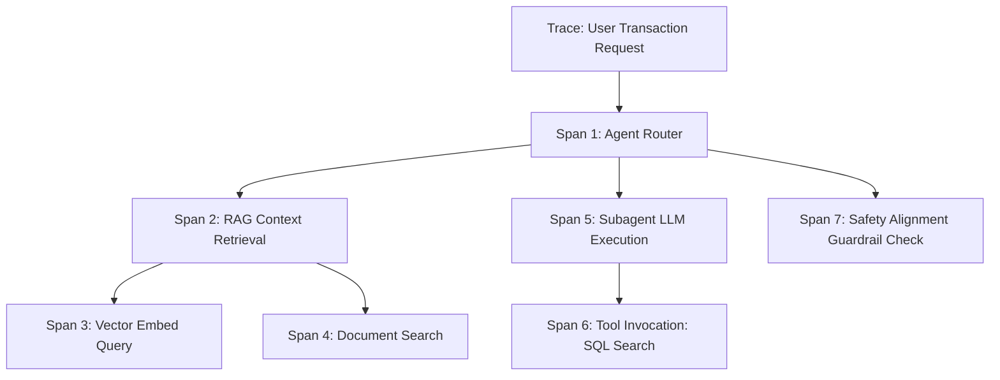

# AI Observability & Tracing Schema Specification
**Document ID:** Venus-UAIEOS-TEMP-29  
**Version:** V0.8  
**Classification:** Institutional-Grade Operations Template  
**Target Directory:** `file:///Users/dronpancholi/Developer/01_Strategic/Venus/uaieos_templates/`  

---

## 1. Executive Summary & Objectives

Multi-agent applications operate as non-deterministic systems, making traditional application debugging methods inadequate. Observability requires tracing not just API calls, but the prompts, context windows, model parameters, tool executions, and state transformations.

This specification details the **AI Observability & Tracing Schema**, aligning trace collection with the OpenTelemetry (OTel) semantic conventions for AI systems. It establishes:
1. Standardized Span types and attributes.
2. JSON structure definitions for tracing payloads.
3. Guidelines to capture metrics (latency, token count, cost, and semantic metrics).

---

## 2. Distributed Tracing Architecture

Trace logs are structured hierarchically: a single user transaction represents a **Trace**, which contains nested execution steps called **Spans**.



---

## 3. Metadata Schema Details & OpenTelemetry Conv.

Each Span must capture operational, financial, and semantic parameters.

### 3.1 Metric Computations
*   **Span Latency ($\Delta t$):**

$$\Delta t = t_{\text{completed}} - t_{\text{started}} \quad [\text{ms}]$$

*   **RAG Relevance / Grounding Score:**
    Let $\mathbf{v}_{\text{response}}$ be the embedding of the generated text, and $\mathbf{v}_{\text{ground}}$ be the embedding of the retrieved document context. The grounding score $G$ is computed as:

$$G = \text{Cos}(\mathbf{v}_{\text{response}}, \mathbf{v}_{\text{ground}}) = \frac{\mathbf{v}_{\text{response}} \cdot \mathbf{v}_{\text{ground}}}{\|\mathbf{v}_{\text{response}}\| \|\mathbf{v}_{\text{ground}}\|}$$

---

## 4. Observability JSON Tracing Schema

Every trace span generated by Venus libraries must validate against this JSON structure:

```json
{
  "$schema": "https://json-schema.org/draft/2020-12/schema",
  "title": "VenusTraceSpan",
  "type": "object",
  "required": [
    "trace_id",
    "span_id",
    "parent_span_id",
    "span_type",
    "name",
    "timestamp_start",
    "timestamp_end",
    "attributes",
    "events"
  ],
  "properties": {
    "trace_id": { "type": "string", "pattern": "^[0-9a-f]{32}$" },
    "span_id": { "type": "string", "pattern": "^[0-9a-f]{16}$" },
    "parent_span_id": { "type": "string", "pattern": "^([0-9a-f]{16}|null)$" },
    "span_type": {
      "type": "string",
      "enum": ["ORCHESTRATOR", "AGENT", "LLM_CALL", "TOOL_CALL", "RAG_RETRIEVAL", "GUARDRAIL"]
    },
    "name": { "type": "string" },
    "timestamp_start": { "type": "string", "format": "date-time" },
    "timestamp_end": { "type": "string", "format": "date-time" },
    "attributes": {
      "type": "object",
      "required": ["model_identifier", "token_metrics", "cost_metrics"],
      "properties": {
        "model_identifier": { "type": "string" },
        "temperature": { "type": "number", "minimum": 0.0, "maximum": 2.0 },
        "token_metrics": {
          "type": "object",
          "required": ["input_tokens", "output_tokens", "cached_tokens"],
          "properties": {
            "input_tokens": { "type": "integer" },
            "output_tokens": { "type": "integer" },
            "cached_tokens": { "type": "integer" }
          }
        },
        "cost_metrics": {
          "type": "object",
          "required": ["cost_usd"],
          "properties": {
            "cost_usd": { "type": "number" }
          }
        },
        "rag_metrics": {
          "type": "object",
          "properties": {
            "retrieved_documents_count": { "type": "integer" },
            "grounding_cosine_score": { "type": "number", "minimum": -1.0, "maximum": 1.0 }
          }
        }
      }
    },
    "events": {
      "type": "array",
      "items": {
        "type": "object",
        "required": ["name", "timestamp", "payload"],
        "properties": {
          "name": { "type": "string" },
          "timestamp": { "type": "string", "format": "date-time" },
          "payload": { "type": "object" }
        }
      }
    }
  }
}
```

---

## 5. Instrumenting Agent Spans (OpenTelemetry Hook)

Use the Python setup below to instantiate spans within agent files:

```python
"""
Venus Observability Instrumentor Hook
"""
from opentelemetry import trace
from opentelemetry.trace import Status, StatusCode
import time

tracer = trace.get_tracer("venus.agent.telemetry")

def trace_agent_execution(agent_name: str, task_input: str):
    """
    Decorator/Wrapper pattern for tracing LLM execution spans.
    """
    with tracer.start_as_current_span(f"agent.{agent_name}") as span:
        span.set_attribute("span_type", "AGENT")
        span.set_attribute("agent.input_bytes", len(task_input))
        
        try:
            start_time = time.time()
            # Execute actual agent task
            output = "Mock agent execution output"
            latency = (time.time() - start_time) * 1000
            
            span.set_attribute("agent.output_bytes", len(output))
            span.set_attribute("latency_ms", latency)
            span.set_status(Status(StatusCode.OK))
            return output
        except Exception as e:
            span.set_status(Status(StatusCode.ERROR, description=str(e)))
            span.record_exception(e)
            raise e
```

---

## 6. Observability Metrics & Alerting Trigger Rules

| Span Event Type | Metric Evaluated | Alert Threshold | Remediation Action |
|---|---|---|---|
| **LLM_CALL** | TTFT (Time to First Token) | $> 1500\text{ms}$ | Route next requests to primary fallback API |
| **TOOL_CALL** | Execution status | Fail Rate $> 5\%$ | Dispatch self-healing playbook |
| **GUARDRAIL** | Violation Confidence | $p > 0.95$ | Lock API key; generate security incident |
| **RAG_RETRIEVAL** | Grounding Score | $G < 0.65$ | Truncate system prompt context; default to search |

---
*For telemetry infrastructure support, contact the Devops & SRE desk at [Venus Systems](file:///Users/dronpancholi/Developer/01_Strategic/Venus/).*
