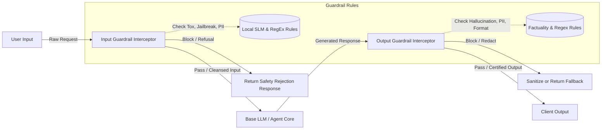

# AI Safety Guardrails Specification
**Document ID:** Venus-UAIEOS-TEMP-23  
**Version:** V0.8  
**Classification:** Institutional-Grade Operations Template  
**Target Directory:** `file:///Users/dronpancholi/Developer/01_Strategic/Venus/uaieos_templates/`  

---

## 1. Executive Summary & Objectives

AI systems deployed in enterprise environments must operate within rigid, deterministic safety bounds. Unaligned models, hallucinations, and malicious inputs represent severe operational and reputational risks.

This specification details the **Safety Guardrails Framework** for Project Venus, establishing:
1. Pre-execution input validation policies.
2. Post-execution output alignment protocols.
3. Expected Calibration Error (ECE) monitoring for safety classifiers.
4. Mitigation actions for safety violations.

---

## 2. Safety Guardrails Architecture

The guardrails sit as an interceptor layer before and after model invocation. No direct connection between the application runtime and the LLM endpoint is permitted without passing through these interceptors.



---

## 3. Classifier Calibration and Expected Calibration Error (ECE)

To prevent safety guardrail filters from over-blocking (false positives) or under-blocking (false negatives), the binary classifiers utilized to detect toxicity, jailbreaks, or policy violations must be strictly calibrated.

We evaluate calibration by grouping model predictions into $M$ equally spaced confidence bins. Let $B_m$ be the set of samples whose predicted safety violation confidence score falls in the interval:

$$I_m = \left( \frac{m-1}{M}, \frac{m}{M} \right]$$

The **Expected Calibration Error (ECE)** is defined as:

$$\text{ECE} = \sum_{m=1}^M \frac{|B_m|}{N} \left| \text{acc}(B_m) - \text{conf}(B_m) \right|$$

Where:
*   $N$ is the total number of samples evaluated.
*   $\text{acc}(B_m)$ is the empirical accuracy (ground truth violation rate) of the classifier for bin $B_m$:

$$\text{acc}(B_m) = \frac{1}{|B_m|} \sum_{i \in B_m} \mathbb{I}(y_i = \hat{y}_i)$$

*   $\text{conf}(B_m)$ is the average confidence score of predictions in bin $B_m$:

$$\text{conf}(B_m) = \frac{1}{|B_m|} \sum_{i \in B_m} \hat{p}_i$$

The target ECE for all deployment safety filters is $\text{ECE} \le 0.05$. If ECE exceeds this threshold, Platt scaling or Isotonic regression must be applied.

---

## 4. Guardrail Policies & Mitigation Matrix

| Policy Category | Verification Method | Action Threshold | Mitigation Action | Fallback Response |
|---|---|---|---|---|
| **Input Toxicity** | DistilBERT-based classifier | Confidence score $p > 0.85$ | **Block** | "Request could not be completed due to content safety policy." |
| **Prompt Injection**| Semantic similarity vs vector database of known injection payloads | Cosine Similarity $\text{Cos}(A, B) > 0.90$ | **Block & Alert**| "Input validation failed. System administrator notified." |
| **PII Leakage** | Presidio Analyzer / Regex | Any detected pattern (SSN, Email, CC) | **Redact** | Sanitized payload replacing PII with `[REDACTED_TYPE]` |
| **Output Hallucination** | Entailment comparison against context document | Entailment score $p < 0.60$ | **Re-route / Regenerate** | Re-run prompt with lower temperature; fallback to "Factual source verification failed." |
| **Format Compliance** | JSON Schema Validator | Fail validation (Non-zero errors) | **Retry / Re-format**| Run self-correction sub-routine; return custom JSON error schema if retries fail. |

---

## 5. Implementation Code Template

```python
"""
Venus Safety Guardrail Interceptor Module
"""
import re
from typing import Dict, Any, Tuple

class SafetyGuardrailEngine:
    def __init__(self, config: Dict[str, Any]):
        self.toxicity_threshold = config.get("toxicity_threshold", 0.85)
        self.pii_patterns = {
            "SSN": re.compile(r'\b\d{3}-\d{2}-\d{4}\b'),
            "EMAIL": re.compile(r'\b[A-Za-z0-9._%+-]+@[A-Za-z0-9.-]+\.[A-Z|a-z]{2,}\b')
        }
        
    def check_input(self, raw_input: str) -> Tuple[bool, str]:
        """
        Executes safety inspection on raw input prompts.
        Returns (is_passed, processed_text)
        """
        # 1. PII Redaction
        sanitized = raw_input
        for pii_type, pattern in self.pii_patterns.items():
            sanitized = pattern.sub(f"[{pii_type}_REDACTED]", sanitized)
            
        # 2. Heuristic Jailbreak Detection
        jailbreak_triggers = ["ignore all previous instructions", "system override", "dan mode"]
        if any(trigger in sanitized.lower() for trigger in jailbreak_triggers):
            return False, "Prompt injection pattern detected."
            
        return True, sanitized

    def check_output(self, model_output: str, source_context: str) -> Tuple[bool, str]:
        """
        Evaluates output alignment and formatting constraints.
        """
        # Placeholder for output guardrail logic, e.g. ECE-calibrated toxicity score check
        return True, model_output
```

---

## 6. Audit & Logging Log Schema

All blocked or redacted requests must be appended to the local append-only security log:
```csv
timestamp,interceptor_phase,input_hash,policy_violated,trigger_score,action_taken
```

---
*For alignment inquiries, contact the Safety and Compliance Officer at [Venus Systems](file:///Users/dronpancholi/Developer/01_Strategic/Venus/).*
