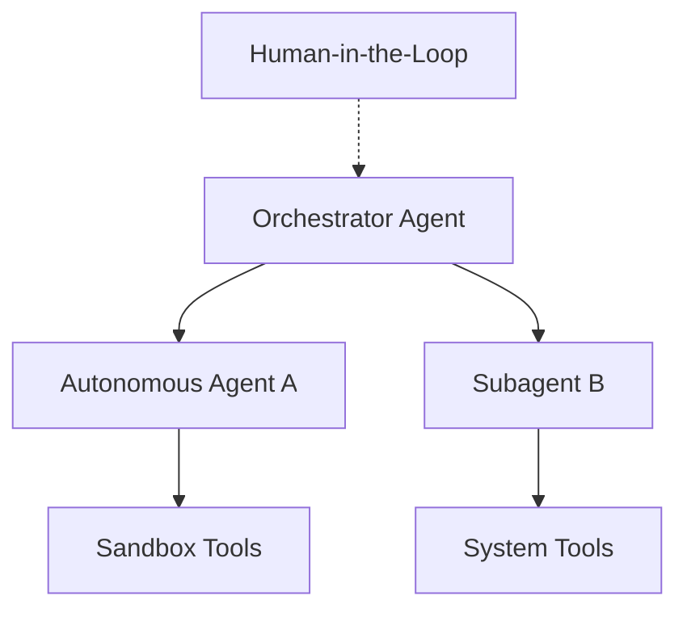

# AI Taxonomy Specification (Project Venus V0.8)

## 1. Executive Summary & Purpose
This document establishes the institutional taxonomy for AI models, agents, tools, and Retrieval-Augmented Generation (RAG) components within the Venus Enterprise Architecture. Standardizing these classifications ensures system interoperability, deterministic routing, and consistent compliance profiling across all operational units.

---

## 2. Model Taxonomy & Classification Framework
Models are classified into four distinct tiers based on parameters, compute profiles, and deployment topologies.

| Class | Parameter Range | Typical Latency | Cost per 1M Tokens (Input/Output) | Core Use Cases |
| :--- | :--- | :--- | :--- | :--- |
| **Frontier (Tier 1)** | >100B | 1.5s - 5.0s | $3.00 / $15.00 | Complex reasoning, multi-turn strategy, synthetic data generation |
| **Utility (Tier 2)** | 10B - 70B | 400ms - 1.2s | $0.20 / $0.60 | General transformation, classification, standard agents |
| **Specialized (Tier 3)** | 3B - 8B | 150ms - 400ms | $0.05 / $0.15 | Embeddings, syntax validation, entity extraction, SQL generation |
| **Edge (Tier 4)** | <3B | <50ms | $0.00 (On-Premise) | High-speed client validation, local auto-complete, offline PII scrubbing |

### 2.1 Model Calibration and Alignment
Calibration represents the degree of correspondence between a model's predicted probability and the actual occurrence of correct outcomes. To maintain high alignment standards, all models must be audited using the **Expected Calibration Error (ECE)** formula:

$$\text{ECE} = \sum_{m=1}^{M} \frac{|B_m|}{N} \left| \text{acc}(B_m) - \text{conf}(B_m) \right|$$

Where:
- $N$ is the total number of evaluation samples.
- $B_m$ represents the $m$-th bin of confidence scores.
- $\text{acc}(B_m)$ is the average accuracy of predictions in bin $B_m$.
- $\text{conf}(B_m)$ is the average confidence level assigned to predictions in bin $B_m$.

---

## 3. Agent Classification & Roles
Agents represent autonomous loop executions utilizing reasoning pipelines to achieve state objectives.

### 3.1 Agent Taxonomy Matrix

| Agent Type | Autonomy Level | State Memory | Coordination Mechanism | Security Clearance |
| :--- | :--- | :--- | :--- | :--- |
| **Orchestrator** | High | Global Graph | Multi-Agent Directed Acyclic Graph (DAG) | L1 (System Admin) |
| **Autonomous** | High | Local Vector + Session | Chain-of-Thought (CoT) / ReAct | L2 (Departmental) |
| **Subagent** | Low | Transient (Call-Stack) | Single-Task Worker Loop | L3 (Task-Specific) |
| **Human-in-the-Loop (HITL)** | Intermittent | Session Ledger | Asynchronous Callback Hook | L1 - L3 (Variable) |

---

## 4. Tool Categorization
Tools represent standardized execution endpoints exposed to models.

1. **System Tools (Local):** Built-in native primitives (e.g., file system, system clock) executing in the host environment.
2. **Sandbox Tools:** Executable runtimes (e.g., Python interpreters, SQL query executors) isolated using containerization or WebAssembly (Wasm).
3. **Remote Tools (MCP):** Model Context Protocol (MCP) endpoints hosted externally, managed via JSON-RPC over stdio or SSE.
4. **Third-Party Integrations:** API-based connectors mapped via standard OpenAPI / Swagger schemas.

---

## 5. RAG Architecture Levels
RAG deployments are structured into three distinct layers to ensure optimal information retrieval and response grounding:

### 5.1 Level 1: Semantic Embeddings & Similarity Search
Computes cosine similarity between document chunk embeddings $A$ and query vector $B$:

$$\text{Cos}(A, B) = \frac{A \cdot B}{\|A\| \|B\|} = \frac{\sum_{i=1}^{n} A_i B_i}{\sqrt{\sum_{i=1}^{n} A_i^2} \sqrt{\sum_{i=1}^{n} B_i^2}}$$

### 5.2 Level 2: Hybrid Search & Sparse-Dense Fusion (RRF)
Combines Sparse Keyword Search (BM25) and Dense Semantic Search scores using Reciprocal Rank Fusion:

$$\text{RRF\_Score}(d) = \sum_{m \in M} \frac{1}{k + r_m(d)}$$

Where $r_m(d)$ is the rank of document $d$ in system $m$, and $k$ is a constant (typically $60$).

### 5.3 Level 3: Grounded Contextual Generation
Applies context compression, neural rerankers (e.g., Cross-Encoder), and citation attribution before ingestion by the generator model.

---

## 6. Cross-References
- Model Evaluation criteria are defined in [MODEL_EVALUATION_REPORT.md](file:///Users/dronpancholi/Developer/01_Strategic/Venus/uaieos_templates/MODEL_EVALUATION_REPORT.md).
- Detailed routing configurations are found in [DYNAMIC_MODEL_ROUTING_SPEC.md](file:///Users/dronpancholi/Developer/01_Strategic/Venus/uaieos_templates/DYNAMIC_MODEL_ROUTING_SPEC.md).
- Security policies for tools are defined in [MCP_SECURITY_POLICY.md](file:///Users/dronpancholi/Developer/01_Strategic/Venus/uaieos_templates/MCP_SECURITY_POLICY.md).
