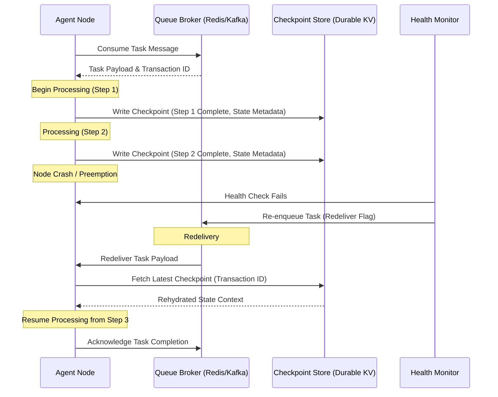
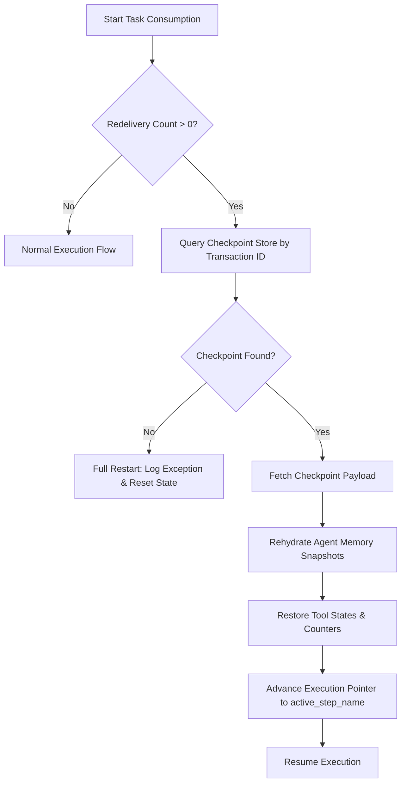

# Distributed Queue & State Checkpoint Plan
**Document ID:** Venus-UAIEOS-TEMP-22  
**Version:** V0.8  
**Classification:** Institutional-Grade Operations Template  
**Target Directory:** `file:///Users/dronpancholi/Developer/01_Strategic/Venus/uaieos_templates/`  

---

## 1. Executive Summary & Objectives

In highly distributed multi-agent systems, agents frequently execute long-running, asynchronous, and stateful operations. System outages, network partitions, or compute node preemptions can result in lost context and costly re-computation. 

This document defines the **Distributed Queue & State Checkpoint Plan**, detailing:
1. The architectural patterns for state capture and queue ingestion.
2. The mathematical framework to optimize the checkpoint frequency trade-off.
3. Serialization protocols and message schemas.
4. Step-by-step restoration and recovery procedures.

---

## 2. Checkpoint Architecture & Flow

State checkpointing utilizes a write-ahead logging (WAL) paradigm coupled with a distributed event broker (e.g., Apache Kafka or Redis Streams) and a durable object store (e.g., Google Cloud Storage or Ceph).



---

## 3. Mathematical Optimization of Checkpoint Frequency

Frequent checkpoints reduce the amount of lost work upon failure but introduce latency and write overhead. We must optimize the checkpoint interval to minimize the expected total time.

Let:
*   $T_{\text{task}}$ be the total processing time of a task without checkpointing.
*   $T_{\text{checkpoint}}$ be the overhead (latency) introduced by writing a single checkpoint.
*   $k$ be the number of execution phases between checkpoints (e.g., $k=1$ means checkpointing after every single sub-operation).
*   $\lambda$ be the failure rate of the agent worker node, assuming a Poisson process for failures.
*   $W$ be the expected wasted work (re-computation time) upon failure.

The expected total execution time $E[T_{\text{total}}]$ including checkpointing overhead and expected recovery time can be modeled as:

$$E[T_{\text{total}}] = (T_{\text{task}} + N_{\text{cp}} \cdot T_{\text{checkpoint}}) \cdot (1 + \lambda \cdot W)$$

Where $N_{\text{cp}} = \frac{T_{\text{task}}}{\tau}$ is the number of checkpoints, and $\tau$ is the checkpoint interval in time. Assuming a uniform distribution of failures within the interval $\tau$, the average wasted work upon failure is:

$$W \approx \frac{\tau}{2} + T_{\text{restore}}$$

Where $T_{\text{restore}}$ is the time required to read the checkpoint and rehydrate the agent state. Minimizing $E[T_{\text{total}}]$ with respect to the optimal checkpoint interval $\tau^*$ yields the classic Young-Tarjan approximation:

$$\tau^* \approx \sqrt{\frac{2 \cdot T_{\text{checkpoint}}}{\lambda}}$$

### 3.1 Parameter Reference Chart
Workers must dynamically adjust checkpoint parameters based on node type:

| Worker Pool Type | Failure Rate ($\lambda$ / hr) | Est. Checkpoint Overhead ($T_{\text{checkpoint}}$) | Target Optimal Interval ($\tau^*$) | Policy Decision |
|---|---|---|---|---|
| **Dedicated VM** | 0.005 (Rare) | 120ms | ~49.0 minutes | Checkpoint only on major transitions |
| **Spot / Preemptible**| 0.200 (High) | 150ms | ~7.7 minutes | Checkpoint after every tool call |
| **Serverless Function**| 0.050 (Med)  | 400ms | ~22.6 minutes | Checkpoint at logical sub-module exits |

---

## 4. Checkpoint Schema & Message Specification

Checkpoints are serialized to JSON (or Protocol Buffers for high-throughput pipelines) and must match the structural blueprint below:

```json
{
  "$schema": "https://json-schema.org/draft/2020-12/schema",
  "title": "AgentQueueCheckpoint",
  "type": "object",
  "required": [
    "checkpoint_id",
    "transaction_id",
    "queue_name",
    "sequence_number",
    "timestamp",
    "agent_metadata",
    "checkpoint_data"
  ],
  "properties": {
    "checkpoint_id": { "type": "string", "format": "uuid" },
    "transaction_id": { "type": "string" },
    "queue_name": { "type": "string" },
    "sequence_number": { "type": "integer", "minimum": 0 },
    "timestamp": { "type": "string", "format": "date-time" },
    "agent_metadata": {
      "type": "object",
      "required": ["agent_id", "host_ip", "pid"],
      "properties": {
        "agent_id": { "type": "string" },
        "host_ip": { "type": "string", "format": "ipv4" },
        "pid": { "type": "integer" }
      }
    },
    "checkpoint_data": {
      "type": "object",
      "required": ["active_step_name", "memory_snapshots", "tool_state"],
      "properties": {
        "active_step_name": { "type": "string" },
        "memory_snapshots": {
          "type": "array",
          "items": {
            "type": "object",
            "required": ["key", "value", "type"],
            "properties": {
              "key": { "type": "string" },
              "value": { "type": "string" },
              "type": { "type": "string", "enum": ["string", "json", "binary_base64"] }
            }
          }
        },
        "tool_state": {
          "type": "object",
          "description": "Serialized execution states of active tools, db connections, or open streams."
        }
      }
    }
  }
}
```

---

## 5. Recovery & Rehydration Protocol

When a worker consumes a task with a redelivery count greater than 0, it must initiate the following rehydration sequence:



### 5.1 Rehydration Shell Script Template
The recovery executor runs the following baseline verification check:

```bash
#!/usr/bin/env bash
# Venus Agent Rehydration & Health Verification Script
set -euo pipefail

TRANSACTION_ID="${1:-}"
CHECKPOINT_ENDPOINT="${CHECKPOINT_ENDPOINT:-http://127.0.0.1:8500/v1/checkpoint}"

if [[ -z "$TRANSACTION_ID" ]]; then
    echo "ERROR: Transaction ID is required." >&2
    exit 1
fi

echo "Retrieving checkpoint for transaction: $TRANSACTION_ID..."
RESPONSE=$(curl -s -w "%{http_code}" -o /tmp/checkpoint.json "$CHECKPOINT_ENDPOINT/$TRANSACTION_ID")
HTTP_STATUS="${RESPONSE: -3}"

if [[ "$HTTP_STATUS" -ne 200 ]]; then
    echo "WARNING: Checkpoint not found (HTTP $HTTP_STATUS). Starting fresh."
    exit 0
fi

# Verify payload structure integrity using jq
if ! jq -e '.checkpoint_id, .checkpoint_data' /tmp/checkpoint.json >/dev/null; then
    echo "ERROR: Invalid checkpoint schema retrieved." >&2
    exit 2
fi

echo "Checkpoint validated. Rehydrating Agent Step: $(jq -r '.checkpoint_data.active_step_name' /tmp/checkpoint.json)"
# Rehydration logic invokes here...
```

---
*For systems engineering support, contact the Venus Devops and State Management unit at [Venus Systems](file:///Users/dronpancholi/Developer/01_Strategic/Venus/).*
