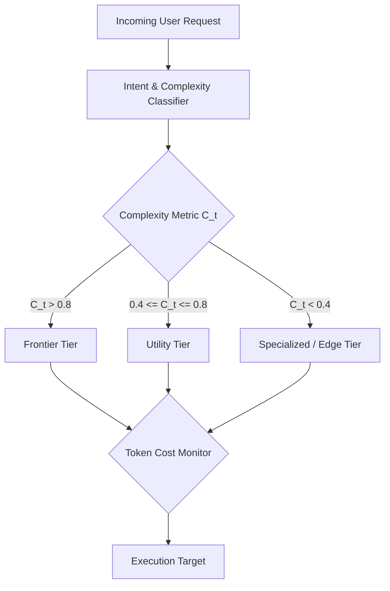

# Dynamic Model Routing Specification (Project Venus V0.8)

## 1. Objective
This specification defines the dynamic routing logic used to dispatch model requests to different execution tiers (Frontier, Utility, Specialized, Edge) based on runtime metrics, cost parameters, and accuracy requirements.

---

## 2. Routing Decision Engine & Architecture
The routing engine evaluates incoming tasks against utility functions to determine the optimal target model.



### 2.1 Optimization Scoring Utility Function
The routing algorithm selects the model $m$ from set $M$ that maximizes the utility score $U(m)$:

$$U(m) = w_a \cdot A(m) - w_c \cdot C(m) - w_l \cdot L(m)$$

Where:
*   $A(m) \in [0, 1]$ represents the target model's task-specific accuracy.
*   $C(m)$ is the normalized token cost:

$$C(m) = \frac{\text{Cost}(m)}{\text{Cost}_{\max}}$$

*   $L(m)$ is the normalized latency:

$$L(m) = \frac{\text{Latency}(m)}{\text{Latency}_{\max}}$$

*   $w_a, w_c, w_l$ are weighting factors where $w_a + w_c + w_l = 1.0$.

---

## 3. Tiered Routing Rules Matrix

| Task Type | Complexity Threshold ($C_t$) | Primary Target | Fallback Target | Latency SLA | Target Cost/1k Queries |
| :--- | :--- | :--- | :--- | :--- | :--- |
| **Strategic Reasoning** | $> 0.85$ | `Model-A-Frontier` | `Model-B-Utility` | $< 2500\text{ ms}$ | $< \$0.05$ |
| **Conversational Flow** | $0.50 - 0.85$ | `Model-B-Utility` | `Model-A-Frontier` | $< 1000\text{ ms}$ | $< \$0.01$ |
| **Structural Processing** | $0.20 - 0.49$ | `Model-C-Special` | `Model-B-Utility` | $< 300\text{ ms}$ | $< \$0.002$ |
| **High-Volume Tagging** | $< 0.20$ | `Model-Edge-Native` | `Model-C-Special` | $< 80\text{ ms}$ | $\$0.000$ |

---

## 4. Fallback and Circuit Breaker Mechanics
If the primary target exceeds latency SLAs or returns a server error (HTTP 5xx, rate limits), the router initiates a step-down fallback:

```
[Primary: Frontier] ──(Timeout / Rate Limit)──> [Fallback 1: Utility] ──(Failure)──> [Static Response / Graceful Failure]
```

The trigger condition for dynamic fallback based on ECE and task confidence threshold $\theta$:

$$\text{Confidence}(m) < \theta \implies \text{Route to } m+1 \text{ (Higher Tier Model)}$$

---

## 5. Cross-References
*   Evaluation reports justifying routing weights are located in [MODEL_EVALUATION_REPORT.md](file:///Users/dronpancholi/Developer/01_Strategic/Venus/uaieos_templates/MODEL_EVALUATION_REPORT.md).
*   Taxonomy parameters for each tier are in [AI_TAXONOMY_SPEC.md](file:///Users/dronpancholi/Developer/01_Strategic/Venus/uaieos_templates/AI_TAXONOMY_SPEC.md).
*   Tool constraints related to specific models are defined in [TOOL_FALLBACK_CIRCUIT_BREAKER.md](file:///Users/dronpancholi/Developer/01_Strategic/Venus/uaieos_templates/TOOL_FALLBACK_CIRCUIT_BREAKER.md).
