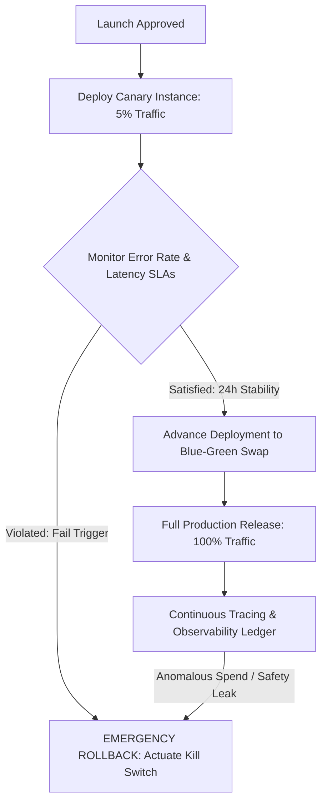

# Final AI Launch Certification
**Document ID:** Venus-UAIEOS-CERT-40  
**Version:** V0.8  
**Classification:** Institutional-Grade Governance Certificate  
**Target Directory:** `file:///Users/dronpancholi/Developer/01_Strategic/Venus/uaieos_templates/`  

---

## 1. Document Identity & System Profile

*This certificate represents the final gate authorization for deploying an AI system to production under Project Venus. By obtaining signatures below, the project team declares the system is safe, stable, and architecturally sound.*

```markdown
┌──────────────────────────────────────────────────────────┐
│ FINAL LAUNCH CERTIFICATE ID: VENUS-LAUNCH-2026-[0-9]{4}  │
├──────────────────────────────────────────────────────────┤
│ System Name: ___________________________________________ │
│ System Version (SPV): __________________________________ │
│ Formal Launch Date: _____________________________________│
│ Lead Sponsor CPO/VP: ___________________________________ │
└──────────────────────────────────────────────────────────┘
```

---

## 2. Component Certificates Reference Ledger

*Prior to launch, the system must reference active, signed compliance and architectural certs. Insert document paths and verification IDs below:*

| Required Sub-Certificate | Verification ID Reference | Relative Link | Verification Status |
|---|---|---|---|
| **AI Architecture Certificate** | `VENUS-SYS-ARCH-2026-____` | [Link](file:///Users/dronpancholi/Developer/01_Strategic/Venus/uaieos_templates/AI_ARCHITECTURE_CERTIFICATE.md) | `[   ]` |
| **Agent Compliance Certificate**| `VENUS-AGT-COMP-2026-____` | [Link](file:///Users/dronpancholi/Developer/01_Strategic/Venus/uaieos_templates/AGENT_COMPLIANCE_CERTIFICATE.md) | `[   ]` |
| **RAG System Certificate** | `VENUS-RAG-CERT-2026-____` | [Link](file:///Users/dronpancholi/Developer/01_Strategic/Venus/uaieos_templates/RAG_SYSTEM_CERTIFICATE.md) | `[   ]` |
| **MCP Integration Certificate** | `VENUS-MCP-CERT-2026-____` | [Link](file:///Users/dronpancholi/Developer/01_Strategic/Venus/uaieos_templates/MCP_INTEGRATION_CERTIFICATE.md) | `[   ]` |
| **Safety Governance Certificate**| `VENUS-SAFE-2026-____` | [Link](file:///Users/dronpancholi/Developer/01_Strategic/Venus/uaieos_templates/SAFETY_GOVERNANCE_CERTIFICATE.md) | `[   ]` |

---

## 3. Operational Performance Audit Summary

*Verify that final testing metrics meet production constraints:*

| Metric | Design Constraint Target | Empirical Result | Verification Check (Pass/Fail) |
|---|---|---|---|
| **System Latency** | Mean TTFT $\le 300\text{ms}$ | `_______ms` | `[   ]` |
| **Grounding Score ($G$)**| $G \ge 0.95$ | `_______` | `[   ]` |
| **Citation Accuracy ($C$)**| $C = 1.0$ | `_______` | `[   ]` |
| **Classifier ECE** | $\text{ECE} \le 0.05$ | `_______` | `[   ]` |
| **Token Budget Velocity** | $\le \$2,000$ / day | `_______` | `[   ]` |
| **Safety Z-score** | $Z \ge 3.29$ ($p < 0.001$) | `_______` | `[   ]` |

---

## 4. Rollout Strategy & Emergency Response (Kill Switch)



### 4.1 Emergency Kill Switch Protocol
1.  **Deactivation:** Toggle the deployment key in the API gateway proxy.
2.  **Reroute:** Divert client requests to the standard fallback static system.
3.  **Isolation:** Terminate compute VM containers or scale serverless functions to zero.
4.  **Log Lock:** Extract active session logs (`file:///Users/dronpancholi/Developer/01_Strategic/Venus/uaieos_templates/AI_OBSERVABILITY_TRACING_SCHEMA.md`) for triage.

---

## 5. Final Launch Approvals & Release Sign-Off

*By signing below, the executive launch committee certifies that this AI system has successfully passed all staging, security, and quality gates.*

| Release Sign-off Role | Name | Signature | Approval Date | Launch Decision |
|---|---|---|---|---|
| **VP of AI Engineering** | | | | **APPROVED / BLOCKED** |
| **Chief Info Security Officer**| | | | **APPROVED / BLOCKED** |
| **Chief Product Officer** | | | | **APPROVED / BLOCKED** |

---
*For information on release gates or launch procedures, refer to the operations management desk at [Venus Systems](file:///Users/dronpancholi/Developer/01_Strategic/Venus/).*
