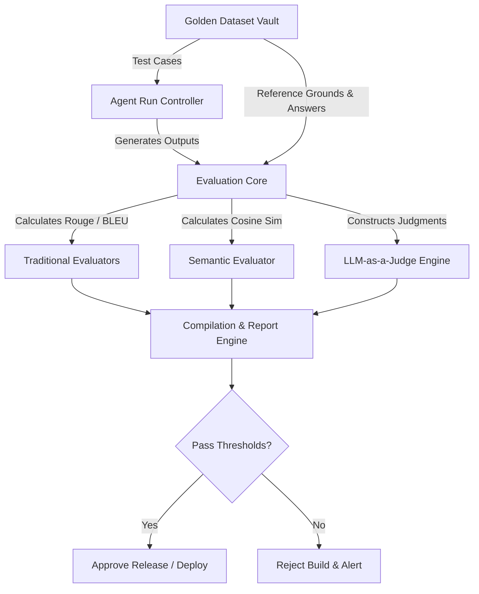

# Golden Dataset Evaluation Plan
**Document ID:** Venus-UAIEOS-TEMP-26  
**Version:** V0.8  
**Classification:** Institutional-Grade Operations Template  
**Target Directory:** `file:///Users/dronpancholi/Developer/01_Strategic/Venus/uaieos_templates/`  

---

## 1. Executive Summary & Objectives

Systematic validation of generative AI models requires structured benchmarking against static, representative reference datasets. Relying on ad-hoc queries results in silent regression and optimization degradation.

This plan details the **Golden Dataset Evaluation Framework** to:
1. Define the structural schema of Golden Datasets.
2. Outline evaluation metrics and mathematical formulation for semantic alignment.
3. Establish a standard configuration for LLM-as-a-Judge and traditional evaluations.
4. Integrate the validation process into continuous delivery pipelines.

---

## 2. Evaluation System Architecture

The evaluation pipeline pulls representative samples from the golden registry, dispatches them to candidate agent runs, and feeds the output paired with reference answers into a grading matrix.



---

## 3. Evaluation Metrics & Formulations

### 3.1 Embedding Semantic Similarity
To determine the semantic closeness of a generated response $R$ to a ground-truth golden answer $G$, we map both outputs to high-dimensional embeddings $\mathbf{v}_R$ and $\mathbf{v}_G$ using a standard model (e.g., `text-embedding-3-large`). The score is the Cosine Similarity:

$$\text{Cos}(R, G) = \frac{\mathbf{v}_R \cdot \mathbf{v}_G}{\|\mathbf{v}_R\| \|\mathbf{v}_G\|}$$

A passing threshold of $\text{Cos}(R, G) \ge 0.85$ is required for normal task evaluations.

### 3.2 Expected Calibration Error (ECE) for Classifier Judgments
When an evaluation judge classifier is used to predict binary correctness (Pass/Fail) of generated responses, we evaluate the judge's reliability using ECE:

$$\text{ECE} = \sum_{m=1}^M \frac{|B_m|}{N} \left| \text{acc}(B_m) - \text{conf}(B_m) \right|$$

Where $B_m$ represents confidence bins of the judge, and $N$ is the total dataset size. The ECE of judge models must remain below $0.07$.

### 3.3 Cohort Z-score for Performance Comparison
When comparing the performance of Model Alpha ($M_1$) against Model Beta ($M_2$) on the golden dataset, the significance of the accuracy improvement is evaluated via the Z-score:

$$Z = \frac{p_1 - p_2}{\sqrt{p(1-p)\left(\frac{1}{n_1} + \frac{1}{n_2}\right)}}$$

Where $p_1, p_2$ represent the passing accuracy rates on the dataset, and $p$ represents the pooled passing rate.

---

## 4. Golden Dataset Schema

Golden datasets must be structured as a JSONL file with the schema represented below:

```json
{
  "$schema": "https://json-schema.org/draft/2020-12/schema",
  "title": "GoldenEvaluationCase",
  "type": "object",
  "required": [
    "case_id",
    "domain",
    "input_prompt",
    "reference_context",
    "expected_output",
    "eval_parameters"
  ],
  "properties": {
    "case_id": { "type": "string" },
    "domain": { "type": "string", "enum": ["rag_retrieval", "code_gen", "structured_json", "reasoning"] },
    "input_prompt": { "type": "string" },
    "reference_context": { 
      "type": "array",
      "items": { "type": "string" }
    },
    "expected_output": { "type": "string" },
    "eval_parameters": {
      "type": "object",
      "required": ["eval_type", "minimum_cosine_similarity", "require_exact_match_tokens"],
      "properties": {
        "eval_type": { "type": "string", "enum": ["exact_match", "fuzzy_semantic", "llm_judge"] },
        "minimum_cosine_similarity": { "type": "number", "minimum": 0.0, "maximum": 1.0 },
        "require_exact_match_tokens": {
          "type": "array",
          "items": { "type": "string" }
        }
      }
    }
  }
}
```

---

## 5. Scoring Matrix Dashboard Template

Upon execution completion, performance results are summarized in the following dashboard format:

| Test Run ID | Model ID | Total Cases | Pass Rate (%) | Avg Cos Sim | Judge ECE | Deployment Status |
|---|---|---|---|---|---|---|
| **RUN-202606-01** | `gpt-4o-2024-05-13` | 1000 | 94.2% | 0.912 | 0.042 | **PROMOTED** |
| **RUN-202606-02** | `custom-llama-3-8b` | 1000 | 88.5% | 0.865 | 0.061 | **DEGRADED (LOCAL)**|
| **RUN-202606-03** | `claude-3-5-sonnet` | 1000 | 95.8% | 0.931 | 0.038 | **PROMOTED (CHAMPION)**|

---

## 6. Execution Command Template
Evaluations are run via standard scripts. Use the baseline test suite invocation below:

```bash
#!/usr/bin/env bash
# Venus Golden Dataset Evaluation Invocation Script
set -euo pipefail

GOLDEN_DATASET_FILE="/Users/dronpancholi/Developer/01_Strategic/Venus/uaieos_templates/golden_reference.jsonl"
CANDIDATE_MODEL_ENDPOINT="http://localhost:8000/v1/chat/completions"

echo "Executing golden evaluation run..."
python -m venus.evaluators.run \
    --dataset "$GOLDEN_DATASET_FILE" \
    --endpoint "$CANDIDATE_MODEL_ENDPOINT" \
    --output-dir "/tmp/eval_results/" \
    --eval-methods "cosine,rouge,llm_judge"

echo "Evaluation complete. Results written to /tmp/eval_results/summary.json"
```

---
*For dataset expansions or schema adjustments, contact the ML Ops unit at [Venus Systems](file:///Users/dronpancholi/Developer/01_Strategic/Venus/).*
