# GPU Utilization & Capacity Model
**Document ID:** Venus-UAIEOS-TEMP-32  
**Version:** V0.8  
**Classification:** Institutional-Grade Operations Template  
**Target Directory:** `file:///Users/dronpancholi/Developer/01_Strategic/Venus/uaieos_templates/`  

---

## 1. Executive Summary & Objectives

Self-hosting Large Language Models (via engines like vLLM, TensorRT-LLM, or TGI) requires strict planning of hardware capacity. Underestimating GPU memory requirements leads to Out-Of-Memory (OOM) crashes, while over-provisioning incurs high operational costs.

This document establishes the **GPU Utilization & Capacity Model** to:
1. Provide the mathematical formulation for sizing memory footprints.
2. Outline KV Cache allocations using PagedAttention metrics.
3. Standardize deployment configurations for varying batch and context sizes.
4. Establish optimization guidelines.

---

## 2. Memory Allocation Overview

The memory of an inference GPU is split into static components (Model Weights) and dynamic components (KV Cache, Activation memory, and CUDA workspace overhead).

```mermaid
gantt
    title GPU VRAM Allocation Breakdown (e.g., 80GB H100)
    dateFormat  X
    axisFormat %s
    
    section VRAM Allocation
    Model Weights (FP16 / BF16)     :active, 0, 35
    KV Cache Allocation             :crit, 35, 70
    Activation Memory (Dynamic)     : 70, 76
    CUDA Context & PyTorch Overhead : 76, 80
```



---

## 3. Mathematical Sizing Formulations

### 3.1 Model Weight Memory ($M_{\text{weights}}$)
The memory required to load a model containing $N$ billion parameters at precision $P$ bytes per parameter is:

$$M_{\text{weights}} = N \cdot P \quad [\text{GB}]$$

*   For **FP16 / BF16** precision: $P = 2$ bytes.
*   For **INT8** quantization: $P = 1$ byte.
*   For **INT4** quantization: $P = 0.5$ bytes.

### 3.2 Key-Value (KV) Cache Memory ($M_{\text{KV}}$)
The memory footprint needed to store the attention states for current active batches is defined as:

$$M_{\text{KV}} = 2 \cdot B \cdot L \cdot n_{\text{layers}} \cdot n_{\text{heads}} \cdot d_{\text{head}} \cdot P_{\text{KV}} \quad [\text{bytes}]$$

Where:
*   $B$ is the maximum batch size (concurrency).
*   $L$ is the maximum sequence length (context window limit).
*   $n_{\text{layers}}$ is the number of transformer layers.
*   $n_{\text{heads}}$ is the number of key-value attention heads (note Grouped Query Attention / Multi-Query Attention reduces this number).
*   $d_{\text{head}}$ is the dimension size of each attention head.
*   $P_{\text{KV}}$ is the bytes per parameter of key-value state (typically $2$ for FP16).

### 3.3 Total VRAM Requirements ($M_{\text{total}}$)
The minimum hardware memory requirement includes a safety margin coefficient $\alpha$ (typically $1.20$ to account for activation spikes and runtime overhead):

$$M_{\text{total}} = \alpha \cdot \left( M_{\text{weights}} + M_{\text{KV}} + M_{\text{activation}} \right)$$

---

## 4. Hardware Sizing & Capacity Reference Matrix

*Choose the target hardware and precision profile based on the computed requirements.*

| Target Model | Parameters ($N$) | Precision ($P$) | Max Context ($L$) | Max Batch ($B$) | Est. KV Cache | Required VRAM | Target GPU Selection |
|---|---|---|---|---|---|---|---|
| **Llama-3-8B** | 8.0 Billion | FP16 (2B) | 8,192 | 16 | 4.8 GB | ~25.0 GB | 1x NVIDIA A10G (24GB) or L4 |
| **Llama-3-8B-Q4**| 8.0 Billion | INT4 (0.5B) | 8,192 | 16 | 4.8 GB | ~11.5 GB | 1x NVIDIA L4 (24GB) |
| **Llama-3-70B**| 70.0 Billion| BF16 (2B) | 8,192 | 32 | 18.2 GB | ~190.0 GB | 8x NVIDIA A100 (40GB) or 4x H100 (80GB) |
| **Mixtral-8x7B**| 46.7 Billion| BF16 (2B) | 16,384 | 16 | 12.5 GB | ~128.0 GB | 2x NVIDIA A100 (80GB) |

---

## 5. Capacity Optimization Profiles

When utilization limits are reached, operators must enforce the following performance optimizations:

*   **PagedAttention:** Prevents memory fragmentation by allocating KV cache space dynamically in non-contiguous physical pages (similar to virtual memory in operating systems). This typically reclaims $20-40\%$ of VRAM.
*   **FlashAttention-2 / 3:** Optimizes GPU SRAM/DRAM bandwidth utilization, reducing the intermediate activation memory overhead from quadratic $O(L^2)$ to linear $O(L)$ space complexity.
*   **Tensor Parallelism ($TP$):** Splits the model weights across multiple GPUs within a single node to divide the memory load:

$$M_{\text{weights\_per\_gpu}} = \frac{M_{\text{weights}}}{TP}$$

---

## 6. Capacity Audit Script (vLLM Launch Config Validation)

Use the validation script below to check GPU capacity metrics prior to starting the host container:

```bash
#!/usr/bin/env bash
# Venus GPU Host Capacity Diagnostic
set -euo pipefail

MODEL_PATH="${1:-}"
GPU_MEMORY_FRACTION="${GPU_MEMORY_FRACTION:-0.90}"

if [[ -z "$MODEL_PATH" ]]; then
    echo "ERROR: Model path is required." >&2
    exit 1
fi

echo "--- GPU Sizing Audit ---"
nvidia-smi --query-gpu=name,memory.total,memory.free --format=csv

TOTAL_VRAM_MB=$(nvidia-smi --query-gpu=memory.total --format=csv,noheader,nounits | head -n1 | tr -d '[:space:]')
ALLOCATABLE_VRAM_MB=$(python3 -c "print(int($TOTAL_VRAM_MB * $GPU_MEMORY_FRACTION))")

echo "Total VRAM Detected: ${TOTAL_VRAM_MB}MB"
echo "Allocatable Inference VRAM Limit (fraction=$GPU_MEMORY_FRACTION): ${ALLOCATABLE_VRAM_MB}MB"

# Trigger vLLM validator with configured constraint parameters...
# python3 -m vllm.entrypoints.openai.api_server --model $MODEL_PATH --gpu-memory-utilization $GPU_MEMORY_FRACTION
```

---
*For GPU infrastructure scaling or node failures, contact the infrastructure operations team at [Venus Systems](file:///Users/dronpancholi/Developer/01_Strategic/Venus/).*
