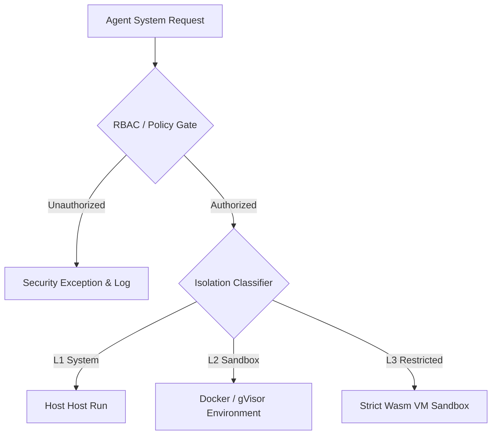

# MCP Security Policy (Project Venus V0.8)

## 1. Security Architecture & Threat Model
This document defines the security parameters governing Model Context Protocol (MCP) server execution, communication channel isolation, and access control levels across the Venus Enterprise environment.



---

## 2. Authentication & Authorization Policies

### 2.1 Role-Based Access Control (RBAC)
All agents attempting to call a tool registered on an MCP server must present a signed JSON Web Token (JWT) in the initialization handshake:

*   **L1 clearance (System Admin):** Can execute any system-level script or read local directories.
*   **L2 clearance (Departmental):** Access restricted to departmental databases and approved external endpoints.
*   **L3 clearance (Task-Specific):** Limited to transient computation tools (e.g., standard calculators, single-cell formatting utilities).

### 2.2 JWT Claims Verification Structure
The host verification middleware inspects the following claims before routing:

```json
{
  "iss": "venus-identity-provider",
  "sub": "agent-instance-449",
  "aud": "mcp-server-database-utility",
  "exp": 1782449000,
  "clearance": "L2",
  "allowed_tools": ["run_read_query", "format_output"]
}
```

---

## 3. Data Sanitization & Input Guardrails
To prevent Prompt Injection and execution attacks (such as SQL Injection or Command Injection), the following sanitization rules must be applied inside the host middleware before tool serialization:

1.  **Strict Regex Matching:** Inputs must match input schemas defined in [TOOL_SCHEMA_DEFINITION.md](file:///Users/dronpancholi/Developer/01_Strategic/Venus/uaieos_templates/TOOL_SCHEMA_DEFINITION.md).
2.  **Escape Injection Markers:** Block characters like `;`, `&&`, `|`, and backticks unless explicitly allowed and sandboxed.
3.  **Maximum Character Limits:** Clamp argument payload sizes based on:

$$\text{Max Payload Size} = 10 \text{ KB} + \text{Context Length Margin}$$

---

## 4. Host System Auditing & Logging Standards
Every tool execution attempt must write a structured log entry to the secure centralized audit database (e.g., Cloud Logging / Elasticsearch). The log entry must contain:

| Attribute | Log Severity | Description | Data Handling Rule |
| :--- | :--- | :--- | :--- |
| `timestamp` | Info | Time of initiation. | Plaintext |
| `agent_id` | Info | Caller unique ID. | Plaintext |
| `tool_name` | Info | Target endpoint identifier. | Plaintext |
| `arguments` | Debug / Warning | Inputs passed by agent. | **Masked / Redacted (PII Check)** |
| `execution_status` | Info / Error | Outcome (`success`, `rejected`, `failed`). | Plaintext |
| `response_hash` | Info | SHA-256 fingerprint of output data. | Plaintext |

---

## 5. Cross-References
*   Registry configurations mapped to clearances are defined in [MCP_TOOL_REGISTRY_SCHEMA.md](file:///Users/dronpancholi/Developer/01_Strategic/Venus/uaieos_templates/MCP_TOOL_REGISTRY_SCHEMA.md).
*   Detailed sandboxing implementation steps are located in [TOOL_SANDBOXING_POLICY.md](file:///Users/dronpancholi/Developer/01_Strategic/Venus/uaieos_templates/TOOL_SANDBOXING_POLICY.md).
*   Network connection security settings for servers are outlined in [MCP_SERVER_SPECIFICATION.md](file:///Users/dronpancholi/Developer/01_Strategic/Venus/uaieos_templates/MCP_SERVER_SPECIFICATION.md).
