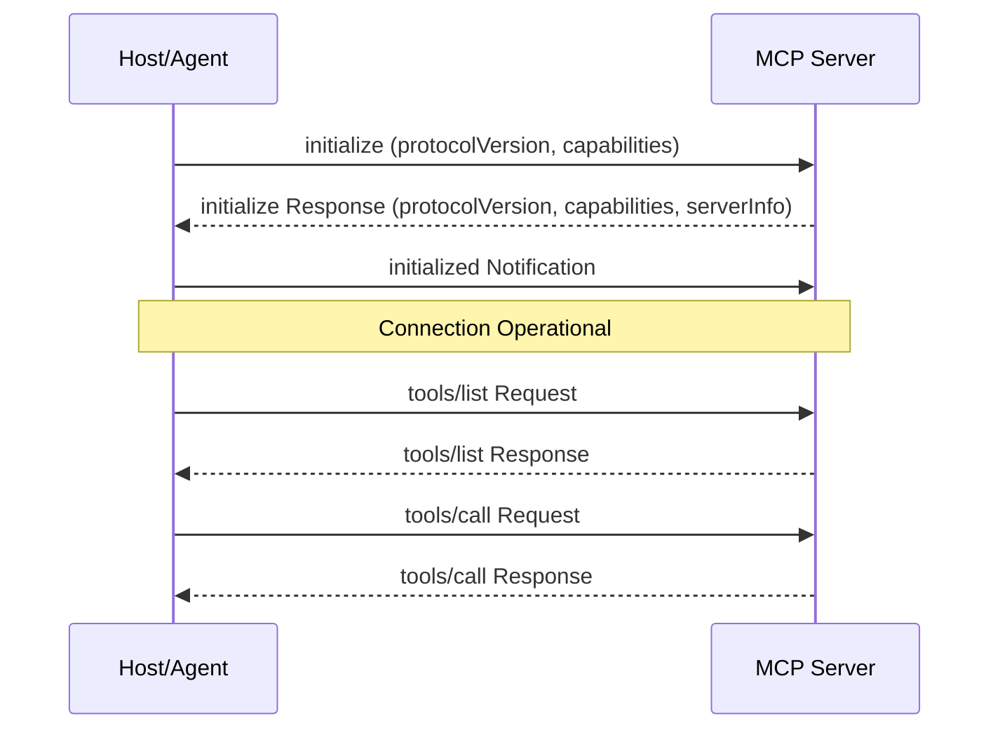

# MCP Server Specification (Project Venus V0.8)

## 1. Introduction
This specification defines the standards for implementing Model Context Protocol (MCP) servers within Project Venus. MCP servers act as bridges to expose structured tools, prompts, and resources to LLMs via standardized JSON-RPC protocols.

---

## 2. Protocol & Transport Options
MCP servers support two primary transport protocols:

1.  **Stdio Transport:**
    *   *Communication:* JSON-RPC 2.0 messages serialized over standard input (`stdin`) and standard output (`stdout`).
    *   *Logging:* Written to standard error (`stderr`) to prevent JSON-RPC stream corruption.
    *   *Use Case:* Local execution, CLI agents, containerized tools.
2.  **Server-Sent Events (SSE) Transport:**
    *   *Communication:* Server sends events to client via HTTP SSE; Client posts actions to Server via HTTP POST.
    *   *Use Case:* Cloud deployments, multi-tenant tooling, distributed microservices.

---

## 3. Protocol Lifecycle & Method Implementations



### 3.1 Initialization Handshake
*   **Method:** `initialize` (Request)
    *   *Client Parameter Structure:*
    ```json
    {
      "protocolVersion": "2024-11-05",
      "capabilities": {
        "roots": { "listChanged": true },
        "sampling": {}
      },
      "clientInfo": {
        "name": "VenusAgentRunner",
        "version": "0.8.0"
      }
    }
    ```
    *   *Server Response Structure:*
    ```json
    {
      "protocolVersion": "2024-11-05",
      "capabilities": {
        "tools": { "listChanged": true },
        "resources": { "subscribe": true }
      },
      "serverInfo": {
        "name": "DatabaseQueryEngine",
        "version": "1.2.0"
      }
    }
    ```
*   **Method:** `notifications/initialized` (Notification sent by client after processing server initialization response).

### 3.2 Core Capabilities Methods

#### Tools Retrieval & Execution
*   **Method:** `tools/list`
    *   *Description:* Retrieves array of tool definitions.
*   **Method:** `tools/call`
    *   *Description:* Executes a tool on the server.
    *   *Request Payload:*
    ```json
    {
      "method": "tools/call",
      "params": {
        "name": "execute_sql_query",
        "arguments": {
          "query": "SELECT * FROM users LIMIT 10;"
        }
      }
    }
    ```

#### Resources Management
*   **Method:** `resources/list`
    *   *Description:* Exposes static data sources or system states.
*   **Method:** `resources/read`
    *   *Description:* Fetches resource payload by URI.

---

## 4. Operational & Performance Standards
*   **Timeout SLA:** Every MCP request must return within $5,000\text{ ms}$. If execution is asynchronous, the server should return a ticket/status URL, avoiding blocking the socket stream.
*   **Keep-Alive Ping:** SSE connections must transmit a keep-alive heart-beat event every $15\text{ seconds}$.
*   **Error Codes:** JSON-RPC standard error codes must be adhered to:
    *   `-32700`: Parse error.
    *   `-32600`: Invalid Request.
    *   `-32601`: Method not found.
    *   `-32602`: Invalid params.
    *   `-32000` to `-32099`: Server-defined execution errors.

---

## 5. Cross-References
*   The schemas for registered tools are governed by [MCP_TOOL_REGISTRY_SCHEMA.md](file:///Users/dronpancholi/Developer/01_Strategic/Venus/uaieos_templates/MCP_TOOL_REGISTRY_SCHEMA.md).
*   Security rules covering transport and execution are detailed in [MCP_SECURITY_POLICY.md](file:///Users/dronpancholi/Developer/01_Strategic/Venus/uaieos_templates/MCP_SECURITY_POLICY.md).
*   Dynamic circuit breaking for slow servers is defined in [TOOL_FALLBACK_CIRCUIT_BREAKER.md](file:///Users/dronpancholi/Developer/01_Strategic/Venus/uaieos_templates/TOOL_FALLBACK_CIRCUIT_BREAKER.md).
