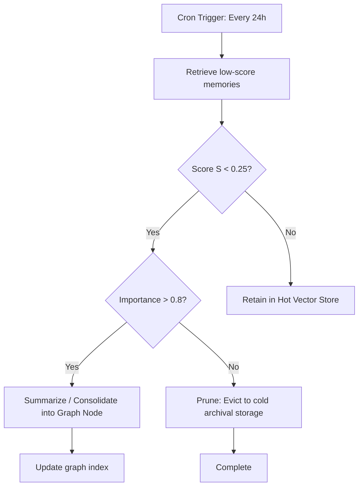

# Memory Pruning & Retrieval Specification (Project Venus V0.8)

## 1. Objective
This specification defines the runtime pruning algorithms, retrieval scoring functions, and offline consolidation logic used to manage agent long-term memory capacity and context window efficiency.

---

## 2. Memory Retrieval Scoring System

### 2.1 Retrieval Utility Scoring Formula
When querying memory, candidate blocks are scored using a weighted utility function that balances recency ($S_{\text{recency}}$), frequency ($S_{\text{frequency}}$), and semantic relevance ($S_{\text{relevance}}$):

$$\text{Memory\_Score}(m) = w_r \cdot S_{\text{recency}}(m) + w_f \cdot S_{\text{frequency}}(m) + w_s \cdot S_{\text{relevance}}(m)$$

Where:
*   **Recency ($S_{\text{recency}}$):** Applies an exponential decay function based on the elapsed time $\Delta t$ (in hours) since the memory was last accessed:

$$S_{\text{recency}}(m) = e^{-\lambda \cdot \Delta t}$$

*   **Frequency ($S_{\text{frequency}}$):** Computes log-normalized frequency of access:

$$S_{\text{frequency}}(m) = \frac{\ln(1 + N_{\text{access}})}{\ln(1 + N_{\text{max\_access}})}$$

*   **Relevance ($S_{\text{relevance}}$):** The cosine similarity between the query embedding $Q$ and memory embedding $M$:

$$S_{\text{relevance}}(m) = \frac{Q \cdot M}{\|Q\| \|M\|}$$

*   **Weights:** Configurable coefficients satisfying $w_r + w_f + w_s = 1.0$. Default configuration:

$$\{w_r = 0.25, w_f = 0.25, w_s = 0.50\}$$

---

## 3. Memory Pruning & Consolidation Pipeline
Memory grows continuously. To prevent search speed degradation and token cost spikes, a background pruning worker runs asynchronously.

### 3.1 Pruning and Eviction Criteria
*   **Hot Vector Store Eviction:** If the vector database exceeds $100,000$ points per agent namespace, memories with a retrieval score $S < 0.30$ and an access count of $1$ (within $30$ days) are queued for eviction.
*   **Consolidation:** Evicted memories undergo a summarization step (using `Model-B-Utility`) to condense multiple conversational blocks into unified declarative statements (e.g., "User prefers PostgreSQL over MongoDB for structured analytics"). These statements are written to the entity graph, while the raw chunk data is deleted.

---

## 4. Vector Query Gating
To prevent the model from processing irrelevant or noisy contextual noise, queries to the vector store discard all results below a strict similarity cutoff:

$$\text{Relevance Threshold } (\theta_{\text{rel}}) = 0.72$$

Any segment yielding $S_{\text{relevance}} < \theta_{\text{rel}}$ is excluded from the context insertion pipeline.

---

## 5. Cross-References
*   The storage layouts and schema designs are defined in [MEMORY_SCHEMA_ARCHITECTURE.md](file:///Users/dronpancholi/Developer/01_Strategic/Venus/uaieos_templates/MEMORY_SCHEMA_ARCHITECTURE.md).
*   Dynamic allocations within the context window are detailed in [CONTEXT_WINDOW_PRIORITIZATION.md](file:///Users/dronpancholi/Developer/01_Strategic/Venus/uaieos_templates/CONTEXT_WINDOW_PRIORITIZATION.md).
*   Cosine similarity vector search mechanics are documented in [RAG_INDEXING_RETRIEVAL_SPEC.md](file:///Users/dronpancholi/Developer/01_Strategic/Venus/uaieos_templates/RAG_INDEXING_RETRIEVAL_SPEC.md).
