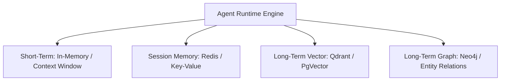

# Memory Schema Architecture (Project Venus V0.8)

## 1. Executive Summary
This document specifies the storage schemas, metadata structures, and access topologies for agent memory subsystems. The architecture supports multi-level context retrieval, graph-based relationship mappings, and semantic vector indexes.

---

## 2. Memory Topologies & Layers



---

## 3. Storage Schema Definitions

### 3.1 Session Conversation Store (JSON Document Structure)
This schema defines the multi-turn session ledger stored in high-performance caches (e.g., Redis JSON or MongoDB).

```json
{
  "$schema": "http://json-schema.org/draft-07/schema#",
  "title": "VenusSessionMemory",
  "type": "object",
  "properties": {
    "session_id": { "type": "string", "format": "uuid" },
    "user_id": { "type": "string" },
    "metadata": {
      "type": "object",
      "properties": {
        "created_at": { "type": "string", "format": "date-time" },
        "last_accessed": { "type": "string", "format": "date-time" },
        "domain": { "type": "string" }
      },
      "required": ["created_at", "last_accessed"]
    },
    "turns": {
      "type": "array",
      "items": {
        "type": "object",
        "properties": {
          "turn_id": { "type": "integer" },
          "role": { "type": "string", "enum": ["user", "assistant", "system"] },
          "content": { "type": "string" },
          "embedding_id": { "type": "string", "format": "uuid" },
          "tokens_used": { "type": "integer" }
        },
        "required": ["turn_id", "role", "content"]
      }
    }
  },
  "required": ["session_id", "user_id", "metadata", "turns"]
}
```

### 3.2 Long-Term Vector Memory Index Schema
Stored in vector engines (e.g., PgVector or Qdrant), representing semantic memory chunks:

*   **Vector Dimensions:** $768$ or $1536$ dimensions (model dependent).
*   **Distance Metric:** Cosine similarity.
*   **Metadata payload properties:**
    *   `memory_id` (UUID): Primary key.
    *   `session_id` (UUID): Relationship trace to source chat session.
    *   `content` (String): Raw semantic string.
    *   `importance_score` (Float range $[0.0, 1.0]$): Importance multiplier based on attention or frequency.
    *   `access_count` (Integer): Frequency count.
    *   `last_accessed_at` (Timestamp): Timestamp for recency decays.

---

## 4. Entity-Relationship Graph Memory Schema
To support relational reasoning across conversations, the system writes entities to a graph database (Neo4j).

*   **Node Types:**
    *   `Entity`: `{name: String, type: "Organization"|"Person"|"Project"|"Concept"}`
    *   `MemoryBlock`: `{memory_id: UUID, created_at: DateTime}`
*   **Relationship Types:**
    *   `MENTIONED_IN`: Connects `Entity` to `MemoryBlock`.
    *   `RELATED_TO`: `{strength: Float, relation_type: String}` - Connects `Entity` to `Entity`.

---

## 5. Cross-References
*   Pruning algorithms for clearing old or irrelevant memories are defined in [MEMORY_PRUNING_RETRIEVAL_SPEC.md](file:///Users/dronpancholi/Developer/01_Strategic/Venus/uaieos_templates/MEMORY_PRUNING_RETRIEVAL_SPEC.md).
*   Context window distribution models are outlined in [CONTEXT_WINDOW_PRIORITIZATION.md](file:///Users/dronpancholi/Developer/01_Strategic/Venus/uaieos_templates/CONTEXT_WINDOW_PRIORITIZATION.md).
*   Vector search similarity formulas are documented in [RAG_INDEXING_RETRIEVAL_SPEC.md](file:///Users/dronpancholi/Developer/01_Strategic/Venus/uaieos_templates/RAG_INDEXING_RETRIEVAL_SPEC.md).
