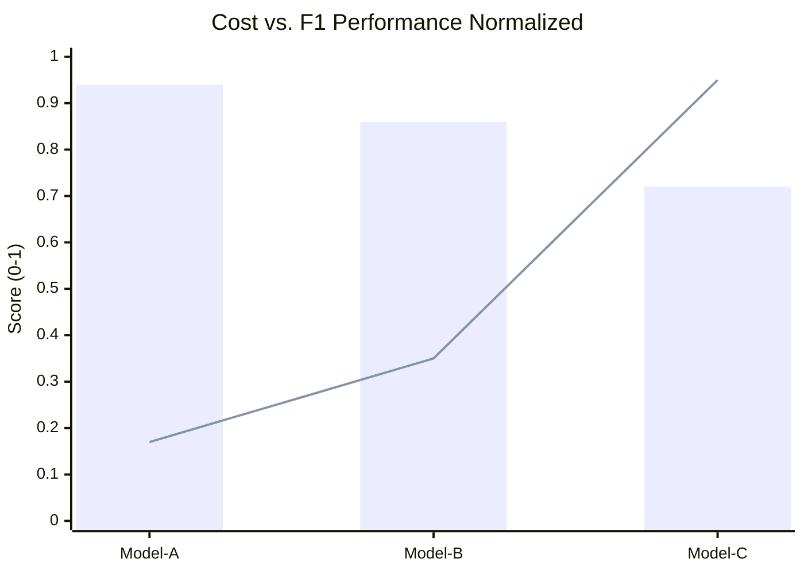

# Model Evaluation Report (Project Venus V0.8)

## 1. Executive Overview
This report documents the performance evaluation of candidate AI models for inclusion in the Project Venus runtime. Evaluation spans semantic capabilities, alignment metrics, execution latency, and cost efficiency.

---

## 2. Evaluation Methodology & Metrics

### 2.1 Core Metrics Definitions
*   **Precision ($P$):** $\frac{TP}{TP + FP}$
*   **Recall ($R$):** $\frac{TP}{TP + FN}$
*   **F1-Score:** $2 \cdot \frac{P \cdot R}{P + R}$
*   **Expected Calibration Error (ECE):** Evaluates model confidence alignment over $M$ bins.

### 2.2 Cohort Comparison Z-Score
To evaluate whether a model update or new candidate ($p_1$) provides a statistically significant improvement in task accuracy over the baseline ($p_2$), we compute the Cohort Z-score:

$$Z = \frac{p_1 - p_2}{\sqrt{p(1-p)\left(\frac{1}{n_1} + \frac{1}{n_2}\right)}}$$

Where:
*   $p_1, p_2$ are the success rates of the candidate and baseline models respectively.
*   $n_1, n_2$ are the sample sizes of the test cohorts.
*   $p$ is the pooled success rate, calculated as:

$$p = \frac{x_1 + x_2}{n_1 + n_2}$$

Where $x_1$ and $x_2$ are the absolute successes in each cohort. A $|Z| > 1.96$ indicates statistical significance at the $95\%$ confidence level.

---

## 3. Evaluation Summary Matrix

| Model Identifier | Primary Provider | ECE | Task Success Rate | Mean Latency (ms) | Tokens / Sec | Z-Score (vs Baseline) | Recommendation |
| :--- | :--- | :--- | :--- | :--- | :--- | :--- | :--- |
| **Model-A-Frontier** | Provider-Alpha | $0.034$ | $92.4\%$ | $1200$ | $85$ | $+2.45$ (Significant) | **Promote to Production** |
| **Model-B-Utility** | Provider-Beta | $0.052$ | $85.1\%$ | $450$ | $120$ | $+0.12$ (Neutral) | **Retain in Staging** |
| **Model-C-Special** | Local-Host | $0.081$ | $79.8\%$ | $180$ | $210$ | $-3.10$ (Degraded) | **Decommission** |

---

## 4. Cost-Benefit Tradeoff Matrix
Evaluated using the token-cost model:

$$\text{Total Cost} = (N_{\text{input}} \cdot C_{\text{input}}) + (N_{\text{output}} \cdot C_{\text{output}})$$

Where $C$ represents cost per token.

| Model ID | Input Cost ($/1M) | Output Cost ($/1M) | Cost/1k Queries (Avg.) | Normalized F1 Score | ROI Ratio ($\frac{\text{F1}}{\text{Cost}}$) |
| :--- | :--- | :--- | :--- | :--- | :--- |
| **Model-A-Frontier** | $3.00$ | $15.00$ | $5.40$ | $0.94$ | $0.174$ |
| **Model-B-Utility** | $0.20$ | $0.60$ | $0.24$ | $0.86$ | $3.583$ |
| **Model-C-Special** | $0.05$ | $0.15$ | $0.06$ | $0.72$ | $12.000$ |

*(Line denotes normalized ROI index; Bar denotes F1 accuracy score).*

---

## 5. Deployment Recommendation
Based on the cohort Z-score of $+2.45$, Model-A-Frontier is approved for reasoning pipelines. Due to extreme ROI efficiency, Model-B-Utility is selected as the primary routing fallback for non-reasoning calls.

---

## 6. Cross-References
*   The baseline taxonomy is configured in [AI_TAXONOMY_SPEC.md](file:///Users/dronpancholi/Developer/01_Strategic/Venus/uaieos_templates/AI_TAXONOMY_SPEC.md).
*   Routing mechanics for these evaluated models are detailed in [DYNAMIC_MODEL_ROUTING_SPEC.md](file:///Users/dronpancholi/Developer/01_Strategic/Venus/uaieos_templates/DYNAMIC_MODEL_ROUTING_SPEC.md).
*   Provider service level comparisons are listed in [MODEL_PROVIDER_COMPARISON.md](file:///Users/dronpancholi/Developer/01_Strategic/Venus/uaieos_templates/MODEL_PROVIDER_COMPARISON.md).
