# Model Provider Comparison (Project Venus V0.8)

## 1. Scope
This document compares verified LLM providers integrated into the Project Venus runtime environment. The matrix facilitates optimal decision-making for dynamic routing, procurement, and data residency audits.

---

## 2. Provider Evaluation Matrix

| Provider Name | API Architecture | Availability SLA | Compliance Certifications | Data Residency Support | Rate Limit Scope (Tpm / Rpm) |
| :--- | :--- | :--- | :--- | :--- | :--- |
| **Google Gemini** | REST / gRPC | $99.95\%$ | SOC2 Type II, HIPAA, ISO 27001 | EU, US, APAC | 4,000,000 / 30,000 |
| **Anthropic** | REST | $99.90\%$ | SOC2 Type II, HIPAA | US, EU | 1,200,000 / 10,000 |
| **OpenAI** | REST | $99.90\%$ | SOC2 Type II, HIPAA | US, EU | 2,000,000 / 15,000 |
| **DeepSeek** | REST | $99.50\%$ | ISO 27001 | APAC, EU | 500,000 / 2,000 |
| **Local (Ollama/vLLM)** | REST (Local) | $100.00\%$ (Self-hosted) | Internal SecOps Standard | Absolute (On-Prem / VPC) | Unlimited (Hardware Bound) |

---

## 3. SLA and Latency Analysis

### 3.1 Network Overheads and Time-to-First-Token (TTFT)
Latency metrics are evaluated under a standard load of 1,000 concurrent sessions:

$$\text{Total Latency} = \text{TTFT} + \left( N_{\text{tokens}} \cdot \text{TBT} \right)$$

Where:
*   $\text{TTFT}$ is the Time-to-First-Token (network overhead + pre-fill phase).
*   $\text{TBT}$ is the Time-Between-Tokens (generation phase).
*   $N_{\text{tokens}}$ is the number of generated tokens.

```mermaid
gantt
    title Mean TTFT and Generation Profiles (100 Token Response)
    dateFormat X
    axisFormat %s
    section Google Gemini
    TTFT (200ms)           :active, a1, 0, 2
    Generation (400ms)     :after a1, 6
    section Anthropic
    TTFT (350ms)           :active, b1, 0, 3.5
    Generation (600ms)     :after b1, 9.5
    section Local (vLLM)
    TTFT (50ms)            :active, c1, 0, 0.5
    Generation (300ms)     :after c1, 3.5
```

---

## 4. Compliance and Security Isolation Levels

1.  **Level 1: Local Deployment (On-Premises / Private VPC)**
    *   *Providers:* Local (vLLM / Ollama).
    *   *Data Policy:* Zero egress. Zero data retention. No external logging.
2.  **Level 2: Zero Data Retention (ZDR) Cloud Endpoints**
    *   *Providers:* Anthropic (Enterprise API), Google Cloud Vertex AI (Enterprise).
    *   *Data Policy:* Data transient in memory, not written to persistent storage.
3.  **Level 3: Standard Commercial Cloud API**
    *   *Providers:* OpenAI API, DeepSeek.
    *   *Data Policy:* Data retained for abuse monitoring (up to 30 days) before deletion.

---

## 5. Cross-References
*   The baseline taxonomy mappings are detailed in [AI_TAXONOMY_SPEC.md](file:///Users/dronpancholi/Developer/01_Strategic/Venus/uaieos_templates/AI_TAXONOMY_SPEC.md).
*   Routing logic between cloud and local options is implemented in [DYNAMIC_MODEL_ROUTING_SPEC.md](file:///Users/dronpancholi/Developer/01_Strategic/Venus/uaieos_templates/DYNAMIC_MODEL_ROUTING_SPEC.md).
*   Evaluation reports validating provider performance are located in [MODEL_EVALUATION_REPORT.md](file:///Users/dronpancholi/Developer/01_Strategic/Venus/uaieos_templates/MODEL_EVALUATION_REPORT.md).
