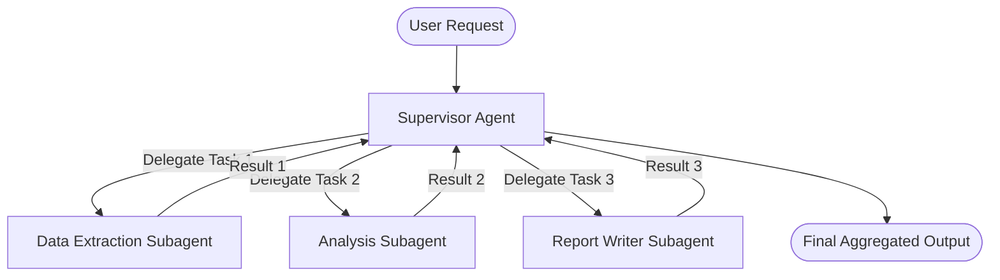

# Multi-Agent Orchestration Specification (Project Venus V0.8)

## 1. Orchestration Topologies
This specification outlines the architecture, coordination topologies, and task delegation patterns for multi-agent systems within the Venus Enterprise ecosystem.

### 1.1 Hierarchical Supervisor Pattern
A supervisor agent coordinates task delegation, analyzes inputs, dispatches work to specialized subagents, and synthesizes final outputs.



### 1.2 Choreography (Chained) Pattern
Agents coordinate task completion sequentially, passing execution context forward along a pipeline without a central orchestrator.

```
[Agent A: Parser] ──(Structured Data)──> [Agent B: Enrichment] ──(Enriched Payload)──> [Agent C: Validation]
```

---

## 2. DAG Engine: Task Planning and Dependencies
For complex execution paths, the Orchestrator generates a Directed Acyclic Graph (DAG) of tasks.

### 2.1 Scheduling Algorithm
Let $G = (V, E)$ be a directed acyclic graph where $V$ represents the tasks to execute, and $E$ represents execution dependencies. The orchestrator schedules task resolution using a topological sort algorithm combined with parallel execution queues:

1.  Compute in-degree for all vertices $v \in V$.
2.  Queue all tasks $v$ with $\text{in-degree}(v) = 0$.
3.  While the queue is not empty:
    *   Dequeue a batch of independent tasks and execute them in parallel (using threads or async worker pools).
    *   Upon successful task execution, decrement in-degree of all target nodes $u$ where $(v, u) \in E$.
    *   If any $\text{in-degree}(u) == 0$, enqueue $u$.
4.  If nodes remain unresolved and the queue is empty, flag a circular dependency error.

---

## 3. Conflict Resolution and Consensus

### 3.1 Consensus Protocols
When multiple specialized agents output conflicting recommendations, the Orchestrator resolves using the following strategies:

*   **Weighted Voting:** Consensus score computed based on agent trust metrics:

$$S_{\text{consensus}} = \sum_{a \in A} w_a \cdot C_a$$

Where $w_a$ is the historical accuracy weight of agent $a$, and $C_a$ is the confidence rating of the decision.
*   **Arbitration Loop:** A dedicated Arbitrator Agent evaluates the conflict payload and executes a reasoning cycle to override or merge outputs.

---

## 4. Execution State Context Map
The orchestrator maintains an execution context map shared among active agents:

```json
{
  "orchestration_id": "orch-8973-2026",
  "dag": {
    "nodes": ["t1", "t2", "t3"],
    "edges": [
      {"from": "t1", "to": "t2"},
      {"from": "t2", "to": "t3"}
    ]
  },
  "shared_context": {
    "extracted_parameters": {},
    "validation_status": "pending",
    "payload_ref": "s3://bucket/venus/payload_2026.json"
  },
  "subagent_pool": {
    "t1": { "agent_id": "extractor-77", "status": "completed", "output_ref": "..." },
    "t2": { "agent_id": "analyzer-12", "status": "executing" },
    "t3": { "agent_id": "reporter-09", "status": "blocked" }
  }
}
```

---

## 5. Cross-References
*   Individual agent configurations must conform to [AGENT_ARCHITECTURE_BLUEPRINT.md](file:///Users/dronpancholi/Developer/01_Strategic/Venus/uaieos_templates/AGENT_ARCHITECTURE_BLUEPRINT.md).
*   Details of the underlying communication formats are described in [AGENT_COMMUNICATION_PROTOCOL.md](file:///Users/dronpancholi/Developer/01_Strategic/Venus/uaieos_templates/AGENT_COMMUNICATION_PROTOCOL.md).
*   External tools mapped into agent tasks are detailed in [MCP_TOOL_REGISTRY_SCHEMA.md](file:///Users/dronpancholi/Developer/01_Strategic/Venus/uaieos_templates/MCP_TOOL_REGISTRY_SCHEMA.md).
