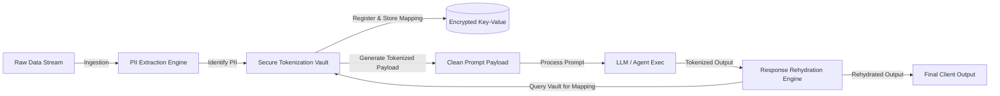

# PII Masking & Data Leak Prevention Policy
**Document ID:** Venus-UAIEOS-TEMP-25  
**Version:** V0.8  
**Classification:** Institutional-Grade Operations Template  
**Target Directory:** `file:///Users/dronpancholi/Developer/01_Strategic/Venus/uaieos_templates/`  

---

## 1. Executive Summary & Objectives

The integration of Large Language Models and agents with enterprise data sources poses significant risks regarding the leakage of Personally Identifiable Information (PII), Protected Health Information (PHI), and proprietary IP to public model providers or untrusted logs.

This document establishes the **PII Masking & Data Leak Prevention Policy** to:
1. Define PII/PHI categories and data classification standards.
2. Outline tokenization and pseudonymization processes.
3. Formulate statistical measures (Cohort Z-score) to validate leakage reduction.
4. Establish audit protocols and recovery checklists.

---

## 2. Policy Scope & Data Classifications

All datasets, prompt contexts, and model outputs must be classified and handled according to the following matrix:

| Data Class | Example Elements | Allowable Storage | Pre-Send Requirement |
|---|---|---|---|
| **Class 4: Public** | Press releases, public docs | Cloud Storage / Vector DB | No restriction |
| **Class 3: Confidential**| Corporate internal reports | Dedicated VPC / DB | Stripped of metadata |
| **Class 2: Restricted (PII)**| Names, emails, IP addresses | Encrypted DB / KMS | **Mandatory Redaction or Pseudo-anonymization** |
| **Class 1: Highly Sensitive**| SSNs, Credit Cards, Medical IDs | Secure Vault / HSM | **Absolute Block** (Never sent to external LLMs) |

---

## 3. Masking & Pseudonymization Schema

To preserve the context of prompts without exposing the raw values, the system utilizes a **Tokenization Vault**. 



### 3.1 Masking Mapping Format
A raw input string: 
`"Contact John Doe at john.doe@example.com for account 4582910"`  
is converted to:  
`"Contact [PERSON_1] at [EMAIL_1] for account [ACCOUNT_ID_1]"`

---

## 4. Statistical Validation of Data Leakage (Cohort Z-score)

To verify the effectiveness of the masking engine, safety teams must perform statistical evaluations on audit datasets. We compare the leak rates between an unmasked cohort (Cohort 1) and a masked cohort (Cohort 2).

Let:
*   $n_1$ and $n_2$ be the sizes of Cohort 1 and Cohort 2 respectively.
*   $x_1$ and $x_2$ be the number of leaked PII instances detected in the logs of Cohort 1 and Cohort 2.
*   $p_1 = x_1 / n_1$ and $p_2 = x_2 / n_2$ be the empirical leakage proportions.

The pooled proportion $p$ is calculated as:

$$p = \frac{x_1 + x_2}{n_1 + n_2}$$

The **Cohort Z-score** for the difference in leakage rates is computed as:

$$Z = \frac{p_1 - p_2}{\sqrt{p(1-p)\left(\frac{1}{n_1} + \frac{1}{n_2}\right)}}$$

A critical value of $Z \ge 3.29$ (corresponding to $p < 0.001$, one-tailed) is required to statistically validate that the PII masking policy implementation yields a significant reduction in data leakage.

---

## 5. PII Masking Implementation Template

```python
"""
Venus PII Detection & Pseudonymization Pipeline
"""
import re
from typing import Dict, Tuple

class PIIPseudonymizer:
    def __init__(self):
        # High confidence patterns
        self.email_regex = re.compile(r'\b[A-Za-z0-9._%+-]+@[A-Za-z0-9.-]+\.[A-Z|a-z]{2,}\b')
        self.phone_regex = re.compile(r'\b(?:\+?\d{1,3}[-.\s]?)?\(?\d{3}\)?[-.\s]?\d{3}[-.\s]?\d{4}\b')
        
    def mask_text(self, text: str) -> Tuple[str, Dict[str, str]]:
        """
        Detects PII elements, generates tokens, and registers mappings.
        Returns (masked_text, vault_mapping)
        """
        vault = {}
        masked = text
        
        # Mask Emails
        emails = self.email_regex.findall(masked)
        for idx, email in enumerate(set(emails)):
            token = f"[EMAIL_{idx + 1}]"
            vault[token] = email
            masked = masked.replace(email, token)
            
        # Mask Phone Numbers
        phones = self.phone_regex.findall(masked)
        for idx, phone in enumerate(set(phones)):
            token = f"[PHONE_{idx + 1}]"
            vault[token] = phone
            masked = masked.replace(phone, token)
            
        return masked, vault

    def rehydrate_text(self, masked_text: str, vault_mapping: Dict[str, str]) -> str:
        """
        Rehydrates response text replacing tokens with raw values.
        """
        rehydrated = masked_text
        for token, raw_val in vault_mapping.items():
            rehydrated = rehydrated.replace(token, raw_val)
        return rehydrated
```

---

## 6. Incident Compliance & Post-Leak Checklist

In the event of a confirmed Class 1 or Class 2 leak to public environments:
- [ ] **1. Isolation:** Deactivate the compromised LLM pipeline keys immediately.
- [ ] **2. Cache Purge:** Execute flush commands on vector databases, session states, and downstream cache servers.
- [ ] **3. Vault Audit:** Validate that keys stored in the KMS tokenization vault are rotated.
- [ ] **4. Regulatory Logging:** Record incident details in the central compliance register:

```csv
incident_id,timestamp,system_context,leak_classification,remediating_engineer,resolution_status
```

---
*For data governance escalations, contact the Data Protection Officer at [Venus Systems](file:///Users/dronpancholi/Developer/01_Strategic/Venus/).*
