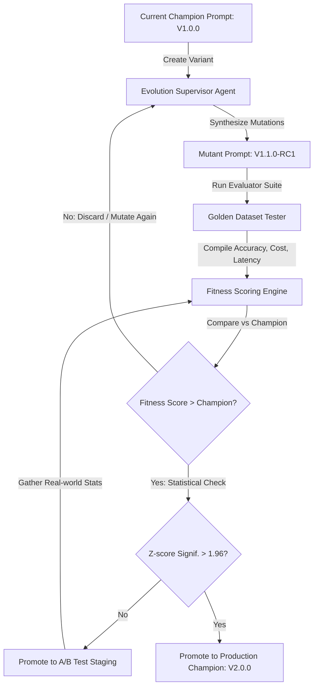

# Prompt Evolution Workflow
**Document ID:** Venus-UAIEOS-TEMP-34  
**Version:** V0.8  
**Classification:** Institutional-Grade Operations Template  
**Target Directory:** `file:///Users/dronpancholi/Developer/01_Strategic/Venus/uaieos_templates/`  

---

## 1. Executive Summary & Objectives

System prompts are the principal code layer for configuring generative AI agents. Like traditional code, prompts must undergo continuous testing, variation, optimization, and controlled deployment. Ad-hoc modifications introduce performance regressions and lack transparency.

This document defines the **Prompt Evolution Workflow**, outlining:
1. The evolutionary tuning loop (Prompt Mutation & Selection).
2. The mathematical formulation of prompt fitness and statistical evaluation.
3. Version control standards (Semantic Prompt Versioning).
4. Automated migration pipelines.

---

## 2. Prompt Evolution Lifecycle

The evolution system functions as an automated optimization loop. Mutant prompts are generated by a supervisor model, tested against the golden evaluation suite, and promoted based on fitness improvements.



---

## 3. Mathematical Optimization & Selection

### 3.1 Fitness Function
To evaluate the overall quality of a prompt configuration $P$, we calculate its Fitness score using normalized accuracy ($A$), cost ($C$), and latency ($L$) metrics:

$$\text{Fitness}(P) = w_a \cdot A(P) - w_c \cdot C(P) - w_l \cdot L(P)$$

Where the weights satisfy the constraint:

$$w_a + w_c + w_l = 1.0 \quad (w_a \ge 0.60 \text{ default})$$

*   $A(P)$ is the pass rate on the golden dataset.
*   $C(P)$ is the average cost normalized against the budget limit.
*   $L(P)$ is the average execution time normalized against the target SLA.

### 3.2 Selection and Promotion (Cohort Z-score)
We compare the mutant prompt performance ($p_m$) against the current champion prompt performance ($p_c$) using a two-proportion Z-test over $n$ evaluation runs:

$$Z = \frac{p_m - p_c}{\sqrt{p(1-p)\left(\frac{1}{n_m} + \frac{1}{n_c}\right)}}$$

Where $p$ is the pooled success proportion. A mutant is automatically promoted to the **Champion** role if $Z \ge 1.96$ ($95\%$ confidence level). If $0 < Z < 1.96$, it is promoted to **Challenger** status for dynamic A/B testing in staging.

---

## 4. Semantic Prompt Versioning (SPV) Schema

Prompt files must follow the semantic versioning schema: `MAJOR.MINOR.PATCH`.

```markdown
  [MAJOR]  .  [MINOR]  .  [PATCH]
     │           │           │
     │           │           └─ Minor updates (Word adjustments, temperature modifications)
     │           └───────────── Structural changes (Adding safety clauses, input/output schemas)
     └───────────────────────── Model migrations (Moving from GPT-3.5 to GPT-4o, or changing providers)
```

---

## 5. Prompt Manifest Specification (YAML)

All prompts must be stored along with a declarative manifest file containing version metadata and hyperparameters:

```yaml
# Venus Prompt Configuration Schema
prompt_metadata:
  identifier: "AGT-FIN-EXTRACTOR"
  name: "Financial Data Extraction Prompt"
  version: "1.2.0"
  last_updated: "2026-06-26T03:06:06Z"
  author: "ML Tuning Agent"
  base_model: "gpt-4o-2024-05-13"
  hyperparameters:
    temperature: 0.0
    top_p: 0.95
    max_tokens: 1024
    frequency_penalty: 0.0
system_template: |
  You are an expert financial extraction agent. Analyze the provided company reports and structure the outputs.
  Rules:
  1. Extract only the values present in the source context.
  2. Structure output matching the JSON schema.
  3. Safety override: Never print personal medical data.
changelog:
  1.2.0: "Added safety override clause to block PHI leaks."
  1.1.0: "Modified formatting instructions to enforce stricter JSON parsing."
  1.0.0: "Initial baseline release."
```

---

## 6. Prompt Evolution Command Line

Use this script in CI/CD pipelines to validate prompt mutations before merging changes to main branches:

```bash
#!/usr/bin/env bash
# Venus Prompt Evolution Validator
set -euo pipefail

PROMPT_MANIFEST_PATH="/Users/dronpancholi/Developer/01_Strategic/Venus/uaieos_templates/prompt_manifest.yaml"
EVAL_PLAN="file:///Users/dronpancholi/Developer/01_Strategic/Venus/uaieos_templates/GOLDEN_DATASET_EVALUATION_PLAN.md"

echo "Validating prompt manifest compilation: $PROMPT_MANIFEST_PATH"
# Run yaml linter
if ! python3 -c "import yaml; yaml.safe_load(open('$PROMPT_MANIFEST_PATH'))" >/dev/null; then
    echo "ERROR: Prompt manifest is structurally invalid." >&2
    exit 1
fi

echo "Triggering evaluation suite for the mutated prompt..."
# Invoke pipeline script comparing candidate against current production champion
python -m venus.prompt.evolution \
    --manifest "$PROMPT_MANIFEST_PATH" \
    --eval-plan "$EVAL_PLAN" \
    --target-confidence 1.96

echo "Mutation evaluation complete. Status check passed."
```

---
*For optimization inquiries, contact the Prompt Engineering tuning desk at [Venus Systems](file:///Users/dronpancholi/Developer/01_Strategic/Venus/).*
