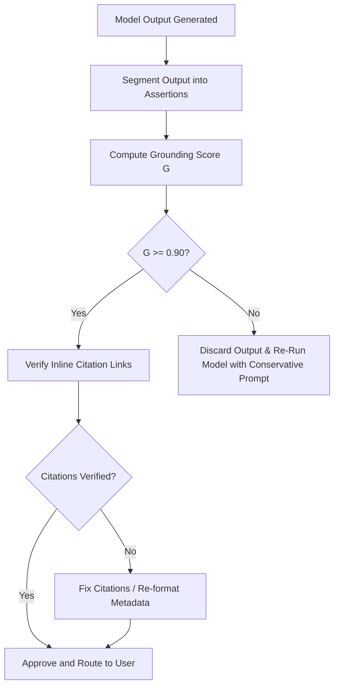

# RAG Citations & Grounding Specification (Project Venus V0.8)

## 1. Grounding & Citation Standards
This document specifies the format, verification algorithms, and response criteria to ensure all generated responses are grounded in retrieved source documents and free from hallucinated content.

---

## 2. Citation & Footnote Formats
Every response incorporating external source facts must provide precise inline references:

*   **Inline Citation Format:** Statements referencing source facts must end with an inline bracket containing the source index, e.g., `[Doc-1]`.
*   **Source Reference Block:** Responses must append a structured reference block mapping keys to file details, including the hash of the source block:

```markdown
### Sources:
- **[Doc-1]**: `/Users/dronpancholi/Developer/01_Strategic/Venus/docs/q2_finance.md` (SHA-256: `ab871c99f...`)
- **[Doc-2]**: `/Users/dronpancholi/Developer/01_Strategic/Venus/docs/internal_roadmap.md` (SHA-256: `90f121e4a...`)
```

---

## 3. Grounding Verification Scoring Formulas
To validate response quality before user delivery, the verification system evaluates three metrics: **Grounding Score ($G$)**, **Answer Relevance ($A_r$)**, and **Hallucination Index ($H$)**.

### 3.1 Grounding Score ($G$)
Measures the percentage of assertions in the output that are directly supported by the retrieved context.

$$G = \frac{N_{\text{grounded\_assertions}}}{N_{\text{total\_assertions}}}$$

Where:
*   $N_{\text{grounded\_assertions}}$ is the count of claims matching sentences in the retrieved chunks.
*   $N_{\text{total\_assertions}}$ is the total count of assertions extracted from the model's response.
*   *Validation Boundary:* Any output with $G < 0.90$ is rejected.

### 3.2 Answer Relevance ($A_r$)
Evaluates the semantic alignment of the response text $R$ relative to the user query $Q$:

$$A_r = \text{Cos}(R_{\text{embedding}}, Q_{\text{embedding}}) = \frac{R_{\text{embedding}} \cdot Q_{\text{embedding}}}{\|R_{\text{embedding}}\| \|Q_{\text{embedding}}\|}$$

### 3.3 Hallucination Index ($H$)
Quantifies the presence of unsupported semantic facts:

$$H = 1.0 - G$$

---

## 4. Verification Workflow Algorithm



### 4.1 Fallback Rules for Grounding Failures
If the grounding score $G$ falls below $0.90$ after two regeneration attempts:
1.  **Safety Override:** Abort generation to prevent hallucination.
2.  **Fallback Response:** Output a pre-formatted message: `"Error: Unable to verify system facts. Please contact system administrator."`
3.  **Audit Flag:** Write the query, source blocks, and failed outputs to the evaluation log file for audit analysis.

---

## 5. Cross-References
*   The retrieval pipeline providing these source files is documented in [RAG_INDEXING_RETRIEVAL_SPEC.md](file:///Users/dronpancholi/Developer/01_Strategic/Venus/uaieos_templates/RAG_INDEXING_RETRIEVAL_SPEC.md).
*   Metrics reporting and continuous RAG validation dashboards are detailed in [RAG_EVALUATION_REPORT.md](file:///Users/dronpancholi/Developer/01_Strategic/Venus/uaieos_templates/RAG_EVALUATION_REPORT.md).
*   Context budget parameters restricting source document insertions are in [CONTEXT_WINDOW_PRIORITIZATION.md](file:///Users/dronpancholi/Developer/01_Strategic/Venus/uaieos_templates/CONTEXT_WINDOW_PRIORITIZATION.md).
