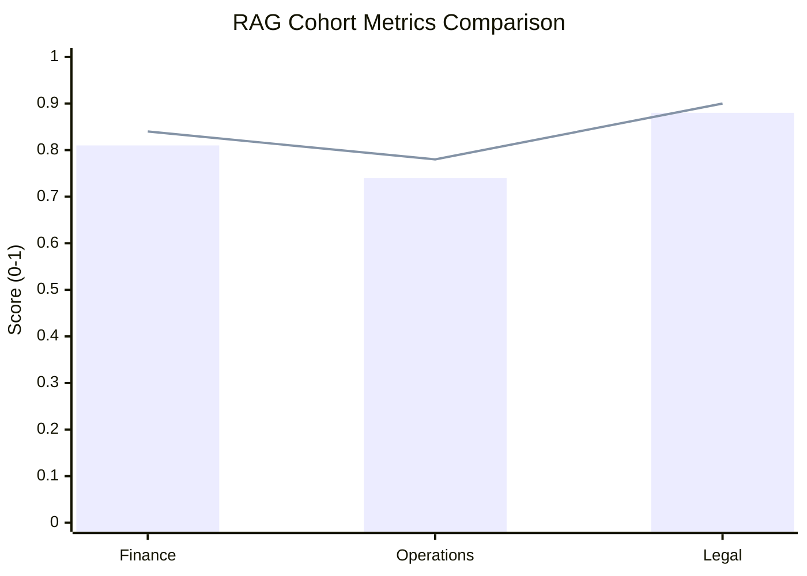

# RAG Evaluation Report (Project Venus V0.8)

## 1. Executive Summary
This report evaluates the performance of the Retrieval-Augmented Generation (RAG) system deployed under Project Venus. It covers indexing fidelity, retrieval metrics (Hit Rate, MRR, NDCG), and generator grounding performance.

---

## 2. Evaluation Metrics & Mathematical Formulations

### 2.1 Retrieval Performance Metrics

#### Mean Reciprocal Rank (MRR)
Evaluates the positional relevance of the first correctly retrieved chunk:

$$\text{MRR} = \frac{1}{|Q|} \sum_{i=1}^{|Q|} \frac{1}{\text{rank}_i}$$

Where $|Q|$ is the total number of evaluation queries, and $\text{rank}_i$ is the rank position of the first relevant document chunk for query $i$.

#### Normalized Discounted Cumulative Gain (NDCG@K)
Measures the ranking quality of retrieved results up to position $K$:

$$\text{NDCG@K} = \frac{\text{DCG@K}}{\text{IDCG@K}}$$

Where:
*   $\text{DCG@K} = \sum_{i=1}^{K} \frac{2^{\text{rel}_i} - 1}{\log_2(i + 1)}$
*   $\text{IDCG@K}$ is the Ideal DCG score (the sorting of results ordered by relevance).

### 2.2 Generation Quality Metrics

*   **Faithfulness:** Measures if all assertions in the generation match the retrieved source blocks.
*   **Answer Relevance:** Measures similarity between the generated response and the query.
*   **Context Recall:** Measures if the retrieval system extracted all relevant information for the query.

---

## 3. RAG Performance Benchmarks

| Test Cohort | Hit Rate @ 5 | MRR @ 5 | NDCG @ 5 | Faithfulness | Context Recall | Verdict |
| :--- | :--- | :--- | :--- | :--- | :--- | :--- |
| **Cohort-1 (Finance)** | $94.2\%$ | $0.81$ | $0.84$ | $92.5\%$ | $91.0\%$ | **PASS** |
| **Cohort-2 (Operations)** | $89.5\%$ | $0.74$ | $0.78$ | $90.1\%$ | $87.5\%$ | **PASS** |
| **Cohort-3 (Legal)** | $96.0\%$ | $0.88$ | $0.90$ | $98.2\%$ | $95.4\%$ | **PASS** |

*(Bar represents MRR@5; Line represents NDCG@5).*

---

## 4. Grounding Correlation and Error Analysis
Analysis of failed generation sessions highlights the following primary error clusters:

1.  **Context Overcrowding:** High token count in the context window dilutes model focus, causing a drop in Faithfulness.
2.  **Weak Reranker Cutoffs:** Low threshold metrics allowed irrelevant chunks to pass to the model, generating noise in outputs.
3.  **Out-of-Index Terminology:** Newly introduced product identifiers not indexed in sparse dictionaries caused semantic mismatches.

---

## 5. Cross-References
*   The indexing and retrieval systems are defined in [RAG_INDEXING_RETRIEVAL_SPEC.md](file:///Users/dronpancholi/Developer/01_Strategic/Venus/uaieos_templates/RAG_INDEXING_RETRIEVAL_SPEC.md).
*   Grounding score criteria are documented in [RAG_CITATIONS_GROUNDING_SPEC.md](file:///Users/dronpancholi/Developer/01_Strategic/Venus/uaieos_templates/RAG_CITATIONS_GROUNDING_SPEC.md).
*   Token management for evaluation is configured in [CONTEXT_WINDOW_PRIORITIZATION.md](file:///Users/dronpancholi/Developer/01_Strategic/Venus/uaieos_templates/CONTEXT_WINDOW_PRIORITIZATION.md).
