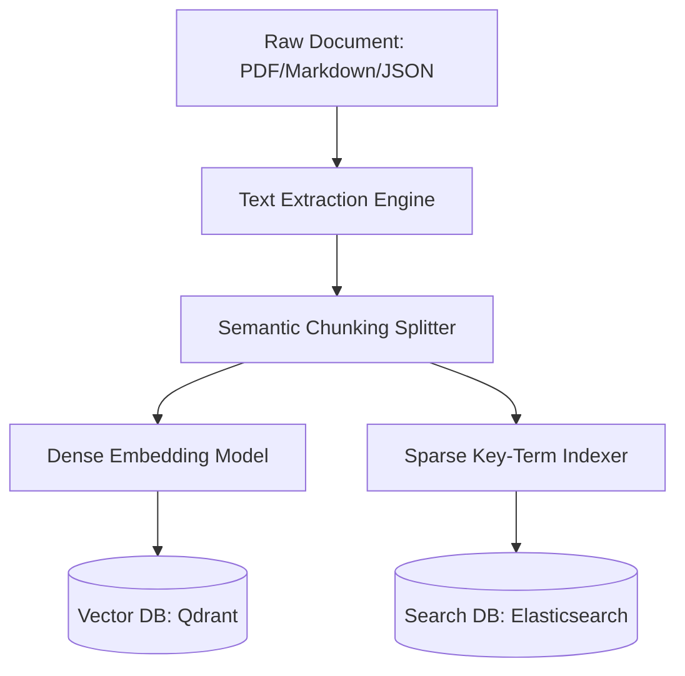

# RAG Indexing & Retrieval Specification (Project Venus V0.8)

## 1. Document Ingestion & Chunking Pipeline
This document defines the technical specifications, file chunking strategies, embedding standards, and hybrid retrieval techniques for the Venus Retrieval-Augmented Generation (RAG) platform.

### 1.1 Chunking Parameters
*   **Strategy:** Semantic Chunking with sliding token windows.
*   **Target Size:** $256$ tokens.
*   **Overlap Window:** $32$ tokens.
*   **Boundary Enforcement:** Split on structural markdown headers (`#`, `##`, `###`), list indicators (`-`), or sentence boundaries (`. `) to preserve semantic intent.

---

## 2. Ingestion Embedding Standards
*   **Primary Embedding Model:** `text-embedding-004` (768 Dimensions) / `text-embedding-3-large` (1536 Dimensions).
*   **Distance Metric:** Cosine similarity:

$$\text{Cos}(A, B) = \frac{A \cdot B}{\|A\| \|B\|}$$

*   **Precision Standard:** Float32 storage formatting.

---

## 3. Hybrid Search Retrieval Pipeline
The retrieval engine executes a hybrid query combining dense semantic vectors and sparse key-term lookups (BM25) to maximize recall and precision.

### 3.1 BM25 Sparse Search Score
$$\text{Score}_{\text{BM25}}(D, Q) = \sum_{i=1}^{n} \text{IDF}(q_i) \cdot \frac{f(q_i, D) \cdot (k_1 + 1)}{f(q_i, D) + k_1 \cdot \left(1 - b + b \cdot \frac{|D|}{\text{avgdl}}\right)}$$

Where:
*   $f(q_i, D)$ is the term frequency of query token $q_i$ in document $D$.
*   $|D|$ is the length of document $D$ in words.
*   $\text{avgdl}$ is the average document length in the index.
*   $k_1 \in [1.2, 2.0]$ and $b = 0.75$ are tuning parameters.

### 3.2 Reciprocal Rank Fusion (RRF)
To combine dense vector ranks and sparse keyword ranks, we calculate the Reciprocal Rank Fusion (RRF) score for each candidate document $d$:

$$\text{RRF\_Score}(d \in D) = \sum_{m \in M} \frac{1}{k + r_m(d)}$$

Where:
*   $M$ represents the search systems (Dense and Sparse).
*   $r_m(d)$ is the ordinal rank of document $d$ within search result set $m$.
*   $k$ is a smoothing constant, set by default to $60$.

---

## 4. Reranking Architecture (Cross-Encoder)
After candidates are fused via RRF, the top $25$ documents are passed to a neural reranker model (e.g., `bge-reranker-large`).
*   **Operation:** Predicts a relevance probability $P(\text{Relevance} \mid \text{Query}, \text{Chunk})$ ranging from $0.0$ to $1.0$.
*   **Filter Threshold:** Chunks with a rerank score $< 0.65$ are evicted from context.

---

## 5. Cross-References
*   Citation mapping rules for these retrieved files are defined in [RAG_CITATIONS_GROUNDING_SPEC.md](file:///Users/dronpancholi/Developer/01_Strategic/Venus/uaieos_templates/RAG_CITATIONS_GROUNDING_SPEC.md).
*   Evaluation of RAG pipelines is documented in [RAG_EVALUATION_REPORT.md](file:///Users/dronpancholi/Developer/01_Strategic/Venus/uaieos_templates/RAG_EVALUATION_REPORT.md).
*   Context budgeting for retrieved chunks is managed under [CONTEXT_WINDOW_PRIORITIZATION.md](file:///Users/dronpancholi/Developer/01_Strategic/Venus/uaieos_templates/CONTEXT_WINDOW_PRIORITIZATION.md).
