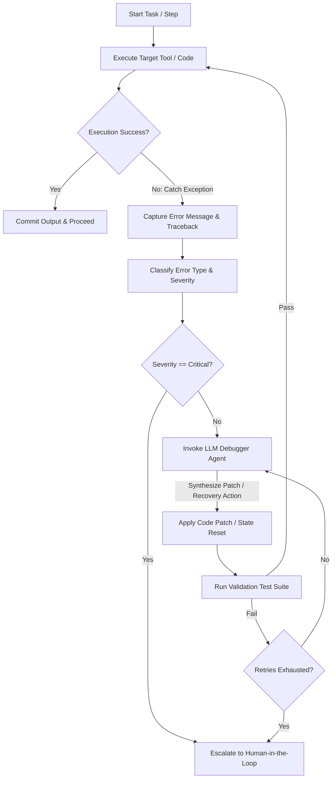

# Self-Healing Debugging Playbook
**Document ID:** Venus-UAIEOS-TEMP-33  
**Version:** V0.8  
**Classification:** Institutional-Grade Operations Template  
**Target Directory:** `file:///Users/dronpancholi/Developer/01_Strategic/Venus/uaieos_templates/`  

---

## 1. Executive Summary & Objectives

Autonomous agents running complex toolsets will inevitably encounter runtime errors, API timeouts, syntax mistakes, or structural validation failures. Rather than halting processes immediately, agents under Project Venus utilize a **Self-Healing Loop** to dynamically inspect stack traces, formulate corrections, run validation tests, and apply patches.

The primary objectives of this playbook are:
1. Define the self-healing control loop architecture.
2. Provide standardized remediation routines by error type.
3. Establish a Python framework for automated runtime recovery.
4. Define escalation criteria for human intervention.

---

## 2. Self-Healing Control Loop Architecture

The self-healing loop runs as an supervisor wrapper around agent execution.



---

## 3. Error Classification & Remediation Matrix

| Error Class | Typical Trigger | Target Diagnosis Metric | Remediation Strategy |
|---|---|---|---|
| **Syntax Error** | AST parsing failure | Traceback line number & code excerpt | Extract file code chunk, prompt debugger agent with AST error message, edit target lines via patch engine. |
| **API / Connection Timeout**| Network socket failure | HTTP Status Code (e.g., 502, 503, 504) | Invoke exponential backoff retry: $t_{\text{backoff}} = \text{base} \cdot 2^{\text{attempt}} + \text{jitter}$. |
| **Data Validation Violation** | JSON Schema mismatch | Validation error array from parser | Re-verify schema contracts, inject output format rules into system context, regenerate prompt payload. |
| **Logic / Assertion Failure**| Unit test suite fails | Test assert error and stdout comparison | Synthesize input/output differences, run semantic drift debugger, adjust context boundaries. |

---

## 4. Statistical Validation of Healing Success

To ensure self-healing routines resolve errors without introducing regressions, we evaluate the **Self-Healing Success Rate ($S_{\text{heal}}$)** across a validation cohort:

$$S_{\text{heal}} = \frac{N_{\text{errors resolved}}}{N_{\text{total errors encountered}}}$$

We evaluate the performance delta between a non-healing agent cohort ($C_1$) and a self-healing agent cohort ($C_2$) using the Z-score calculation:

$$Z = \frac{p_{\text{heal}} - p_{\text{base}}}{\sqrt{p(1-p)\left(\frac{1}{n_{\text{heal}}} + \frac{1}{n_{\text{base}}}\right)}}$$

Where $p$ represents the pooled task success rate. The self-healing configuration is only promoted to production if $Z \ge 2.58$ ($99\%$ confidence level).

---

## 5. Self-Healing Implementation Code

The agent wrapper below intercepts executions, classifies errors, and calls a debugger model:

```python
"""
Venus Self-Healing Execution Wrapper
"""
import sys
import traceback
from typing import Callable, Any, Dict

class SelfHealingRunner:
    def __init__(self, debugger_client, max_retries: int = 3):
        self.debugger = debugger_client
        self.max_retries = max_retries

    def execute_with_healing(self, target_func: Callable[..., Any], *args, **kwargs) -> Any:
        retries = 0
        while retries < self.max_retries:
            try:
                # Attempt execution of code or tool
                return target_func(*args, **kwargs)
            except Exception as e:
                retries += 1
                exc_type, exc_value, exc_traceback = sys.exc_info()
                tb_str = "".join(traceback.format_exception(exc_type, exc_value, exc_traceback))
                
                print(f"CRITICAL: Execution failed (Attempt {retries}/{self.max_retries}). Catching exception...")
                print(f"Error: {e}")
                
                # Check for absolute escalation
                if self._is_fatal_error(tb_str):
                    raise e
                    
                # Synthesize healing strategy
                patch_code = self._consult_debugger(tb_str, target_func.__code__)
                if not patch_code:
                    raise e
                
                # Apply remediation (state reset / patch code execution)
                self._apply_remediation(patch_code)
                
        raise RuntimeError("Self-healing exhausted max retries without successful resolution.")

    def _is_fatal_error(self, traceback_str: str) -> bool:
        # Halt immediately if database credentials or security boundaries are breached
        fatal_signatures = ["AuthError", "PermissionDenied", "AccessDeniedException"]
        return any(sig in traceback_str for sig in fatal_signatures)

    def _consult_debugger(self, traceback_str: str, source_code: Any) -> str:
        # Query debugger model for solution path
        # In reality, this dispatches to an LLM endpoint
        return "# Remediation patch generated by debugger agent"

    def _apply_remediation(self, patch_code: str) -> None:
        # Safely execute remediation script or adjust agent context variables
        pass
```

---

## 6. Human Escalation Procedures

If the self-healing attempts are exhausted, the system must freeze task execution and escalate:
- [ ] **1. Snapshot State:** Write current state context and tracing logs to the recovery vault.
- [ ] **2. Freezing locks:** Lock task execution paths to prevent corrupted database transactions.
- [ ] **3. Notification Dispatch:** Alert the primary operational engineer via the incident register:

```csv
incident_id,timestamp,failed_agent_id,error_class,healer_attempts,state_snapshot_uri
```

---
*For manual overrides or playbook exceptions, contact the Agent Reliability Engineer at [Venus Systems](file:///Users/dronpancholi/Developer/01_Strategic/Venus/).*
