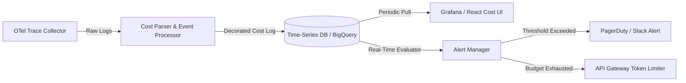
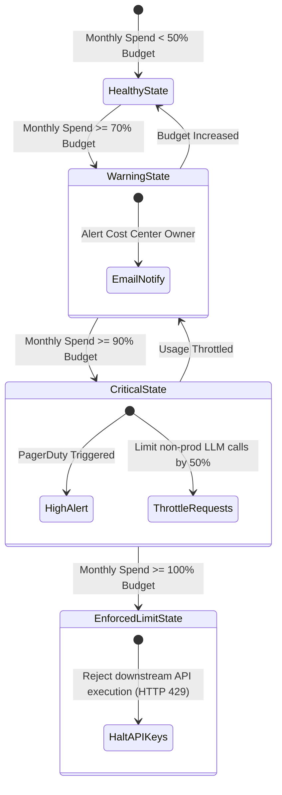

# Token Cost Analytics Dashboard
**Document ID:** Venus-UAIEOS-TEMP-30  
**Version:** V0.8  
**Classification:** Institutional-Grade Operations Template  
**Target Directory:** `file:///Users/dronpancholi/Developer/01_Strategic/Venus/uaieos_templates/`  

---

## 1. Executive Summary & Objectives

Unmonitored agent networks can consume substantial token allocations rapidly. Effective management requires granular analytics detailing model spend, token efficiency, and project cost center alignment.

This document defines the **Token Cost Analytics Dashboard Specification**, establishing:
1. Operational KPIs and mathematical calculations for tracking and forecasting spend.
2. The data ingestion pipeline and token logging database schema.
3. Allocation tags for cost center billing.
4. Alerts for cost anomalies and budget overruns.

---

## 2. Ingestion Pipeline & Analytics Flow

Token metrics are extracted asynchronously from observability traces and pushed to a time-series database (e.g., InfluxDB, Prometheus, or BigQuery) for reporting.



---

## 3. Analytics Metrics & Formulations

### 3.1 Total Dynamic Token Spend
The exact cost of a given token transaction sequence is calculated as:

$$C_{\text{run}} = \left( N_{\text{input\_tokens}} \cdot P_{\text{input\_unit}} \right) + \left( N_{\text{output\_tokens}} \cdot P_{\text{output\_unit}} \right) - \left( N_{\text{cached\_tokens}} \cdot P_{\text{cache\_discount}} \right)$$

Where $P_{\text{unit}}$ is standard pricing per 1,000,000 tokens.

### 3.2 Budget Burn Rate (Velocity)
The budget consumption speed (velocity) $V(t)$ over a time window $\Delta t$ is computed as:

$$V(t) = \frac{\Delta C}{\Delta t} = \frac{\sum_{i=1}^K C_i}{t_{\text{end}} - t_{\text{start}}} \quad [\text{USD/day}]$$

### 3.3 Forecast Projection
Given current expenditures $C_{\text{elapsed}}$ and current day $t$ within a monthly billing cycle of length $D$ (usually 30 days):

$$C_{\text{projected}} = C_{\text{elapsed}} + V(t) \cdot (D - t)$$

If $C_{\text{projected}} > C_{\text{budget\_limit}}$, the Alert Engine raises a warning flag.

---

## 4. Database Schema Specification (BigQuery DDL)

To generate the analytics backend, execute the table definition below:

```sql
CREATE OR REPLACE TABLE `project_venus.token_billing_ledger` (
  transaction_id STRING NOT NULL OPTIONS(description="UUID matching execution trace"),
  timestamp TIMESTAMP DEFAULT CURRENT_TIMESTAMP(),
  project_id STRING NOT NULL OPTIONS(description="Cost center allocation ID"),
  cost_center STRING NOT NULL OPTIONS(description="Financial department tag"),
  agent_id STRING NOT NULL OPTIONS(description="Target agent registration ID"),
  model_name STRING NOT NULL OPTIONS(description="Exact model identifier utilized"),
  tokens_input INT64 NOT NULL,
  tokens_output INT64 NOT NULL,
  tokens_cached INT64 NOT NULL,
  cost_usd NUMERIC(15, 6) NOT NULL OPTIONS(description="Calculated transaction cost in USD")
)
PARTITION BY DATE(timestamp)
CLUSTER BY project_id, agent_id;
```

---

## 5. Cost Allocation Tags Matrix

Every LLM API call must pass billing metadata in the request header properties:

| Metadata Tag | Expected Format | Purpose | Constraint |
|---|---|---|---|
| `x-venus-project-id` | `PRJ-[A-Z]{3}-[0-9]{3}` | Grouping metrics by product team | Mandatory |
| `x-venus-cost-center`| `CC-[0-9]{4}` | Direct cost assignment for accounting | Mandatory |
| `x-venus-agent-id`   | `AGT-[A-Z0-9_-]+` | Tracking agent optimization targets | Mandatory |
| `x-venus-env`        | `dev \| stage \| prod` | Segmenting experimental vs active runs | Mandatory |

---

## 6. Budget Warning Thresholds & Defenses



---
*For billing accounts and adjustments, contact the FinOps controller at [Venus Systems](file:///Users/dronpancholi/Developer/01_Strategic/Venus/).*
