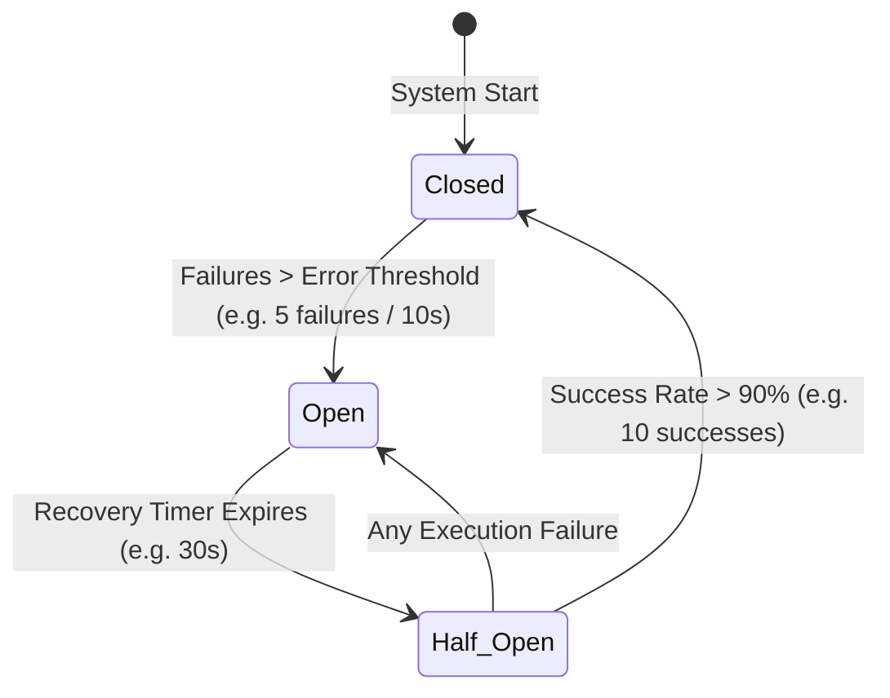

# Tool Fallback & Circuit Breaker Specification (Project Venus V0.8)

## 1. Objectives
This document specifies the circuit breaker and fallback logic designed to handle downstream tool execution failures, network latency spikes, and system resource exhaustion. It ensures that transient failures do not cause cascade failures across agent pipelines.

---

## 2. Circuit Breaker State Machine
The execution gate operates in three distinct states, maintaining tracking counters for error rates and recovery steps.

---

## 3. Thresholds & Trigger Metrics

### 3.1 Failure Rate Calculation
The circuit breaker monitors executions within a rolling time window $W$ (e.g., $10$ seconds). The error rate $R_{\text{error}}$ is computed as:

$$R_{\text{error}} = \frac{N_{\text{failed}}}{N_{\text{total}}}$$

The circuit transitions to **Open** if:
*   $N_{\text{total}} \ge N_{\text{min\_requests}}$ (e.g., a minimum of $5$ requests in $W$).
*   $R_{\text{error}} \ge \theta_{\text{error}}$ (e.g., $50\%$ error rate threshold) OR the rolling average latency exceeds the SLA limit:

$$\bar{L} = \frac{1}{n} \sum_{i=1}^{n} L_i > \text{Latency SLA}$$

---

## 4. Fallback Execution Matrix
When the circuit is **Open**, or when a single call fails during a **Closed** state before the threshold is reached, the execution manager applies one of the following fallback strategies:

| Target Tool | Failure Trigger | Fallback Strategy | Action Executed |
| :--- | :--- | :--- | :--- |
| `run_read_query` | DB Timeout / Offline | **Cached Response / Replica** | Direct lookup from replica DB; fallback to Redis cache if replica offline. |
| `fetch_api_data` | HTTP 5xx / Rate Limit | **Mock Static Payload** | Return last cached successful response or a formatted mock response based on tool schema. |
| `python_exec` | OOM / Runtime Error | **Alternative Tool / Step-down** | Reroute calculation task to a fast localized WebAssembly (Wasm) calculator. |
| `semantic_search` | Vector Index Failure | **Fallback to Keyword** | Transition search query to standard Elasticsearch/BM25 keyword search index. |

---

## 5. Circuit Recovery & Half-Open Trialing
1.  **Transition to Half-Open:** When the recovery timer expires, the circuit enters the **Half-Open** state.
2.  **Trial Volume Constraint:** The system permits only a limited percentage of standard traffic (e.g., $10\%$) to access the primary tool.
3.  **Reset Criteria:** If $10$ consecutive calls complete successfully within latency bounds, the circuit returns to the **Closed** state.
4.  **Instant Trip:** If *any* call returns a server error or timeout during the trialing phase, the circuit immediately trips back to the **Open** state, resetting the recovery timer.

---

## 6. Cross-References
*   The schemas validation limits causing failures are detailed in [TOOL_SCHEMA_DEFINITION.md](file:///Users/dronpancholi/Developer/01_Strategic/Venus/uaieos_templates/TOOL_SCHEMA_DEFINITION.md).
*   Sandboxing limitations that might trigger resource-based OOM failures are documented in [TOOL_SANDBOXING_POLICY.md](file:///Users/dronpancholi/Developer/01_Strategic/Venus/uaieos_templates/TOOL_SANDBOXING_POLICY.md).
*   Model routing fallbacks triggered by persistent tool errors are defined in [DYNAMIC_MODEL_ROUTING_SPEC.md](file:///Users/dronpancholi/Developer/01_Strategic/Venus/uaieos_templates/DYNAMIC_MODEL_ROUTING_SPEC.md).
