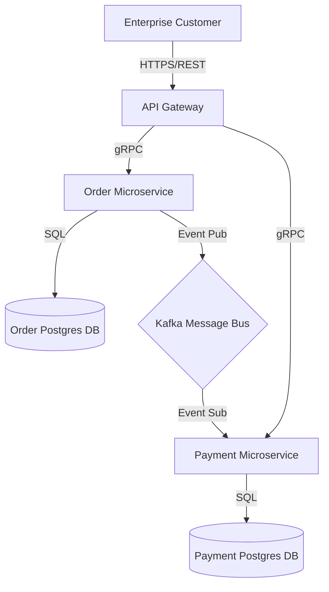

# Part 32: Documentation Engineering

## 1. Context & Strategy
Documentation Engineering under Project Venus mandates that documentation be treated as code (Doc-as-Code). It must reside in the same repository as the application code, be written in markdown, undergo pull request reviews, contain active architectural diagrams (C4 Model), and be automatically validated for dead links and structural consistency during CI pipeline runs.

---

## 2. Documentation Coverage & Model Metrics

### 2.1 Documentation Completeness Score
The Documentation Completeness Score ($DCS$) evaluates the coverage of architectural references, endpoints, and data interfaces:

$$DCS = \frac{N_{docs\_valid}}{N_{system\_elements}} \times 100$$

Where:
*   $N_{docs\_valid}$: Number of system elements (APIs, DB tables, events) with up-to-date documentation.
*   $N_{system\_elements}$: Total count of active elements across the codebase.
*   *Requirement*: Deployable packages must maintain $DCS \ge 90\%$.

### 2.2 Relative Entropy of Doc Updates
Documentation updates must keep pace with code evolution. The documentation drift ratio ($D_{drift}$) relative to code churn over a timeframe is calculated as:

$$D_{drift} = 1 - \frac{\text{Commits containing DOC modifications}}{\text{Commits containing SRC modifications}}$$

*   *Goal*: Maintain $D_{drift} \le 0.3$. A high $D_{drift}$ triggers alerts indicating outdated documentation files.

---

## 3. C4 Architecture & API Specifications

### 3.1 C4 Container Diagram (Mermaid Definition)
All projects must embed architectural state representations directly in documentation markdown using Mermaid.



### 3.2 OpenAPI v3 Integration Schema
Public endpoints must declare API specs to allow automated mock generation.

```json
{
  "openapi": "3.0.0",
  "info": {
    "title": "Venus Core API",
    "version": "1.0.0"
  },
  "paths": {
    "/v1/health": {
      "get": {
        "summary": "Retrieve service health state",
        "responses": {
          "200": {
            "description": "System operational",
            "content": {
              "application/json": {
                "schema": {
                  "type": "object",
                  "properties": {
                    "status": { "type": "string" }
                  }
                }
              }
            }
          }
        }
      }
    }
  }
}
```

---

## 4. Reusable Checklist & Exit Criteria
*   [ ] Checked that all public API schemas conform to the OpenAPI 3.0 specification.
*   [ ] Verified that markdown files contain no dead relative file links (`file:///...` or `./...`).
*   [ ] Confirmed architectural changes are accompanied by updated C4 Mermaid diagrams in pull requests.
*   [ ] Checked that code blocks in documentation compile and parse correctly.
*   [ ] Verified that database schemas have corresponding column descriptions in documentation tables.
