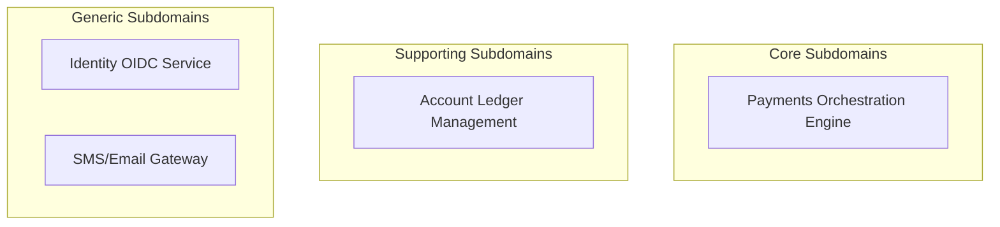

# Bounded Context Definition Specification

## Document Control
| Version | Date | Author | Description | Reviewer |
| :--- | :--- | :--- | :--- | :--- |
| 1.0.0 | 2026-06-26 | Domain Modeler | Bounded Context definitions | Principal Architect |

## 1. Domain Categorization Map
The system's subdomain portfolio categorizes services into Core (high competitive value), Supporting (necessary, custom-built), and Generic (off-the-shelf or commoditized).



---

## 2. Bounded Context Catalog
### 2.1 Accounts Context
- **Subdomain Mapping**: Supporting Subdomain.
- **Ubiquitous Language Scope**: Manages accounts, balances, credit limits, holds, and adjustments.
- **Exposed APIs**: [GRPC_PROTO_CONTRACT.md](file:///Users/dronpancholi/Developer/01_Strategic/Venus/usedpos_templates/GRPC_PROTO_CONTRACT.md) (Accounts service contract).

### 2.2 Payments Context
- **Subdomain Mapping**: Core Subdomain.
- **Ubiquitous Language Scope**: Manages transactions, payment intents, transfer instructions, and settlement reconciliations.
- **Exposed APIs**: [OPENAPI_3_SPECIFICATION.md](file:///Users/dronpancholi/Developer/01_Strategic/Venus/usedpos_templates/OPENAPI_3_SPECIFICATION.md).

---

## 3. Boundary Integration Integrity Rules
```
                    +--------------------+
                    |  Accounts Context  |
                    +---------+----------+
                              ^ (Supplier)
                              |
                              | gRPC Interface (OHS)
                              |
                    +---------+----------+
                    |  Payments Context  |
                    +--------------------+
```

### 3.1 Strict Invariant Checks
1. No payments context schema may directly reference the Account database entities. Interaction must pass through the `AccountRepository` port.
2. The Accounts context does not know about payment routing mechanisms (e.g., SWIFT, ACH).
3. Re-computation of ledger statements must remain isolated inside the Accounts context. Refer to [EVENT_SOURCING_REPLAY_PLAN.md](file:///Users/dronpancholi/Developer/01_Strategic/Venus/usedpos_templates/EVENT_SOURCING_REPLAY_PLAN.md).
