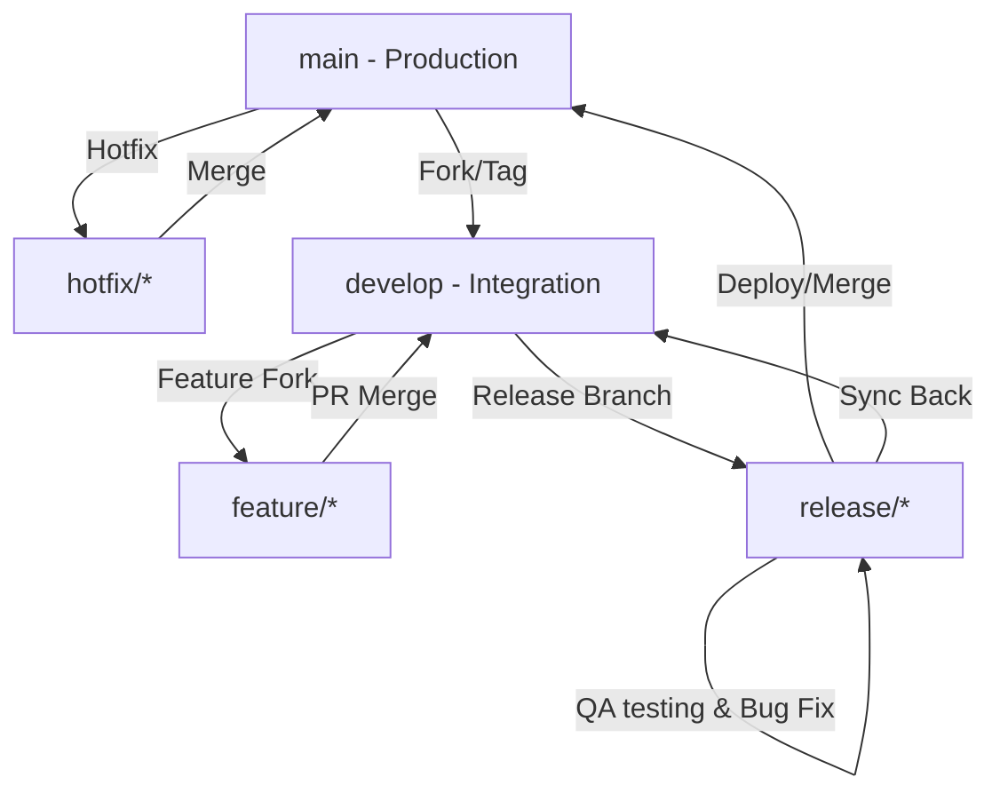

# Branching Strategy and GitFlow Specification
**Document ID:** VENUS-STD-054
**Version:** 1.0.0
**Status:** Approved
**Effective Date:** 2026-06-26

## 1. Overview
Project Venus uses a structured GitFlow branching strategy to maintain stability in production environments while enabling continuous development and integration.

## 2. Branch Lifecycle and Naming Rules

### 2.1 Branch Classification

| Branch | Base Branch | Target Branch | Target Env | Naming Convention | Description |
| :--- | :--- | :--- | :--- | :--- | :--- |
| **Main** | N/A | N/A | Production | `main` | Production-ready state. Represents stable releases. |
| **Develop** | `main` | `main` | Staging/UAT | `develop` | Integration branch for features. |
| **Feature** | `develop` | `develop` | Development | `feature/<ticket-id>-<short-description>` | Work on specific user stories or tasks. |
| **Release** | `develop` | `main` & `develop` | Pre-Prod | `release/v<major>.<minor>.<patch>` | Hardening phase before deployment. |
| **Hotfix** | `main` | `main` & `develop` | Production | `hotfix/<ticket-id>-<patch-version>` | Emergency production bug fixes. |

## 3. Branch Merge Rules and Pull Requests
1. **No Direct Commits:** Commits to `main` and `develop` are blocked by branch protection rules.
2. **Squash and Merge:** Feature branches must use "Squash and Merge" when merging into `develop` to maintain a clean history.
3. **Rebase First:** Before submitting a PR to `develop`, developers must rebase their feature branch onto the latest `develop` to resolve conflicts locally.
4. **Signature Required:** All commits must be GPG signed to pass the build checks.

## 4. Cross-References
- [Contribution Guide](file:///Users/dronpancholi/Developer/01_Strategic/Venus/usedpos_templates/CONTRIBUTION_GUIDE.md)
- [Pull Request Template](file:///Users/dronpancholi/Developer/01_Strategic/Venus/usedpos_templates/PULL_REQUEST_TEMPLATE.md)
- [Code Review Checklist](file:///Users/dronpancholi/Developer/01_Strategic/Venus/usedpos_templates/CODE_REVIEW_CHECKLIST.md)
