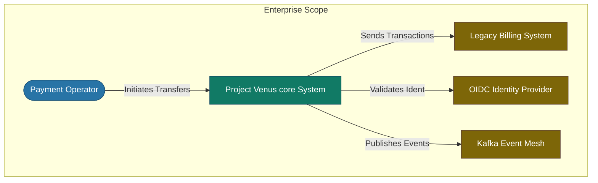

# C4 Architecture - Level 1: System Context

## Document Control
| Version | Date | Author | Description | Reviewer |
| :--- | :--- | :--- | :--- | :--- |
| 1.0.0 | 2026-06-26 | Enterprise Architect | C4 L1 System Context Diagram | Tech Council |

## 1. System Scope
The System Context provides a macro-level overview of the target system, mapping its boundaries to external actors, OIDC Identity Providers, and downstream legacy systems.
- Container design: [C4_ARCHITECTURE_L2_CONTAINER.md](file:///Users/dronpancholi/Developer/01_Strategic/Venus/usedpos_templates/C4_ARCHITECTURE_L2_CONTAINER.md)
- Network layout: [HLD_HIGH_LEVEL_DESIGN.md](file:///Users/dronpancholi/Developer/01_Strategic/Venus/usedpos_templates/HLD_HIGH_LEVEL_DESIGN.md)

---

## 2. L1 System Context Diagram

---

## 3. Element Catalogue
| Element Name | Type | Description | Technologies |
| :--- | :--- | :--- | :--- |
| **Payment Operator** | Person (Actor) | Internal staff executing payments (Sarah / David from PRD). | Web Browser / OAuth2 Client |
| **Project Venus Core System** | Software System | The application being designed. Coordinates transactions. | Microservices (Go / Python) |
| **Legacy Billing System**| Software System | Legacy platform used for historical client accounts. | Mainframe / Cobol REST Wrapper |
| **OIDC Identity Provider**| Software System | Active Directory / Identity Broker. | Okta / Keycloak |
| **Kafka Event Mesh** | Software System | Distributed message system mapping topic logs. | Kafka Clusters |
