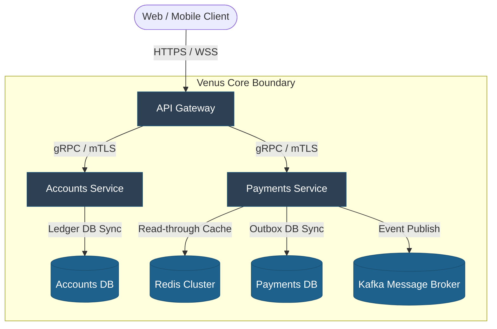

# C4 Architecture - Level 2: Container

## Document Control
| Version | Date | Author | Description | Reviewer |
| :--- | :--- | :--- | :--- | :--- |
| 1.0.0 | 2026-06-26 | Enterprise Architect | C4 L2 Container Diagram | Infrastructure Architect |

## 1. Scope
The Level 2 Container diagram decomposes the software system boundary, detailing the structural elements (applications, databases, message stores) that compose the execution environment.
- Micro-structure maps: [C4_ARCHITECTURE_L3_COMPONENT.md](file:///Users/dronpancholi/Developer/01_Strategic/Venus/usedpos_templates/C4_ARCHITECTURE_L3_COMPONENT.md).
- Overall system view: [C4_ARCHITECTURE_L1_SYSTEM_CONTEXT.md](file:///Users/dronpancholi/Developer/01_Strategic/Venus/usedpos_templates/C4_ARCHITECTURE_L1_SYSTEM_CONTEXT.md).

---

## 2. L2 Container Diagram

---

## 3. Container Catalogue
| Container Name | Type | Description | Technologies | Port / Protocol |
| :--- | :--- | :--- | :--- | :--- |
| **API Gateway** | Reverse Proxy | Enforces SSL, routing rules, sliding window rate limits. | Envoy / NGINX | `443` -> `8080` (HTTP/2) |
| **Accounts Service** | Service Container | Manages customer balances, credit records, and ledger. | Go / Gin | `50051` (gRPC / mTLS) |
| **Payments Service** | Service Container | Orchestrates transaction state machines and outbox emission. | Python / FastAPI | `50052` (gRPC / mTLS) |
| **Redis Cluster** | Cache Store | Caches read transactions for active balance queries. | Redis Enterprise | `6379` (TCP) |
| **Accounts Database** | Database | Multi-zone relational transactional storage. | PostgreSQL 16 | `5432` (TCP) |
| **Payments Database** | Database | Relational store housing transaction outbox queues. | PostgreSQL 16 | `5433` (TCP) |
| **Kafka Broker** | Event Stream | Manages transactional domain event topics. | Apache Kafka | `9092` (SASL_SSL) |
