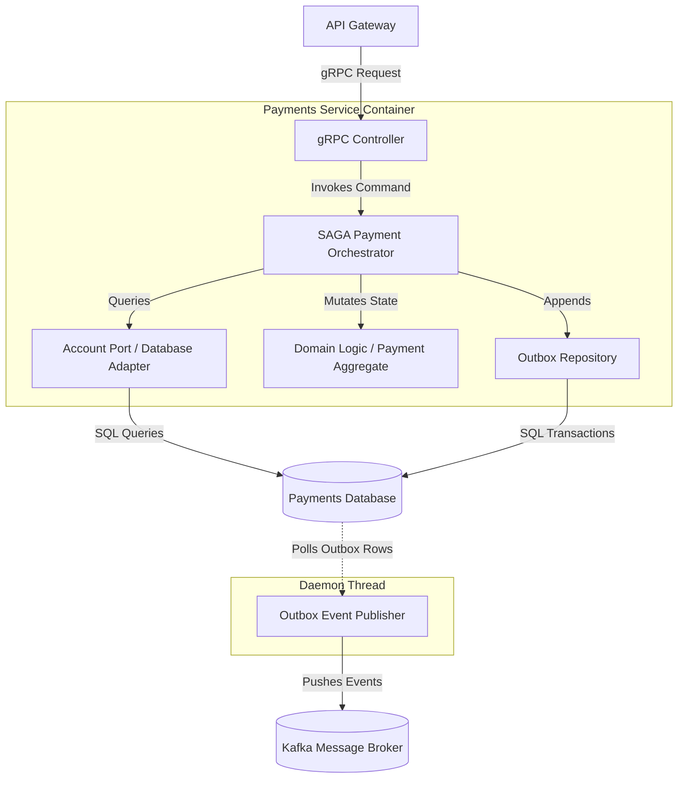

# C4 Architecture - Level 3: Component

## Document Control
| Version | Date | Author | Description | Reviewer |
| :--- | :--- | :--- | :--- | :--- |
| 1.0.0 | 2026-06-26 | Tech Lead | C4 L3 Component Diagram | Architect Board |

## 1. Scope
This document decomposes the **Payments Service** container, illustrating the logical component boundaries, dependency vectors, and data pathways.
- Class-level layouts: [C4_ARCHITECTURE_L4_CODE.md](file:///Users/dronpancholi/Developer/01_Strategic/Venus/usedpos_templates/C4_ARCHITECTURE_L4_CODE.md).
- Global network topology: [C4_ARCHITECTURE_L2_CONTAINER.md](file:///Users/dronpancholi/Developer/01_Strategic/Venus/usedpos_templates/C4_ARCHITECTURE_L2_CONTAINER.md).

---

## 2. L3 Component Diagram (Payments Service)

---

## 3. Component Directory
| Component Name | Description | Key Responsibilities | Files/Packages |
| :--- | :--- | :--- | :--- |
| **gRPC Controller** | Primary Adapter (Ingress) | Unpacks protocol buffers, enforces mTLS authorization tokens. | `/ports/grpc/` |
| **SAGA Payment Orchestrator**| Application Service | Executes Saga flow, handling compensates on exception steps. | `/app/saga/` |
| **Payment Domain Aggregate** | Core Domain | Asserts business invariants (balance validity, status limits). | `/domain/model/` |
| **Database Adapter** | Secondary Adapter (Egress) | Maps Domain aggregates to relational schemas. | `/adapters/db/` |
| **Outbox Repository** | Secondary Adapter (Egress) | Inserts serialized domain events into outbox tables. | `/adapters/outbox/` |
| **Outbox Event Publisher** | Daemon Process | Asynchronously polls outbox and publishes messages to Kafka. | `/daemons/publisher/` |
