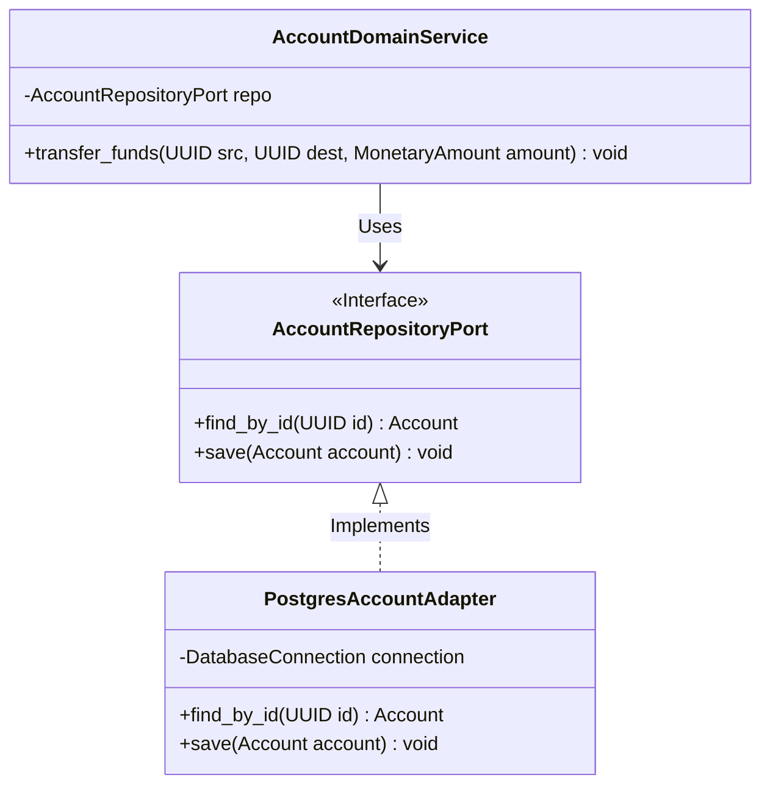

# C4 Architecture - Level 4: Code

## Document Control
| Version | Date | Author | Description | Reviewer |
| :--- | :--- | :--- | :--- | :--- |
| 1.0.0 | 2026-06-26 | Tech Lead | C4 L4 Code & Class Mapping | Senior Developer |

## 1. Scope & Structural Interfaces
This document maps out the class structures, interfaces, and design patterns governing system components. 
- Higher-level container view: [C4_ARCHITECTURE_L3_COMPONENT.md](file:///Users/dronpancholi/Developer/01_Strategic/Venus/usedpos_templates/C4_ARCHITECTURE_L3_COMPONENT.md).
- Domain rules: [DOMAIN_MODEL_SPECIFICATION.md](file:///Users/dronpancholi/Developer/01_Strategic/Venus/usedpos_templates/DOMAIN_MODEL_SPECIFICATION.md).

---

## 2. Ports and Adapters Code Model
The class architecture enforces clean separation of concerns using interfaces for primary and secondary ports.



---

## 3. Concrete Python Code Implementation
The following code establishes the abstract ports and concrete adapters structure for database operations.

```python
# app/ports/repository.py
from abc import ABC, abstractmethod
from uuid import UUID
from typing import Optional

class AccountRepositoryPort(ABC):
    @abstractmethod
    def find_by_id(self, account_id: UUID) -> Optional[dict]:
        """
        Retrieves serialized aggregate details from storage.
        """
        pass

    @abstractmethod
    def save(self, account_state: dict) -> None:
        """
        Persists serialized aggregate state back to storage.
        """
        pass


# app/adapters/postgres_adapter.py
import psycopg2
from uuid import UUID
from app.ports.repository import AccountRepositoryPort

class PostgresAccountAdapter(AccountRepositoryPort):
    def __init__(self, connection_pool):
        self.pool = connection_pool

    def find_by_id(self, account_id: UUID) -> Optional[dict]:
        conn = self.pool.getconn()
        try:
            with conn.cursor() as cursor:
                cursor.execute(
                    "SELECT state FROM account_aggregates WHERE aggregate_id = %s", 
                    (str(account_id),)
                )
                row = cursor.fetchone()
                if row:
                    return row[0]  # Returns JSON state
                return None
        finally:
            self.pool.putconn(conn)

    def save(self, account_state: dict) -> None:
        conn = self.pool.getconn()
        try:
            with conn.cursor() as cursor:
                cursor.execute(
                    """
                    INSERT INTO account_aggregates (aggregate_id, version, owner_id, state) 
                    VALUES (%s, %s, %s, %s)
                    ON CONFLICT (aggregate_id) DO UPDATE 
                    SET version = EXCLUDED.version, state = EXCLUDED.state, updated_at = CURRENT_TIMESTAMP
                    """,
                    (
                        account_state["aggregate_id"],
                        account_state["version"],
                        account_state["owner_id"],
                        psycopg2.extras.Json(account_state)
                    )
                )
            conn.commit()
        except Exception as e:
            conn.rollback()
            raise e
        finally:
            self.pool.putconn(conn)
```
- DB Table definitions are outlined in [DATABASE_SCHEMA_DEFINITION.md](file:///Users/dronpancholi/Developer/01_Strategic/Venus/usedpos_templates/DATABASE_SCHEMA_DEFINITION.md).
