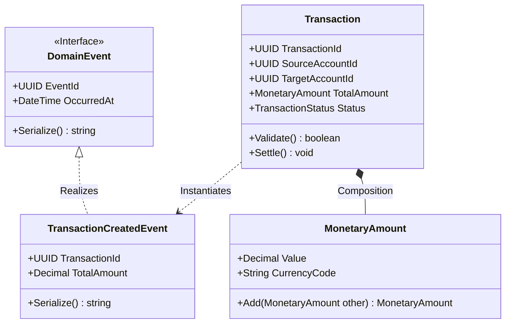

# Class Diagram Specification

## Document Control
| Version | Date | Author | Description | Reviewer |
| :--- | :--- | :--- | :--- | :--- |
| 1.0.0 | 2026-06-26 | Engineering Lead | Class structure specifications | Lead Architect |

## 1. Scope & Domain Context
This document specifies Class models, attributes, method signatures, and associations defining core components of the system.
- Complete domain specifications are in [DOMAIN_MODEL_SPECIFICATION.md](file:///Users/dronpancholi/Developer/01_Strategic/Venus/usedpos_templates/DOMAIN_MODEL_SPECIFICATION.md).
- Code implementation models are located in [C4_ARCHITECTURE_L4_CODE.md](file:///Users/dronpancholi/Developer/01_Strategic/Venus/usedpos_templates/C4_ARCHITECTURE_L4_CODE.md).

---

## 2. Core Service Class Diagram

---

## 3. Structural Bindings and Properties
### 3.1 DomainEvent Interface
Acts as the baseline for all serialization schemas.
- `EventId`: Unique identifier (UUIDv4) utilized for de-duplication checks at endpoints.
- `OccurredAt`: Immutable UTC timestamp indicating when the domain state change was committed.

### 3.2 Transaction Class
The root processing class for the Payments domain.
- `Validate()`: Asserts that structural properties match rules before execution.
- `Settle()`: Transitions status from `PENDING` to `SETTLED`. Throws exception if validation or database locks fail. Refer to [DISTRIBUTED_LOCKING_REDLOCK_SPEC.md](file:///Users/dronpancholi/Developer/01_Strategic/Venus/usedpos_templates/DISTRIBUTED_LOCKING_REDLOCK_SPEC.md).
- Detailed transactional statuses are tracked via state engines in [STATE_DIAGRAM_SPECIFICATION.md](file:///Users/dronpancholi/Developer/01_Strategic/Venus/usedpos_templates/STATE_DIAGRAM_SPECIFICATION.md).
