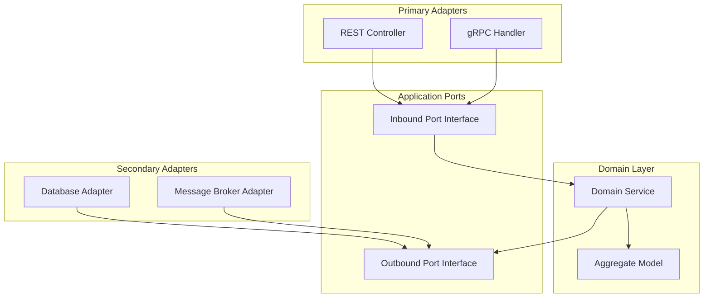

# Component Dependency Graph
**Document ID:** VENUS-STD-023
**Version:** 1.0.0
**Status:** Approved
**Effective Date:** 2026-06-26

## 1. Context & Boundaries
This specification maps the dependency tree of core system components in a Hexagonal (Ports and Adapters) architecture, ensuring that domain models have zero external dependencies.

## 2. Directed Acyclic Graph of Dependencies

## 3. Boundary Rules & Validation
1. **Dependency Inversion**: Outer layers (Adapters) must depend on inner layers (Ports / Domain). Inner layers must never depend on outer layers.
2. **Cycle Prevention**: The dependency graph must represent a Directed Acyclic Graph (DAG). Any circular dependency detected during static analysis will abort the CI build.

---

## 4. Reusable Checklist & Exit Criteria
*   [ ] Checked that domain models contain zero framework imports.
*   [ ] Verified that adapters only communicate with the domain via ports.
*   [ ] Confirmed dependency graphs are cyclic-dependency audited.
