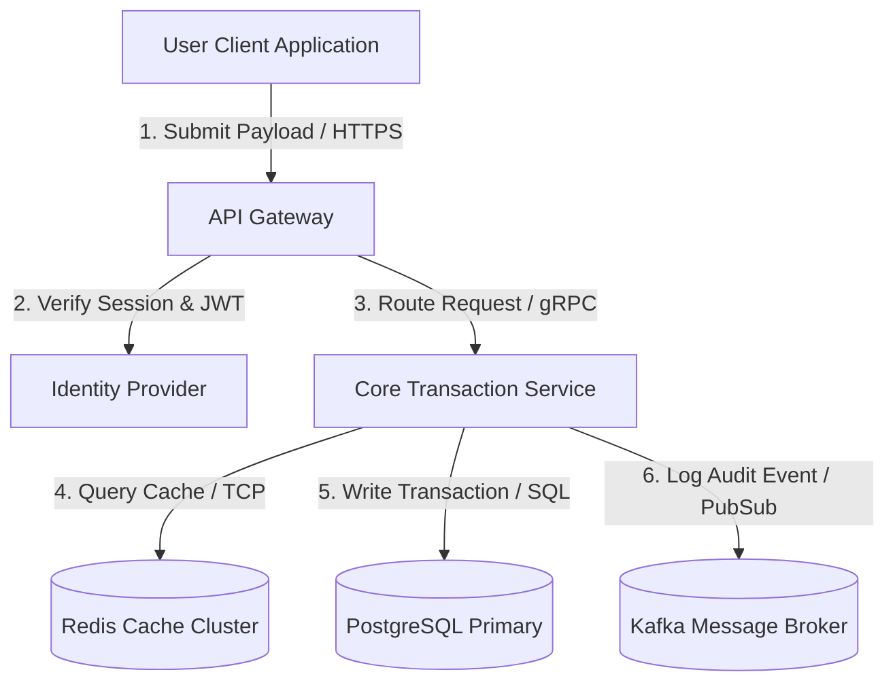

# Data Flow Diagram Specification
**Document ID:** VENUS-STD-022
**Version:** 1.0.0
**Status:** Approved
**Effective Date:** 2026-06-26

## 1. Overview
This document specifies the Data Flow Diagram (DFD) standard for Project Venus. It details how data flows through system boundaries, transformation nodes, and storage systems.

## 2. DFD Level 1: System Data Flow

## 3. Data Transformation Matrix
| Step | Source Component | Destination Component | Data Payload | Security & Validation Controls |
| :--- | :--- | :--- | :--- | :--- |
| 1 | Client Browser | API Gateway | REST JSON Payload | TLS 1.3, Rate-limiting, WAF Check |
| 3 | API Gateway | Core Service | Deserialized gRPC Request | mTLS, JWT token validation |
| 5 | Core Service | PostgreSQL | Relational SQL Transaction | Prepared statements, SQL Injection checks |
| 6 | Core Service | Kafka Broker | JSON/Avro Encoded Event | SASL_SSL SCRAM-512 authentication |

---

## 4. Reusable Checklist & Exit Criteria
*   [ ] Checked that all external data input boundaries enforce TLS 1.3.
*   [ ] Verified that data transition logs do not expose sensitive/PII data.
*   [ ] Confirmed data flow paths contain no cycles or un-audited paths.
