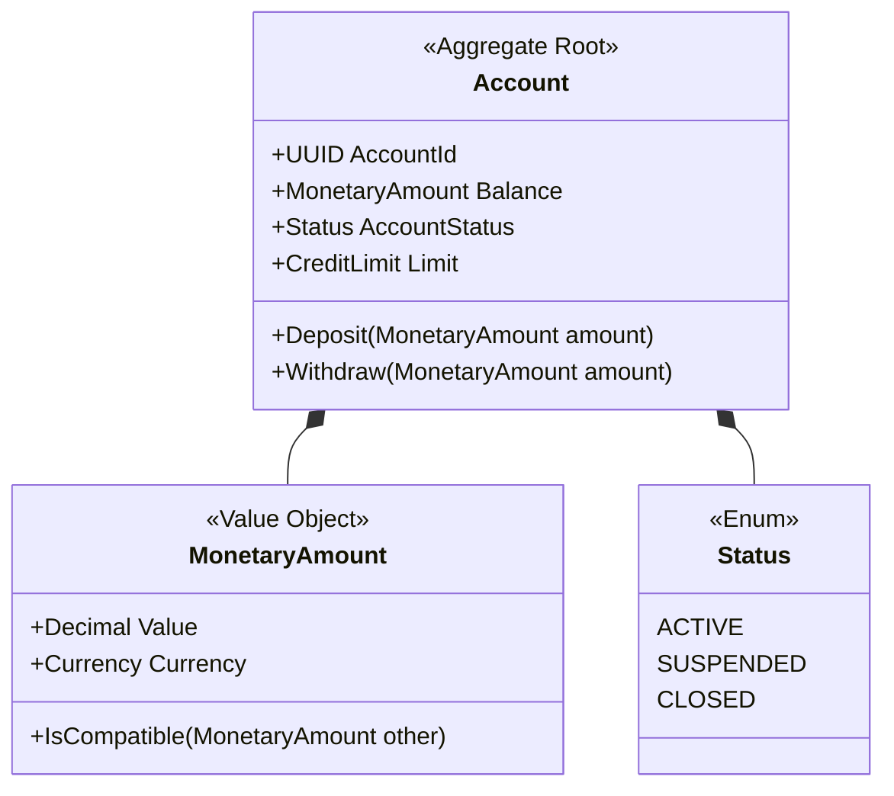

# Domain Model Specification

## Document Control
| Version | Date | Author | Description | Reviewer |
| :--- | :--- | :--- | :--- | :--- |
| 1.0.0 | 2026-06-26 | Domain Architect | Domain Entity & Value Object Model | DDD Working Group |

## 1. Context and Domain Scope
This specification describes the core business entities, aggregates, and value structures governing target system domains.
- Context relationships: [CONTEXT_MAP_SPECIFICATION.md](file:///Users/dronpancholi/Developer/01_Strategic/Venus/usedpos_templates/CONTEXT_MAP_SPECIFICATION.md)
- Bounded Context borders: [BOUNDED_CONTEXT_DEFINITION.md](file:///Users/dronpancholi/Developer/01_Strategic/Venus/usedpos_templates/BOUNDED_CONTEXT_DEFINITION.md)

---

## 2. Ubiquitous Language Glossary
| Domain Term | Category | Definition / Boundary | Allowed States |
| :--- | :--- | :--- | :--- |
| **Account** | Entity | Represents a ledger balance and holder identification. | `ACTIVE`, `SUSPENDED`, `CLOSED` |
| **Transaction** | Entity | Represents an immutable financial transfer log entry. | `PENDING`, `SETTLED`, `FAILED` |
| **Currency** | Value Object | ISO standard currency container (e.g. USD, EUR). | Immutable three-letter code |
| **MonetaryAmount**| Value Object | A tuple representing scale, amount, and Currency. | Scale capped to 4 decimals |

---

## 3. Aggregate Boundary: Account Aggregate


Refer to [AGGREGATE_ROOT_SCHEMA.md](file:///Users/dronpancholi/Developer/01_Strategic/Venus/usedpos_templates/AGGREGATE_ROOT_SCHEMA.md) for JSON schemas validating Aggregate serialization.

---

## 4. Domain Events
Domain events are emitted on state mutation. They must be stored in the transactional outbox (Refer to [OUTBOX_PATTERN_RECONCILIATION.md](file:///Users/dronpancholi/Developer/01_Strategic/Venus/usedpos_templates/OUTBOX_PATTERN_RECONCILIATION.md)).

### 4.1 AccountDebited Event Schema (JSON)
```json
{
  "$schema": "https://json-schema.org/draft/2020-12/schema",
  "title": "AccountDebited",
  "type": "object",
  "properties": {
    "event_id": { "type": "string", "format": "uuid" },
    "aggregate_id": { "type": "string", "format": "uuid" },
    "amount": { "type": "number", "minimum": 0.01 },
    "currency": { "type": "string", "pattern": "^[A-Z]{3}$" },
    "timestamp": { "type": "string", "format": "date-time" }
  },
  "required": ["event_id", "aggregate_id", "amount", "currency", "timestamp"]
}
```
