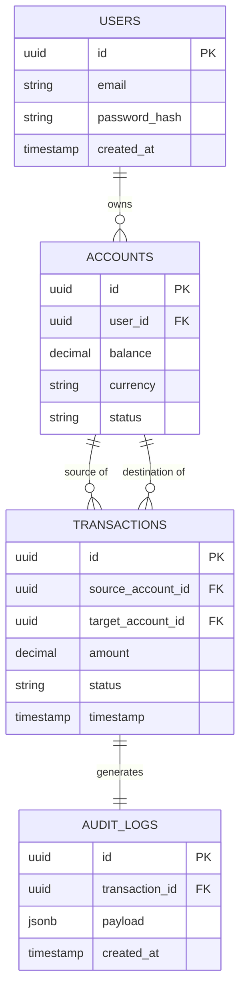

# Entity Relationship Diagram (ERD) Specification
**Document ID:** VENUS-STD-032
**Version:** 1.0.0
**Status:** Approved
**Effective Date:** 2026-06-26

## 1. Core Models Relationships

---

## 2. Reusable Checklist & Exit Criteria
*   [ ] Checked that foreign keys have explicit indexes to avoid full table scans.
*   [ ] Verified database schemas mirror ERD keys and relationships.
*   [ ] Confirmed field constraint definitions prevent orphan database states.
