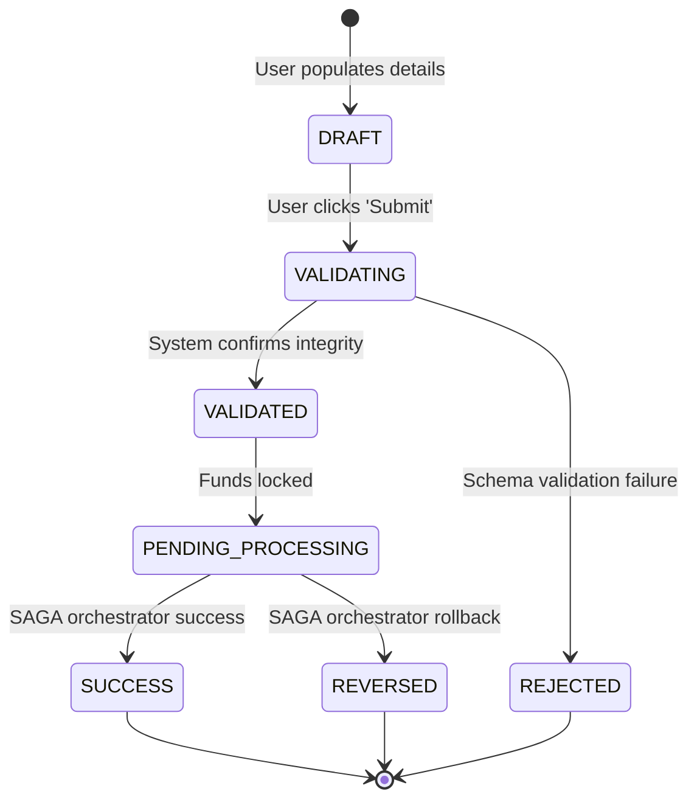

# Functional Specification Document

## Document Control
| Version | Date | Author | Description | Reviewer |
| :--- | :--- | :--- | :--- | :--- |
| 1.0.0 | 2026-06-26 | Business Analyst Team | Functional Specification Model | System Stakeholders |

## 1. System Scope & User Actions
This document describes the functional characteristics, input rules, and system behavior expected by product owners.
- Direct use-cases are detailed in [USE_CASE_SPECIFICATION.md](file:///Users/dronpancholi/Developer/01_Strategic/Venus/usedpos_templates/USE_CASE_SPECIFICATION.md).
- User entities are documented in [USER_CATALOG_SPEC.md](file:///Users/dronpancholi/Developer/01_Strategic/Venus/usedpos_templates/USER_CATALOG_SPEC.md).

---

## 2. Core Functional Requirements Matrix
| Req ID | Module | Feature Description | Trigger Event | Post-conditions |
| :--- | :--- | :--- | :--- | :--- |
| FUN-001 | Identity | Multi-factor enrollment | Admin sets policy | User receives MFA challenge |
| FUN-002 | Accounts | Balance check | User loads dashboard | Reads from Cache database |
| FUN-003 | Payments | Outbound wire transfer | User submits form | Triggers SAGA orchestration workflow |

---

## 3. Workflow State Transition
Below is the standard transaction lifecycle state transition model.

---

## 4. Field Validation Rules
All payload structures must validate against these rules before invoking domain processing:

| Field Path | Type | Required | Constraints | Action on Violation |
| :--- | :--- | :--- | :--- | :--- |
| `transaction.id` | UUIDv4 | Yes | Must match UUID regex | Reject with `ERR_INVALID_UUID` (HTTP 400) |
| `transaction.amount` | Decimal | Yes | Range: $[0.01, 1000000.00]$ | Reject with `ERR_OUT_OF_BOUNDS` (HTTP 400) |
| `transaction.currency` | String | Yes | ISO 4217 code (length = 3) | Reject with `ERR_INVALID_CURRENCY` (HTTP 400) |
