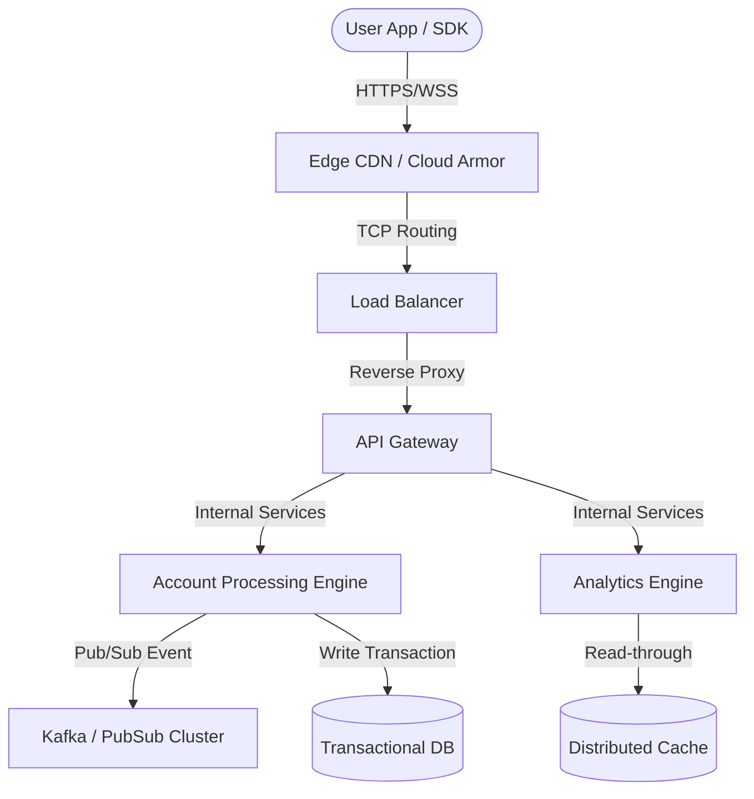

# High-Level Design (HLD)

## Document Control
| Version | Date | Author | Description | Reviewer |
| :--- | :--- | :--- | :--- | :--- |
| 1.0.0 | 2026-06-26 | Core Architecture Team | High-Level Structural Design | Technical Council |

## 1. Introduction & Objectives
This document establishes the macro-architectural blueprint for the system, laying out the components, interface patterns, and distributed systems models.

---

## 2. Global Architecture Layout
The system is divided into logical layers: Presentation, Edge/Routing, Processing Core, Messaging Broker, and Persistent Databases.

---

## 3. Component Decomposition
### 3.1 Load Balancing and Gateway Layer
- **API Gateway**: Decouples client interface layers. Resolves rate-limiting via the [RATE_LIMITER_SLIDING_WINDOW_SPEC.md](file:///Users/dronpancholi/Developer/01_Strategic/Venus/usedpos_templates/RATE_LIMITER_SLIDING_WINDOW_SPEC.md).
- **SSL Termination**: Performed at Load Balancer using secure TLS 1.3 cypher suites.

### 3.2 Core Processing Services
- **Stateful Domain Engines**: Written using Domain-Driven Design (DDD) aggregates. Details in [BOUNDED_CONTEXT_DEFINITION.md](file:///Users/dronpancholi/Developer/01_Strategic/Venus/usedpos_templates/BOUNDED_CONTEXT_DEFINITION.md).
- **Outbox Engine**: Coordinates event emission to Kafka. Details in [OUTBOX_PATTERN_RECONCILIATION.md](file:///Users/dronpancholi/Developer/01_Strategic/Venus/usedpos_templates/OUTBOX_PATTERN_RECONCILIATION.md).

### 3.3 Event Mesh & Persistence Layer
- **Event Streaming**: Managed via Kafka partitions. Refer to [MESSAGE_BROKER_TOPIC_SCHEMA.md](file:///Users/dronpancholi/Developer/01_Strategic/Venus/usedpos_templates/MESSAGE_BROKER_TOPIC_SCHEMA.md).
- **Relational Databases**: Standard normalized SQL layouts mapped out in [DATABASE_SCHEMA_DEFINITION.md](file:///Users/dronpancholi/Developer/01_Strategic/Venus/usedpos_templates/DATABASE_SCHEMA_DEFINITION.md).

---

## 4. Key Performance Indicators & Target SLOs
- **Reliability (A)**: Target $A \ge 99.99\%$ for critical paths.
- **MTTR Limit**: Target $< 5\text{ minutes}$ via automated container orchestration self-healing.
- **Latency Budget**:
  - Edge Routing: $< 20\text{ms}$
  - Cache Read: $< 2\text{ms}$ (Refer to [REDIS_CACHING_STRATEGY.md](file:///Users/dronpancholi/Developer/01_Strategic/Venus/usedpos_templates/REDIS_CACHING_STRATEGY.md))
  - Database Commit: $< 50\text{ms}$
