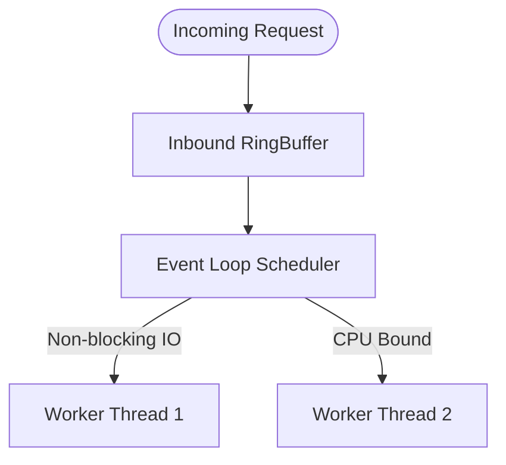

# Low-Level Design (LLD)

## Document Control
| Version | Date | Author | Description | Reviewer |
| :--- | :--- | :--- | :--- | :--- |
| 1.0.0 | 2026-06-26 | Tech Lead | Detailed Class & Implementation Design | Engineering Review |

## 1. Scope & Component Structure
This document provides the micro-level implementation specification for the core business services.
- Detailed UML relationships can be found in [CLASS_DIAGRAM_SPECIFICATION.md](file:///Users/dronpancholi/Developer/01_Strategic/Venus/usedpos_templates/CLASS_DIAGRAM_SPECIFICATION.md).
- Operational state transitions are located in [STATE_DIAGRAM_SPECIFICATION.md](file:///Users/dronpancholi/Developer/01_Strategic/Venus/usedpos_templates/STATE_DIAGRAM_SPECIFICATION.md).

---

## 2. Core Execution Engine Design
### 2.1 Concurrency Model and Threading
The execution engine utilizes a non-blocking Event Loop backed by a fixed worker thread pool sized according to the hardware profile:
$$\text{Pool Size} = N_{\text{cores}} \times \text{Target CPU Utilization} \times \left(1 + \frac{W}{C}\right)$$
Where:
- $W/C$ is the ratio of waiting time to computing time.



### 2.2 Database Index B-Tree Estimate
Sizing primary key indices using a $B$-Tree structure of order $m$, matching page block size $4\text{KB}$:
$$\text{Max Keys Per Node} = m - 1 = \lfloor \frac{\text{Page Size} - \text{Metadata}}{\text{Key Size} + \text{Pointer Size}} \rfloor$$
For a $64$-bit key (8 bytes) and $64$-bit pointer (8 bytes), with 128 bytes metadata:
$$\text{Max Keys} = \lfloor \frac{4096 - 128}{8 + 8} \rfloor = 248 \text{ keys}$$

---

## 3. Resiliency, Retries & Backoff Pattern
The service uses an exponential backoff formula for upstream API calls:
$$t_{\text{retry}} = \min(t_{\text{max}}, t_{\text{initial}} \times 2^{\text{attempt}} + \text{jitter})$$

### 3.1 Skeleton Retry Logic (Python/Pseudocode)
```python
import time
import random

def execute_with_retry(operation, max_attempts=5, initial_backoff=0.1, max_backoff=2.0):
    attempt = 0
    while attempt < max_attempts:
        try:
            return operation()
        except Exception as e:
            attempt += 1
            if attempt == max_attempts:
                raise e
            
            # Calculate backoff with full jitter
            backoff = min(max_backoff, initial_backoff * (2 ** attempt))
            jitter = random.uniform(0, backoff)
            time.sleep(jitter)
```

Refer to [CIRCUIT_BREAKER_MATRICES.md](file:///Users/dronpancholi/Developer/01_Strategic/Venus/usedpos_templates/CIRCUIT_BREAKER_MATRICES.md) for structural circuit breaker failure thresholds.
