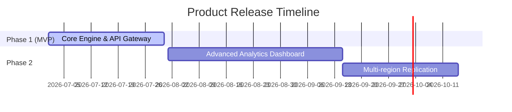

# Product Requirements Document (PRD)

## Document Control
| Version | Date | Author | Description | Reviewer |
| :--- | :--- | :--- | :--- | :--- |
| 1.0.0 | 2026-06-26 | Product Management | Initial Release | Stakeholder Advisory |

## 1. Executive Summary & Vision
### 1.1 Executive Summary
This product establishes a scalable ecosystem enabling real-time collaborative tasks, high-integrity analytical processing, and transactional safety.

### 1.2 Product Vision
To democratize enterprise-grade workflows with sub-second execution speeds, achieving 99.99% availability under massive concurrency.

---

## 2. Target Audience & User Personas
For a comprehensive catalog of roles, access the [USER_CATALOG_SPEC.md](file:///Users/dronpancholi/Developer/01_Strategic/Venus/usedpos_templates/USER_CATALOG_SPEC.md).

| Persona | Name | Role | Primary Goal | Paint Points |
| :--- | :--- | :--- | :--- | :--- |
| Enterprise Admin | Sarah | Access control & audit compliance | Maintain system security policy | Slow, non-auditable API actions |
| Analyst | David | Real-time reporting | Run ad-hoc queries without lag | Query timeout during data syncs |

---

## 3. Product Release Scope

---

## 4. User Stories & Acceptance Criteria
Detailed functional specs can be found in [FUNCTIONAL_SPECIFICATION.md](file:///Users/dronpancholi/Developer/01_Strategic/Venus/usedpos_templates/FUNCTIONAL_SPECIFICATION.md).

### 4.1 Epic: Real-Time Transaction Execution
#### 4.1.1 User Story 1
*As a registered analyst, I want to execute a transaction report in less than 500ms so that I can make critical decisions dynamically.*
- **Acceptance Criteria**:
  1. Under load of up to 10,000 requests/sec, P95 latency must be <= 500ms.
  2. The system must fallback gracefully if the read cache is down (Refer to [REDIS_CACHING_STRATEGY.md](file:///Users/dronpancholi/Developer/01_Strategic/Venus/usedpos_templates/REDIS_CACHING_STRATEGY.md)).

---

## 5. Non-Functional Requirements & Performance Matrix
Refer to [NON_FUNCTIONAL_REQUIREMENTS_SPEC.md](file:///Users/dronpancholi/Developer/01_Strategic/Venus/usedpos_templates/NON_FUNCTIONAL_REQUIREMENTS_SPEC.md) for full benchmarks.

| Metric | Target | Verification Method |
| :--- | :--- | :--- |
| Transaction Latency | P99 < 800ms | K6 / LoadRunner scripts |
| Data Consistency | Strong eventual consistency | Outbox reconciliation logs |

---

## 6. Assumptions and Risks
- **Risk**: Eventual consistency lag during multi-region failovers.
- **Mitigation**: Implemented outbound queuing models details in [OUTBOX_PATTERN_RECONCILIATION.md](file:///Users/dronpancholi/Developer/01_Strategic/Venus/usedpos_templates/OUTBOX_PATTERN_RECONCILIATION.md).
