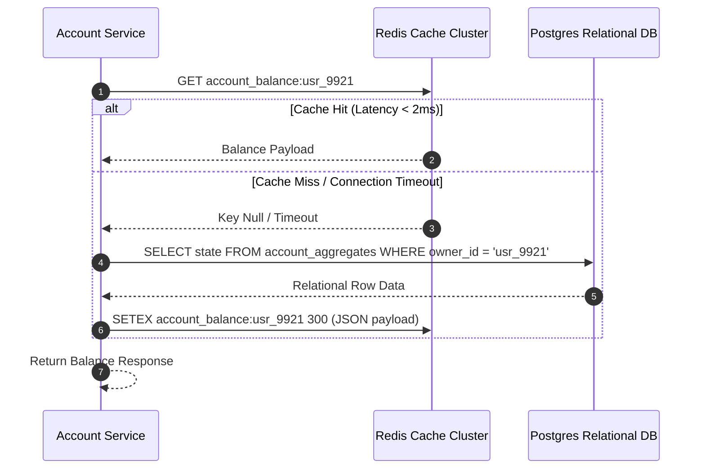

# Sequence Diagram Specification

## Document Control
| Version | Date | Author | Description | Reviewer |
| :--- | :--- | :--- | :--- | :--- |
| 1.0.0 | 2026-06-26 | Systems Engineer | Sequence validation diagrams | Dev Lead |

## 1. Scope
This document specifies the sequence of messaging, thread interactions, and network roundtrips for critical application paths.
- Component breakdown: [C4_ARCHITECTURE_L3_COMPONENT.md](file:///Users/dronpancholi/Developer/01_Strategic/Venus/usedpos_templates/C4_ARCHITECTURE_L3_COMPONENT.md).
- Resiliency handling: [CIRCUIT_BREAKER_MATRICES.md](file:///Users/dronpancholi/Developer/01_Strategic/Venus/usedpos_templates/CIRCUIT_BREAKER_MATRICES.md).

---

## 2. Dynamic Verification Flow: Read-Through Cache Fallback
The sequence below details cache check logic prior to fetching records from transactional databases.

---

## 3. Sequence Step Explanations
| Step | Source | Target | Protocol / Operation | Description |
| :--- | :--- | :--- | :--- | :--- |
| 1 | Account Service | Redis Cache Cluster | TCP / GET | Attempts sub-millisecond retrieval of cached account balances. |
| 2 | Redis Cache Cluster | Account Service | Return data | Returns cached balance payload if key is valid. |
| 3 | Redis Cache Cluster | Account Service | Return null / Error | Returns null if key is expired, or times out. |
| 4 | Account Service | Postgres Relational DB | SQL / SELECT | Queries transactional DB directly. (Fallback path) |
| 5 | Postgres Relational DB | Account Service | Row payload | Relational database returns raw JSON state representation. |
| 6 | Account Service | Redis Cache Cluster | TCP / SETEX | Cache replenishment with a 300-second TTL. |
| 7 | Account Service | - | Internal | Prepares JSON object structure for presentation. |

Refer to [REDIS_CACHING_STRATEGY.md](file:///Users/dronpancholi/Developer/01_Strategic/Venus/usedpos_templates/REDIS_CACHING_STRATEGY.md) for caching expiration profiles and eviction algorithms.
