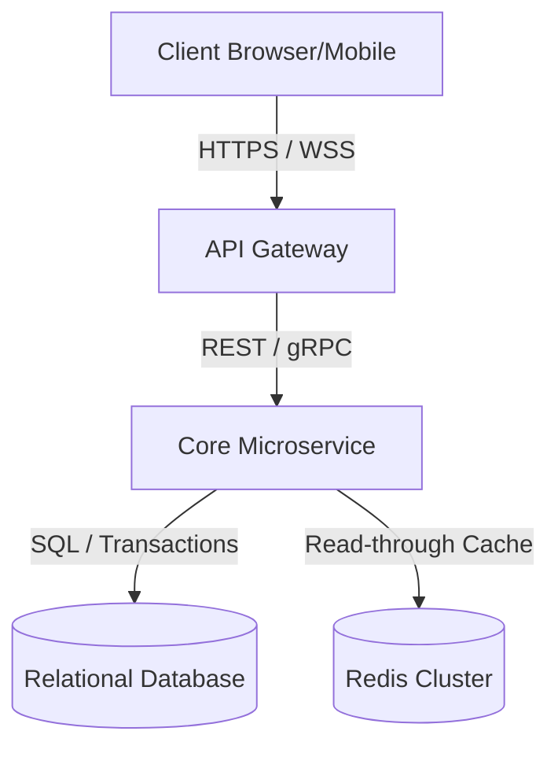

# Software Requirements Specification (SRS)

## Document Control
| Version | Date | Author | Description | Reviewer |
| :--- | :--- | :--- | :--- | :--- |
| 1.0.0 | 2026-06-26 | Strategic Architecture Board | Initial Release | Peer Review Group |

## 1. Introduction
### 1.1 Purpose
This document specifies the software requirements for the system, establishing a baseline for development, testing, and validation.

### 1.2 Scope
The scope encompasses all core services, integration points, and UI deliverables of the target system. Relative details can be cross-referenced with the Product Requirements Document in [PRD_PRODUCT_REQUIREMENTS_DOCUMENT.md](file:///Users/dronpancholi/Developer/01_Strategic/Venus/usedpos_templates/PRD_PRODUCT_REQUIREMENTS_DOCUMENT.md).

### 1.3 Definitions, Acronyms, and Abbreviations
- **MTBF**: Mean Time Between Failures.
- **MTTR**: Mean Time To Repair.
- **SLA**: Service Level Agreement.
- **SLO**: Service Level Objective.

---

## 2. Overall Description
### 2.1 Product Perspective
The system is designed as a modular, distributed web service. It relies on internal databases and microservices mapped in [C4_ARCHITECTURE_L2_CONTAINER.md](file:///Users/dronpancholi/Developer/01_Strategic/Venus/usedpos_templates/C4_ARCHITECTURE_L2_CONTAINER.md).

### 2.2 System Architecture Overview

### 2.3 Design and Implementation Constraints
- **Database Engine**: PostgreSQL 16+ or Spanner.
- **Protocol**: HTTP/2 or HTTP/3 for API gateways.
- **Concurrency Model**: Async non-blocking event-driven loop.

---

## 3. System Features
### 3.1 Feature 1: Core Transaction Processing
#### 3.1.1 Description and Priority
High priority. Handles real-time transaction workflows under strict atomic guarantees.
#### 3.1.2 Functional Requirements
| Req ID | Title | Description | Inputs | Expected Output |
| :--- | :--- | :--- | :--- | :--- |
| FR-101 | Transaction Creation | Accept and validate payment requests | Event payload (JSON) | HTTP 201 Created |
| FR-102 | State Validation | Validate balance against limits | Account ID | State transition confirmation |

---

## 4. Non-Functional Requirements (NFR)
Detailed targets are defined in [NON_FUNCTIONAL_REQUIREMENTS_SPEC.md](file:///Users/dronpancholi/Developer/01_Strategic/Venus/usedpos_templates/NON_FUNCTIONAL_REQUIREMENTS_SPEC.md).

### 4.1 System Availability Formula
Availability ($A$) must satisfy the following relation for Tier-1 microservices:
$$A = \frac{\text{MTBF}}{\text{MTBF} + \text{MTTR}} \ge 0.9999$$

### 4.2 Performance Constraints (Amdahl's Law)
When optimizing system speedup ($S$), the maximum speedup is bounded by:
$$S = \frac{1}{(1 - p) + \frac{p}{s}}$$
Where:
- $p$ is the parallelizable portion of the execution path.
- $s$ is the speedup factor of the parallel execution unit.

---

## 5. System Interfaces
Refer to [SYSTEM_INTERFACE_SPECIFICATION.md](file:///Users/dronpancholi/Developer/01_Strategic/Venus/usedpos_templates/SYSTEM_INTERFACE_SPECIFICATION.md) for full descriptions of external API endpoints, payloads, and protocol definitions.
