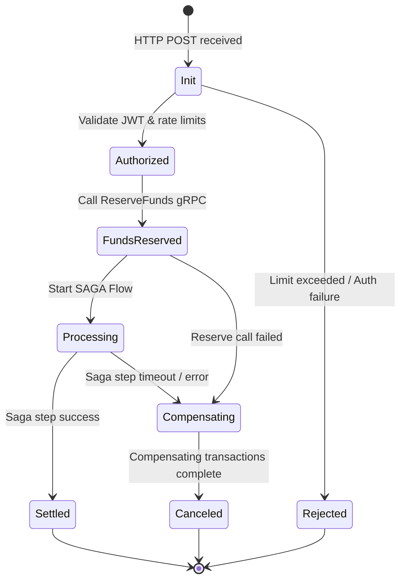

# State Diagram Specification

## Document Control
| Version | Date | Author | Description | Reviewer |
| :--- | :--- | :--- | :--- | :--- |
| 1.0.0 | 2026-06-26 | Workflow Engineer | State Machine specification | QA Lead |

## 1. Scope
This document specifies the lifecycle states, valid transitions, guard conditions, and triggers for core domain entities.
- Low-level execution patterns are located in [LLD_LOW_LEVEL_DESIGN.md](file:///Users/dronpancholi/Developer/01_Strategic/Venus/usedpos_templates/LLD_LOW_LEVEL_DESIGN.md).
- Detailed Saga recovery steps are in [SAGA_ORCHESTRATION_PLAYBOOK.md](file:///Users/dronpancholi/Developer/01_Strategic/Venus/usedpos_templates/SAGA_ORCHESTRATION_PLAYBOOK.md).

---

## 2. Transaction Lifecycle State Diagram

---

## 3. Transition Rules and Guard Conditions
| Source State | Target State | Triggering Event | Guard Condition / Validation | Action Executed |
| :--- | :--- | :--- | :--- | :--- |
| **Init** | **Authorized** | Authentication verified | JWT signature validated | Generate trace ID |
| **Init** | **Rejected** | Rate limit hit | Sliding window count > threshold | Log rejection metric |
| **Authorized** | **FundsReserved**| Reserve request | Account has sufficient balance | Lock funds in ledger |
| **FundsReserved**| **Processing** | Fund reservation success| Funds locked successfully | Execute transaction |
| **Processing** | **Settled** | Settlement confirm | Gateway confirms receipt | Emit Outbox event |
| **Processing** | **Compensating** | Network timeout | Timeout >= 3000ms | Trigger release of funds |
| **Compensating** | **Canceled** | Compensate finish | Release database locks | Mark record CANCELED |
