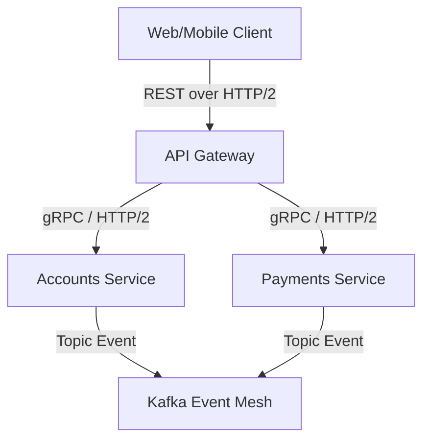

# System Interface Specification

## Document Control
| Version | Date | Author | Description | Reviewer |
| :--- | :--- | :--- | :--- | :--- |
| 1.0.0 | 2026-06-26 | Integration Architect | Interface Mapping & Protocol definitions | Lead Engineer |

## 1. Boundary & Network Interface Model
The system exposes external REST/JSON gateways, low-latency gRPC internal endpoints, and asynchronous event streams via Kafka brokers.



---

## 2. Protocol Configurations
Detailed interface contracts are located in:
- REST Specifications: [OPENAPI_3_SPECIFICATION.md](file:///Users/dronpancholi/Developer/01_Strategic/Venus/usedpos_templates/OPENAPI_3_SPECIFICATION.md)
- GraphQL Queries: [GRAPHQL_SCHEMA_SPECIFICATION.md](file:///Users/dronpancholi/Developer/01_Strategic/Venus/usedpos_templates/GRAPHQL_SCHEMA_SPECIFICATION.md)
- gRPC Protobuf definitions: [GRPC_PROTO_CONTRACT.md](file:///Users/dronpancholi/Developer/01_Strategic/Venus/usedpos_templates/GRPC_PROTO_CONTRACT.md)

| Interface Name | Protocol | Network Port | Auth Model | Data Format |
| :--- | :--- | :--- | :--- | :--- |
| Public API Gateway | HTTP/2 (HTTPS) | `443` | OAuth2 Bearer JWT | JSON |
| Internal Core gRPC | gRPC over TCP | `50051` | mTLS (Mutual TLS) | Protocol Buffers |
| Event Mesh | Kafka TCP | `9092` | SASL_SSL SCRAM-512 | Avro / JSON |

---

## 3. Mutual TLS (mTLS) Security Specification
All internal gRPC communication must negotiate mutual TLS validation.

### Cipher Enforcement Profile
- **Allowed TLS Version**: TLS 1.3 only
- **Allowed Ciphers**:
  - `TLS_AES_256_GCM_SHA384`
  - `TLS_CHACHA20_POLY1305_SHA256`

---

## 4. API Response Standardization
All JSON response schemas must adhere to this wrapper payload contract:

```json
{
  "status": "success | error",
  "data": {},
  "error": {
    "code": "ERR_CODE_STRING",
    "message": "Human-readable trace explanation",
    "details": []
  },
  "meta": {
    "trace_id": "w3c-trace-id-1234567890",
    "timestamp": "2026-06-26T03:14:35Z"
  }
}
```
Refer to [API_VERSIONING_POLICY.md](file:///Users/dronpancholi/Developer/01_Strategic/Venus/usedpos_templates/API_VERSIONING_POLICY.md) for endpoint deprecation and sunset protocols.
