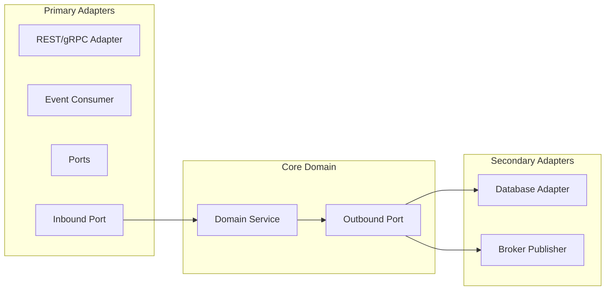

# Technical Design Document (TDD)

## Document Control
| Version | Date | Author | Description | Reviewer |
| :--- | :--- | :--- | :--- | :--- |
| 1.0.0 | 2026-06-26 | System Architect | Initial Architecture Specification | Engineering Review Board |

## 1. Executive Summary
This document specifies the technical design for the platform, ensuring compliance with high scalability, zero-downtime upgrades, and strong transactional integrity.

---

## 2. System Architecture
The system architecture follows a Hexagonal Ports & Adapters design to isolate domain logic from external transport layers and database platforms.

Detailed architectural views are provided in:
- Level 1: System Context - [C4_ARCHITECTURE_L1_SYSTEM_CONTEXT.md](file:///Users/dronpancholi/Developer/01_Strategic/Venus/usedpos_templates/C4_ARCHITECTURE_L1_SYSTEM_CONTEXT.md)
- Level 2: Container - [C4_ARCHITECTURE_L2_CONTAINER.md](file:///Users/dronpancholi/Developer/01_Strategic/Venus/usedpos_templates/C4_ARCHITECTURE_L2_CONTAINER.md)
- Level 3: Component - [C4_ARCHITECTURE_L3_COMPONENT.md](file:///Users/dronpancholi/Developer/01_Strategic/Venus/usedpos_templates/C4_ARCHITECTURE_L3_COMPONENT.md)
- Level 4: Code - [C4_ARCHITECTURE_L4_CODE.md](file:///Users/dronpancholi/Developer/01_Strategic/Venus/usedpos_templates/C4_ARCHITECTURE_L4_CODE.md)

### 2.1 Hexagonal Design Overview


---

## 3. Database Design & Persistence
The relational data layer utilizes PostgreSQL 16+. Key database design elements include:
- Entity Relationship Model: [ENTITY_RELATIONSHIP_DIAGRAM_SPEC.md](file:///Users/dronpancholi/Developer/01_Strategic/Venus/usedpos_templates/ENTITY_RELATIONSHIP_DIAGRAM_SPEC.md)
- Database Schema definitions: [DATABASE_SCHEMA_DEFINITION.md](file:///Users/dronpancholi/Developer/01_Strategic/Venus/usedpos_templates/DATABASE_SCHEMA_DEFINITION.md)
- Index Optimization guidelines: [DATABASE_INDEXING_QUERY_PLAN.md](file:///Users/dronpancholi/Developer/01_Strategic/Venus/usedpos_templates/DATABASE_INDEXING_QUERY_PLAN.md)

---

## 4. Kubernetes Deployment Specification
The following manifest outlines the target deployment structure for core microservices:

```yaml
apiVersion: apps/v1
kind: Deployment
metadata:
  name: core-service-deployment
  namespace: production
  labels:
    app: core-service
spec:
  replicas: 3
  selector:
    matchLabels:
      app: core-service
  template:
    metadata:
      labels:
        app: core-service
    spec:
      containers:
      - name: service
        image: gcr.io/project-venus/core-service:v0.9.0
        ports:
        - containerPort: 8080
        resources:
          limits:
            cpu: "2"
            memory: 4Gi
          requests:
            cpu: "500m"
            memory: 1Gi
        readinessProbe:
          httpGet:
            path: /healthz/ready
            port: 8080
          initialDelaySeconds: 5
          periodSeconds: 10
        livenessProbe:
          httpGet:
            path: /healthz/live
            port: 8080
          initialDelaySeconds: 15
          periodSeconds: 20
```

---

## 5. Security & Auditing
- **Authentication**: JWT token authorization using asymmetric RS256 signing keys.
- **Data Encryption**: AES-256-GCM for sensitive table column storage.
- **Traceability**: End-to-end W3C Trace Context headers injected into every asynchronous payload. Refer to [MESSAGE_BROKER_TOPIC_SCHEMA.md](file:///Users/dronpancholi/Developer/01_Strategic/Venus/usedpos_templates/MESSAGE_BROKER_TOPIC_SCHEMA.md).
