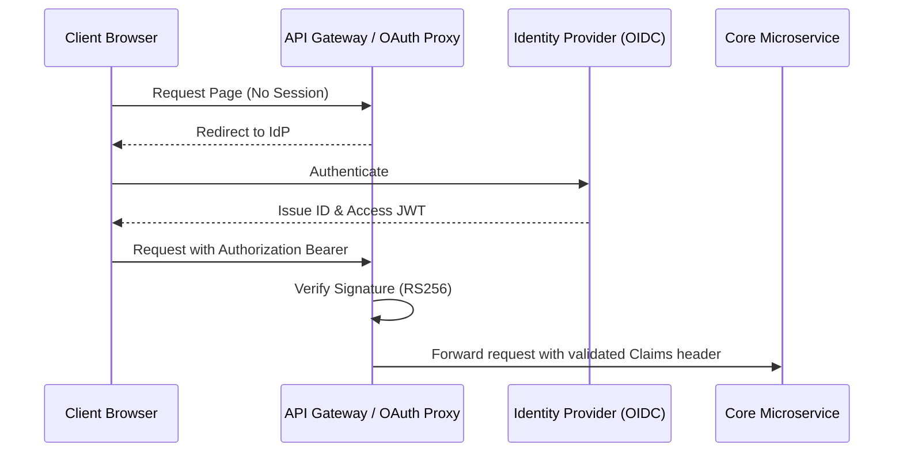

# User Catalog Specification

## Document Control
| Version | Date | Author | Description | Reviewer |
| :--- | :--- | :--- | :--- | :--- |
| 1.0.0 | 2026-06-26 | Identity Architect | Role Definitions and RBAC mapping | InfoSec Officer |

## 1. Scope and Identity Framework
This document defines user archetypes, permissions, and synchronization models for access control policies. It aligns with [PRD_PRODUCT_REQUIREMENTS_DOCUMENT.md](file:///Users/dronpancholi/Developer/01_Strategic/Venus/usedpos_templates/PRD_PRODUCT_REQUIREMENTS_DOCUMENT.md).

---

## 2. Role-Based Access Control (RBAC) Matrix
The application permissions follow a least-privilege model. The table below represents the active resource control flags:

| Role Name | Resource: Account | Resource: Payments | Resource: System Config | Resource: Audit Logs |
| :--- | :--- | :--- | :--- | :--- |
| **SystemAdmin** | Read / Write / Delete | Read / Write / SAGA | Read / Write | Read |
| **PaymentOperator** | Read | Read / Write / SAGA | None | None |
| **Auditor** | Read | Read | None | Read |
| **CustomerService** | Read | Read | None | None |

---

## 3. Directory Synchronization Rules (OIDC / OAuth2)
User roles are mapped dynamically from identity provider JWT claims during session handshake:

### 3.1 Mapping Schema (OIDC ID Token JSON)
```json
{
  "iss": "https://identity.project-venus.net",
  "sub": "usr_9988776655",
  "name": "Sarah Connor",
  "email": "sconnor@project-venus.net",
  "roles": [
    "SystemAdmin",
    "SecurityAuditor"
  ],
  "tenant_id": "tenant_enterprise_01",
  "exp": 1782470000
}
```

### 3.2 Authorization Flow Rules

