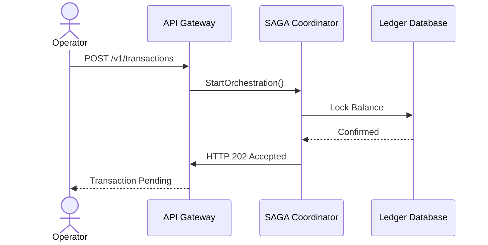

# Use Case Specification

## Document Control
| Version | Date | Author | Description | Reviewer |
| :--- | :--- | :--- | :--- | :--- |
| 1.0.0 | 2026-06-26 | Solutions Architect | System Use Case Catalogs | Development Lead |

## 1. Introduction
This document catalogs system interactions, actors, preconditions, postconditions, and alternative flows. Functional requirements mapping is located in [FUNCTIONAL_SPECIFICATION.md](file:///Users/dronpancholi/Developer/01_Strategic/Venus/usedpos_templates/FUNCTIONAL_SPECIFICATION.md).

---

## 2. Core Use Cases
### 2.1 Use Case UC-101: Initiate SAGA Transaction

### 2.2 Template Specification Definition
| Field | Value Details |
| :--- | :--- |
| **Use Case ID** | **UC-101** |
| **Use Case Name** | Initiate SAGA Transaction |
| **Primary Actor** | PaymentOperator (Defined in [USER_CATALOG_SPEC.md](file:///Users/dronpancholi/Developer/01_Strategic/Venus/usedpos_templates/USER_CATALOG_SPEC.md)) |
| **Description** | Initiates an atomic, distributed multi-step payment transaction across ledger and accounts databases. |
| **Preconditions** | User is authenticated. Sender has sufficient funds in account balance. |
| **Trigger** | User calls `POST /v1/transactions` with payload. |

#### 2.2.1 Primary Flow
1. Operator submits payment payload.
2. System validates fields against constraints (described in [FUNCTIONAL_SPECIFICATION.md](file:///Users/dronpancholi/Developer/01_Strategic/Venus/usedpos_templates/FUNCTIONAL_SPECIFICATION.md)).
3. System invokes SAGA Coordinator to lock funds on source ledger.
4. SAGA Coordinator returns execution tracking ID.
5. System returns status response HTTP `202 Accepted`.

#### 2.2.2 Alternative Flows
- **Alt Flow 2A: Insufficient Funds**
  1. System checks sender balance.
  2. Funds check fails.
  3. System rejects payment with error `ERR_INSUFFICIENT_FUNDS` (HTTP 422).
  4. Flow terminates.

#### 2.2.3 Exception Flows
- **Exc Flow 2B: Database Timeout**
  1. Connection to ledger times out during fund lock.
  2. SAGA Coordinator triggers compensating transactions to release local locks.
  3. System logs warning to tracing engine.
  4. Returns `ERR_SERVICE_TIMEOUT` (HTTP 504).
